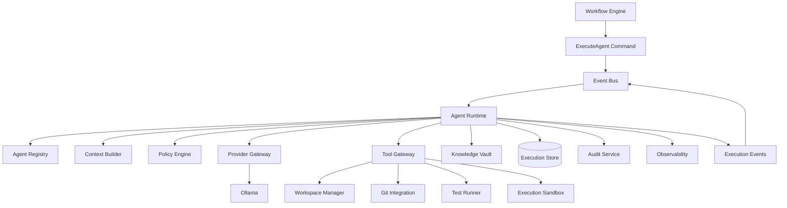
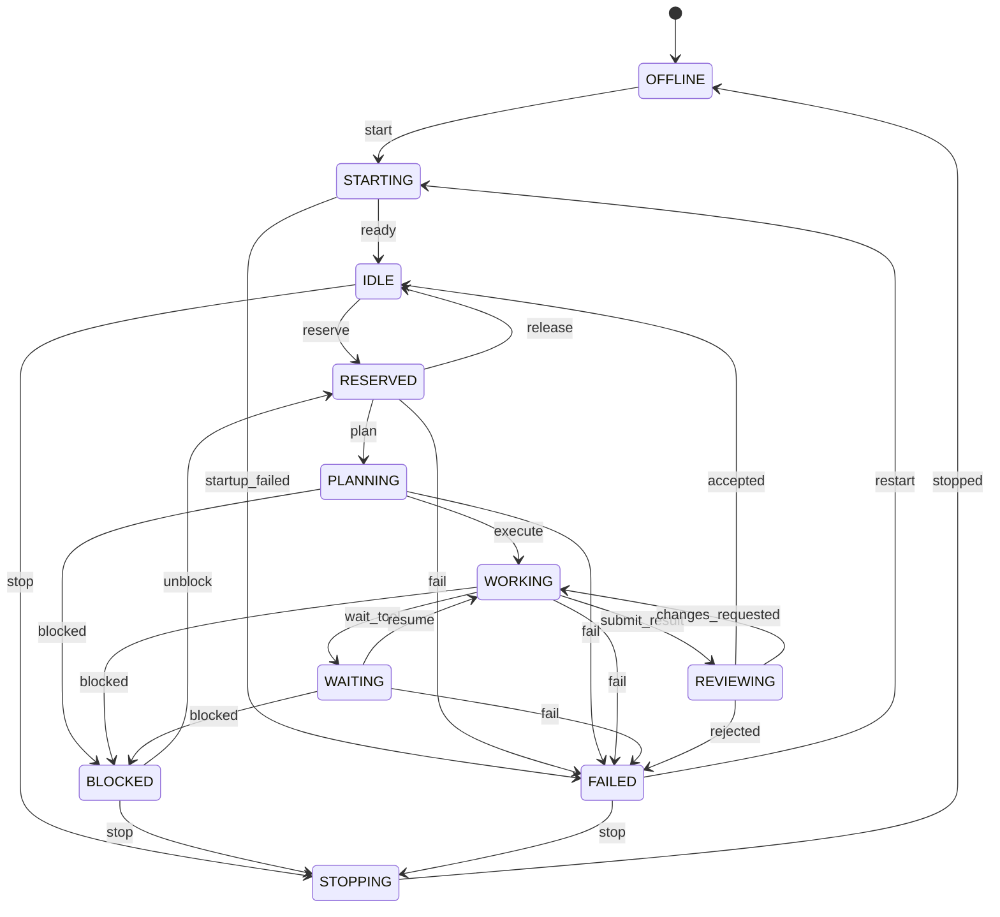
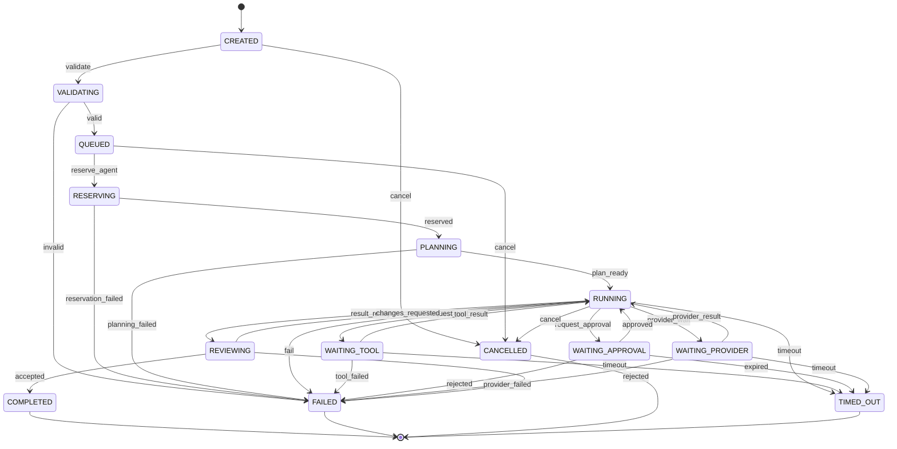

# Arquitetura do Agent Runtime da Stieve Software Company

## Objetivo

Definir a arquitetura oficial do Agent Runtime do CompanyOS.

Este documento estabelece:

- responsabilidades;
- ciclo de vida dos agentes;
- definições e instâncias;
- execução;
- contexto;
- memória;
- modelos de IA;
- ferramentas;
- permissões;
- isolamento;
- limites;
- segurança;
- auditoria;
- observabilidade;
- recuperação;
- integração com workflows;
- integração com o Event Bus;
- critérios de teste.

O Agent Runtime será responsável por executar agentes de IA de forma controlada, rastreável, isolada e segura.

---

# Princípios

## Agentes são stateless

Agentes não deverão depender de memória interna permanente.

Todo estado durável deverá estar em:

- Project Knowledge Vault;
- PostgreSQL;
- Workflow Engine;
- Object Storage;
- Audit Log;
- Event Store.

## Execução controlada

Nenhum agente poderá executar ferramentas diretamente.

Toda ferramenta deverá passar pelo:

```text
Tool Gateway
```

## Menor privilégio

Cada agente deverá receber somente:

- projeto autorizado;
- tarefa autorizada;
- ferramentas autorizadas;
- caminhos autorizados;
- comandos autorizados;
- contexto necessário;
- tempo necessário;
- recursos necessários.

## Isolamento por projeto

O contexto, workspace, arquivos, logs e artefatos de um projeto não poderão ser acessados por agentes de outro projeto.

## Aprovação humana

Ações críticas deverão aguardar aprovação humana.

Exemplos:

- alterar produção;
- publicar release;
- aceitar risco;
- executar migração crítica;
- acessar segredo sensível;
- executar rollback de produção.

## Rastreabilidade

Toda execução deverá registrar:

```text
quem solicitou
qual agente executou
qual tarefa
qual modelo
qual contexto
quais ferramentas
quais arquivos
qual resultado
qual custo
qual duração
qual aprovação
```

---

# Visão geral



---

# Responsabilidades

O Agent Runtime deverá:

- receber comandos de execução;
- validar execução;
- carregar definição do agente;
- validar projeto;
- validar tarefa;
- carregar políticas;
- construir contexto;
- reservar agente;
- selecionar modelo;
- montar prompt;
- chamar provedor;
- interpretar resposta;
- solicitar ferramenta;
- aguardar resultado;
- atualizar progresso;
- produzir resultado;
- registrar uso;
- liberar agente;
- publicar eventos;
- recuperar execuções interrompidas.

O Agent Runtime não deverá:

- alterar diretamente tabelas de domínio;
- acessar banco de outro serviço;
- executar shell irrestrito;
- publicar em produção;
- aprovar ações humanas;
- acessar segredos sem política;
- manter memória permanente fora do Knowledge Vault.

---

# Conceitos principais

## AgentDefinition

Define um tipo de agente.

## AgentInstance

Representa uma instância disponível para execução.

## AgentExecution

Representa uma execução concreta.

## AgentExecutionStep

Representa uma etapa da execução.

## AgentContextManifest

Define o contexto permitido.

## AgentToolGrant

Define ferramentas autorizadas.

## AgentResourcePolicy

Define limites de recursos.

## AgentResult

Representa o resultado final.

## AgentUsage

Registra consumo do modelo e da infraestrutura.

---

# AgentDefinition

## Campos

```text
id
organization_id
code
name
description
layer
purpose
capabilities
default_model_policy
default_tool_policy
default_resource_policy
default_context_policy
system_prompt_template
status
version
created_at
created_by
updated_at
updated_by
```

## Camadas

```text
EXECUTIVE
ENGINEERING
OPERATIONS
```

## Estados

```text
DRAFT
ACTIVE
DISABLED
DEPRECATED
```

## Regras

- `code + version` deverá ser único;
- definição ativa não deverá ser alterada silenciosamente;
- alteração relevante deverá gerar nova versão;
- agente desativado não recebe novas execuções;
- prompt do sistema deverá ser versionado.

---

# Tipos iniciais de agentes

## Executivos

```text
CEO_AGENT
SOLUTION_ARCHITECT
PRODUCT_MANAGER
CHANGE_MANAGER
TECH_LEAD
RELEASE_MANAGER
DEPLOYMENT_MANAGER
INFRASTRUCTURE_MANAGER
KNOWLEDGE_MANAGER
```

## Engenharia

```text
BACKEND_ENGINEER
FRONTEND_ENGINEER
QA_ENGINEER
SECURITY_ENGINEER
DEVOPS_ENGINEER
DOCUMENTATION_ENGINEER
DATABASE_ENGINEER
UX_UI_ENGINEER
```

---

# AgentInstance

## Campos

```text
id
organization_id
agent_definition_id
name
status
model_provider
model_name
current_execution_id
last_heartbeat_at
resource_limits
capabilities_override
tools_override
created_at
updated_at
```

## Estados

```text
OFFLINE
STARTING
IDLE
RESERVED
PLANNING
WORKING
WAITING
REVIEWING
BLOCKED
FAILED
STOPPING
```

---

# Máquina de estado do agente



---

# AgentExecution

## Campos

```text
id
organization_id
project_id
task_id
workflow_instance_id
workflow_step_instance_id
agent_definition_id
agent_definition_version
agent_instance_id
status
objective
input
context_manifest_id
model_provider
model_name
started_at
completed_at
failed_at
timeout_at
attempt_number
max_attempts
correlation_id
causation_id
requested_by_type
requested_by_id
result_id
error
version
created_at
updated_at
```

## Estados

```text
CREATED
VALIDATING
QUEUED
RESERVING
PLANNING
RUNNING
WAITING_TOOL
WAITING_APPROVAL
WAITING_PROVIDER
REVIEWING
COMPLETED
FAILED
CANCELLED
TIMED_OUT
```

---

# Máquina de estado da execução



---

# Fluxo de execução

```text
1. receber comando
2. validar schema
3. validar projeto
4. validar tarefa
5. validar agente
6. validar permissões
7. validar políticas
8. construir contexto
9. reservar instância
10. selecionar modelo
11. gerar plano
12. executar ciclo
13. solicitar ferramentas
14. validar resultados
15. gerar resposta final
16. persistir resultado
17. publicar eventos
18. liberar instância
```

---

# Comando de execução

Exemplo:

```json
{
  "command_id": "cmd_01",
  "command_type": "ExecuteAgent",
  "command_version": 1,
  "organization_id": "org_01",
  "project_id": "prj_01",
  "correlation_id": "cor_01",
  "causation_id": "evt_01",
  "payload": {
    "task_id": "tsk_01",
    "agent_definition_code": "BACKEND_ENGINEER",
    "objective": "Implementar o endpoint de criação de projetos.",
    "context_policy": "TASK_REQUIRED",
    "tool_policy": "BACKEND_STANDARD",
    "timeout_seconds": 1800
  }
}
```

---

# Validação inicial

Antes de enfileirar, validar:

- organização ativa;
- projeto ativo;
- tarefa válida;
- tarefa não terminal;
- agente permitido;
- definição ativa;
- modelo disponível;
- ferramentas disponíveis;
- limites válidos;
- aprovação prévia quando exigida;
- contexto acessível;
- tentativa dentro do limite.

---

# Reserva de agente

## Regra

Somente instância `IDLE` poderá ser reservada.

## Processo

```text
selecionar instância
→ obter lock
→ validar status
→ atribuir execution_id
→ marcar RESERVED
→ confirmar
```

## Concorrência

A reserva deverá usar:

- lock no PostgreSQL;
- versão otimista;
- ou mecanismo equivalente.

---

# Seleção de agente

Critérios possíveis:

- definição;
- capacidades;
- disponibilidade;
- modelo;
- recursos;
- projeto;
- ambiente;
- fila;
- prioridade;
- afinidade;
- histórico de falhas.

---

# Planejamento

Antes da execução, o agente poderá gerar um plano.

Exemplo:

```json
{
  "steps": [
    {
      "order": 1,
      "action": "inspect_repository",
      "tool": "file.read"
    },
    {
      "order": 2,
      "action": "implement_endpoint",
      "tool": "file.write"
    },
    {
      "order": 3,
      "action": "run_tests",
      "tool": "test.execute"
    }
  ]
}
```

## Regras

- plano deve ser persistido;
- ferramentas devem estar autorizadas;
- ação crítica deve ser identificada;
- plano poderá exigir revisão;
- agente não poderá ampliar seu próprio escopo.

---

# Ciclo de execução

O ciclo poderá seguir:

```text
observe
→ reason
→ act
→ observe result
→ continue
```

Na persistência, não é necessário armazenar raciocínio interno detalhado do modelo.

Deverão ser armazenados:

- objetivo;
- plano;
- comandos;
- ferramentas;
- resultados;
- decisões explícitas;
- evidências;
- resumo da execução.

---

# Context Builder

## Responsabilidade

Construir o contexto mínimo necessário para a execução.

## Fontes

```text
Project
Task
Requirement
Decision
Reference
Knowledge Vault
Repository
Previous Execution Summary
Workflow Context
```

## Regras

- aplicar autorização;
- filtrar projeto;
- limitar tamanho;
- priorizar informação;
- remover segredo;
- registrar origem;
- registrar versão;
- evitar contexto irrelevante.

---

# AgentContextManifest

## Campos

```text
id
organization_id
project_id
execution_id
policy_code
sources
resource_ids
file_paths
knowledge_items
token_budget
created_at
expires_at
```

## Exemplo

```json
{
  "policy_code": "TASK_REQUIRED",
  "sources": [
    {
      "type": "task",
      "id": "tsk_01"
    },
    {
      "type": "requirement",
      "id": "req_01"
    },
    {
      "type": "decision",
      "id": "dec_01"
    }
  ],
  "file_paths": [
    "src/companyos/modules/projects",
    "tests/projects"
  ],
  "token_budget": 24000
}
```

---

# Políticas de contexto

## MINIMAL

Apenas objetivo e tarefa.

## TASK_REQUIRED

Tarefa, requisitos relacionados e arquivos relevantes.

## PROJECT_TECHNICAL

Arquitetura, decisões, backlog e repositório técnico.

## DISCOVERY

Referências, perguntas, respostas e requisitos.

## RELEASE

Commit, testes, segurança, documentação e changelog.

## INCIDENT

Logs, deployment, eventos, métricas e alterações recentes.

---

# Limite de contexto

O contexto deverá respeitar:

```text
max_context_tokens
max_files
max_file_size
max_knowledge_items
max_reference_items
```

Conteúdo grande deverá ser:

- resumido;
- dividido;
- buscado sob demanda;
- referenciado por identificador.

---

# Memória

## Memória de execução

Temporária e vinculada à execução.

## Memória de projeto

Persistente no Project Knowledge Vault.

## Memória de agente

Não deverá ser usada como memória privada permanente na primeira versão.

Preferências ou aprendizados deverão ser registrados como conhecimento auditável.

---

# Prompts

## Tipos

```text
system_prompt
role_prompt
task_prompt
context_prompt
tool_instructions
output_schema
```

## Regras

- prompts versionados;
- templates auditáveis;
- variáveis validadas;
- sem segredos;
- sem instruções de outro projeto;
- saída estruturada quando aplicável.

---

# Prompt Injection

O runtime deverá tratar referências, arquivos e conteúdo externo como dados não confiáveis.

## Controles

- separar instruções de dados;
- marcar origem;
- limitar ferramentas;
- ignorar instruções dentro de documentos;
- validar ações fora do modelo;
- solicitar aprovação para risco;
- não enviar segredo ao modelo.

---

# Provider Gateway

## Responsabilidade

Abstrair provedores e modelos.

## Interface

```text
generate
stream
embed
list_models
health
cancel
```

## Provedor inicial

```text
Ollama
```

## Modelo

A seleção deverá considerar:

- agente;
- tarefa;
- contexto;
- capacidade;
- recurso disponível;
- prioridade;
- política;
- fallback.

---

# ModelPolicy

## Campos

```text
id
code
allowed_providers
allowed_models
preferred_model
fallback_models
temperature
max_output_tokens
context_limit
timeout_seconds
streaming
created_at
updated_at
```

---

# Fallback

Fluxo possível:

```text
modelo principal falha
→ verificar erro temporário
→ validar política de fallback
→ selecionar próximo modelo
→ repetir com mesma execução
```

## Restrições

- não repetir erro permanente;
- registrar mudança de modelo;
- limitar tentativas;
- manter auditoria;
- preservar contexto.

---

# Uso do modelo

Registrar:

```text
provider
model
input_tokens
output_tokens
total_tokens
duration_ms
attempt
started_at
completed_at
status
```

Quando o provedor não oferecer tokens exatos, registrar estimativa identificada.

---

# Tool Gateway

Toda solicitação de ferramenta deverá possuir:

```text
execution_id
agent_id
tool_code
arguments
project_id
workspace_id
idempotency_key
timeout_seconds
```

## Fluxo

```text
agente solicita ferramenta
→ runtime valida formato
→ Tool Gateway valida política
→ ferramenta executa
→ resultado é retornado
→ runtime retoma
```

---

# AgentToolGrant

## Campos

```text
id
execution_id
tool_code
scope_type
scope_id
allowed_actions
allowed_paths
denied_paths
allowed_commands
denied_commands
max_calls
expires_at
granted_by
created_at
```

---

# Ferramentas iniciais

```text
file.read
file.write
file.list
git.status
git.diff
git.branch.create
git.commit
test.execute
container.run
artifact.create
knowledge.read
knowledge.write
```

---

# Restrições de ferramenta

Agentes não poderão:

- executar `sudo`;
- acessar `/root`;
- acessar `/etc` sem permissão especial;
- acessar socket Docker;
- alterar outro projeto;
- executar comando bloqueado;
- alterar credenciais;
- apagar auditoria;
- fazer `push --force`;
- publicar em produção.

---

# Workspace

Cada execução deverá operar em workspace controlado.

Estrutura:

```text
/workspaces/{organization_id}/{project_id}/executions/{execution_id}
```

## Conteúdos

```text
repository
temp
artifacts
logs
manifest
```

## Regras

- path traversal bloqueado;
- symlinks externos bloqueados;
- permissões mínimas;
- limpeza após retenção;
- artefatos importantes preservados.

---

# Execution Sandbox

## Responsabilidade

Isolar execução técnica.

## Tecnologia inicial

```text
container
```

## Controles

```text
non-root user
read-only base filesystem
limited writable volumes
CPU limit
memory limit
disk limit
network policy
timeout
capability drop
process limit
```

---

# Rede

Políticas possíveis:

## NONE

Sem acesso de rede.

## INTERNAL_ONLY

Acesso apenas a serviços internos autorizados.

## ALLOWLIST

Acesso a domínios específicos.

## FULL_RESTRICTED

Acesso ampliado mediante aprovação.

A política padrão deverá ser:

```text
NONE
```

ou:

```text
INTERNAL_ONLY
```

conforme a tarefa.

---

# AgentResourcePolicy

## Campos

```text
id
code
cpu_limit
memory_limit_mb
disk_limit_mb
process_limit
network_policy
max_duration_seconds
max_tool_calls
max_model_calls
max_output_size
created_at
updated_at
```

---

# Timeouts

## Tipos

```text
execution_timeout
provider_timeout
tool_timeout
approval_timeout
heartbeat_timeout
```

Nenhuma execução deverá permanecer indefinidamente.

---

# Heartbeat

Execuções ativas deverão atualizar:

```text
last_heartbeat_at
current_phase
current_step
resource_usage
```

Heartbeat expirado deverá gerar:

```text
AgentHeartbeatExpired
```

A execução deverá entrar em análise de recuperação.

---

# Cancelamento

## Fluxo

```text
cancel requested
→ impedir novas ações
→ cancelar chamada de modelo
→ cancelar ferramenta quando possível
→ persistir estado
→ liberar agente
→ publicar evento
```

## Regras

- cancelamento deve ser idempotente;
- ferramenta não cancelável deve expirar;
- resultado parcial deve ser preservado;
- efeitos externos devem ser reconciliados.

---

# Retry

Nova tentativa deverá criar uma nova `AgentExecution` ou incrementar tentativa conforme política explícita.

Recomendação:

```text
nova execução relacionada
```

Campos de relação:

```text
retry_of_execution_id
root_execution_id
attempt_number
```

---

# Erros temporários

```text
AI_PROVIDER_UNAVAILABLE
AI_PROVIDER_TIMEOUT
TOOL_TEMPORARILY_UNAVAILABLE
EVENT_BUS_UNAVAILABLE
OBJECT_STORAGE_UNAVAILABLE
```

---

# Erros permanentes

```text
PERMISSION_DENIED
AGENT_PROJECT_ACCESS_DENIED
AGENT_TOOL_NOT_ALLOWED
VALIDATION_ERROR
INVALID_CONTEXT
TASK_NOT_EXECUTABLE
MODEL_NOT_ALLOWED
```

---

# Resultado da execução

## AgentResult

Campos:

```text
id
execution_id
status
summary
structured_output
artifacts
changed_files
commits
tests
findings
recommendations
limitations
created_at
```

## Resultado estruturado

Exemplo:

```json
{
  "summary": "Endpoint implementado.",
  "changed_files": [
    "src/companyos/modules/projects/api/routes.py"
  ],
  "tests": {
    "status": "PASSED",
    "total": 18
  },
  "commit": {
    "sha": "abc123",
    "message": "feat: add project creation endpoint"
  }
}
```

---

# Revisão do resultado

A revisão poderá ser:

- automática;
- por outro agente;
- humana;
- por testes;
- por quality gate.

## Estados possíveis

```text
PENDING
ACCEPTED
CHANGES_REQUESTED
REJECTED
```

---

# Separação entre executor e revisor

Para ações relevantes, o agente executor não deverá ser o único revisor.

Exemplos:

```text
Backend Engineer → QA Engineer
Backend Engineer → Security Engineer
Release Manager → Human Approver
```

---

# Integração com Workflow Engine

## Entrada

O Workflow Engine publica:

```text
ExecuteAgent
```

## Saída

O Agent Runtime publica:

```text
AgentExecutionStarted
AgentPlanningCompleted
AgentToolRequested
AgentToolCompleted
AgentExecutionReviewing
AgentExecutionCompleted
AgentExecutionFailed
AgentExecutionCancelled
AgentExecutionTimedOut
```

## Regra

O Workflow Engine coordena o processo.

O Agent Runtime executa a atividade do agente.

---

# Integração com Event Bus

## Comandos consumidos

```text
ExecuteAgent
CancelAgentExecution
RetryAgentExecution
BlockAgent
UnblockAgent
```

## Eventos publicados

```text
AgentReserved
AgentExecutionStarted
AgentPlanningCompleted
AgentToolRequested
AgentToolCompleted
AgentWaitingApproval
AgentExecutionCompleted
AgentExecutionFailed
AgentExecutionCancelled
AgentExecutionTimedOut
AgentReleased
AgentHeartbeatExpired
```

---

# Integração com Knowledge Vault

O Agent Runtime poderá:

- consultar conhecimento;
- registrar resumo de execução;
- propor novo conhecimento;
- registrar evidências;
- relacionar alterações.

Não poderá:

- alterar item aprovado silenciosamente;
- apagar histórico;
- misturar projetos;
- registrar inferência como fato confirmado.

---

# Escrita no Knowledge Vault

Toda escrita deverá informar:

```text
source_type
source_id
confidence
created_by_agent_id
execution_id
status
```

Estados possíveis:

```text
PROPOSED
CONFIRMED
REJECTED
ARCHIVED
```

---

# Integração com Approval Service

Quando a ferramenta ou ação exigir aprovação:

```text
runtime cria solicitação
→ execução entra em WAITING_APPROVAL
→ aprovação é decidida
→ evento é recebido
→ execução retoma ou falha
```

---

# Aprovações críticas

Exemplos:

```text
database.migrate.production
deployment.production
deployment.rollback
security.risk.accept
secret.access.critical
repository.main.push
```

---

# Auditoria

Ações auditáveis:

- criação de execução;
- seleção de agente;
- seleção de modelo;
- construção de contexto;
- ferramenta solicitada;
- ferramenta negada;
- ferramenta executada;
- arquivo alterado;
- commit criado;
- aprovação solicitada;
- aprovação recebida;
- resultado produzido;
- execução cancelada;
- execução falha;
- acesso negado.

---

# Logs

Campos mínimos:

```text
timestamp
level
service
agent_definition
agent_instance_id
execution_id
task_id
workflow_instance_id
project_id
correlation_id
phase
tool_code
provider
model
status
error_code
```

---

# Métricas

```text
agent_executions_started_total
agent_executions_completed_total
agent_executions_failed_total
agent_executions_cancelled_total
agent_executions_timed_out_total
agent_execution_duration_seconds
agent_tool_calls_total
agent_tool_failures_total
agent_provider_calls_total
agent_provider_failures_total
agent_input_tokens_total
agent_output_tokens_total
agent_active_executions
agent_queue_depth
agent_heartbeat_expired_total
```

---

# Alertas

- agente sem heartbeat;
- fila crescendo;
- alta taxa de falha;
- modelo indisponível;
- ferramenta bloqueada repetidamente;
- execução longa;
- consumo excessivo;
- tentativa de acesso entre projetos;
- tentativa de comando proibido;
- segredo detectado.

---

# Mission Control

A Sala de Operações deverá exibir:

- agente;
- definição;
- instância;
- estado;
- tarefa;
- workflow;
- modelo;
- duração;
- fase atual;
- ferramentas;
- aprovações;
- consumo;
- resultado;
- erros;
- artefatos;
- correlação.

Controles autorizados:

```text
cancel
block
unblock
retry
review
approve tool
reject tool
```

---

# Persistência

Tabelas principais:

```text
agent_definitions
agent_instances
agent_executions
agent_execution_steps
agent_context_manifests
agent_tool_grants
agent_results
agent_usage
agent_heartbeats
agent_history
```

---

# Índices

```text
agent_instances(status)
agent_instances(agent_definition_id, status)
agent_executions(project_id, status)
agent_executions(task_id)
agent_executions(workflow_instance_id)
agent_executions(correlation_id)
agent_executions(agent_instance_id, status)
agent_heartbeats(agent_instance_id, created_at)
```

---

# Retenção

## Preservar

- resultados;
- auditoria;
- commits;
- artefatos relevantes;
- resumos;
- uso;
- erros importantes.

## Limpar conforme política

- temporários;
- cache;
- arquivos intermediários;
- outputs repetitivos;
- sandboxes encerrados.

---

# Recuperação após falha

Ao reiniciar:

```text
1. localizar execuções não terminais
2. verificar heartbeat
3. verificar chamada externa
4. verificar ferramenta pendente
5. verificar aprovação
6. reconciliar efeito
7. retomar ou falhar com segurança
8. liberar agentes órfãos
```

---

# Reconciliação

Jobs periódicos deverão detectar:

- agente reservado sem execução;
- execução ativa sem heartbeat;
- ferramenta concluída não consumida;
- aprovação decidida não consumida;
- execução concluída sem resultado;
- agente bloqueado recebendo tarefa;
- workspace órfão;
- container órfão.

---

# Estado de resultado desconhecido

Quando uma ferramenta externa pode ter executado, mas não retornou confirmação:

```text
UNKNOWN_OUTCOME
```

A execução não deverá repetir automaticamente ações não idempotentes.

Deverá:

- consultar estado externo;
- reconciliar;
- solicitar revisão;
- registrar incidente quando necessário.

---

# Segurança

## Identidade

Cada instância deverá possuir identidade própria.

## Permissões

Permissões são calculadas por:

```text
AgentDefinition
+
ProjectAgent
+
Task
+
Execution
+
ToolGrant
```

## Segredos

Segredos deverão ser:

- temporários;
- escopados;
- mascarados;
- revogáveis;
- não persistidos em prompt;
- não persistidos em workspace.

---

# Defesa em profundidade

Controles:

```text
Policy Engine
Tool Gateway
Sandbox
Filesystem restrictions
Network policy
Resource limits
Approval Service
Audit
Secret detection
Output validation
```

---

# Output validation

Respostas estruturadas deverão ser validadas por schema.

Exemplo:

```text
AgentResultSchema
```

Saída inválida deverá:

- permitir correção controlada;
- contar como tentativa;
- não atualizar domínio automaticamente.

---

# Conteúdo não confiável

Entradas de referência, repositório e internet deverão ser classificadas como não confiáveis.

O modelo não poderá transformar instruções presentes nesses conteúdos em privilégios.

---

# Limites iniciais

Configurações sugeridas por política:

```text
max_execution_duration
max_model_calls
max_tool_calls
max_context_tokens
max_output_tokens
max_changed_files
max_artifact_size
max_parallel_executions
max_retries
```

---

# Escalabilidade

O Agent Runtime poderá escalar horizontalmente.

Requisitos:

- instâncias stateless;
- reserva atômica;
- filas;
- locks;
- heartbeat;
- storage compartilhado controlado;
- idempotência.

---

# Afinidade

Algumas execuções poderão exigir:

- GPU específica;
- modelo carregado;
- workspace local;
- projeto;
- capacidade;
- ferramenta.

Esses requisitos deverão fazer parte da política de agendamento.

---

# Agendamento

Critérios:

```text
priority
agent_type
capability
resource_availability
project_quota
model_availability
queue_age
retry_count
```

---

# Quotas

Quotas poderão ser aplicadas por:

- organização;
- projeto;
- agente;
- usuário;
- modelo;
- período.

Exemplos:

```text
max_active_executions
max_tokens_per_day
max_tool_calls_per_hour
max_gpu_minutes
```

---

# Anti-padrões proibidos

```text
agente com acesso total
shell irrestrito
agente acessando banco diretamente
agente com segredo no prompt
agente alterando própria permissão
agente aprovando produção
contexto de múltiplos projetos
workspace compartilhado sem isolamento
retry infinito
resultado sem evidência
modelo escolhido sem política
ferramenta executada fora do Tool Gateway
```

---

# Primeira implementação

A primeira versão deverá suportar:

```text
AgentDefinition
AgentInstance
AgentExecution
AgentResult
Context Builder
Provider Gateway para Ollama
Tool Gateway
Workspace isolado
heartbeat
timeout
cancelamento
logs
métricas
auditoria
```

Ferramentas iniciais:

```text
file.read
file.write
git.status
git.diff
git.commit
test.execute
```

---

# Testes obrigatórios

## Definição

- definição válida;
- versão duplicada;
- agente desativado;
- modelo proibido;
- ferramenta proibida.

## Reserva

- agente disponível;
- dois workers disputando agente;
- agente bloqueado;
- agente já reservado.

## Contexto

- somente projeto correto;
- limite de tamanho;
- segredo removido;
- fonte registrada;
- acesso negado.

## Modelo

- resposta válida;
- timeout;
- indisponibilidade;
- fallback;
- saída inválida.

## Ferramenta

- ferramenta permitida;
- ferramenta negada;
- caminho proibido;
- comando proibido;
- timeout;
- resultado duplicado.

## Execução

- conclusão;
- falha;
- cancelamento;
- heartbeat expirado;
- retry;
- recuperação após reinício.

## Segurança

- acesso entre projetos;
- tentativa de produção;
- tentativa de alterar permissão;
- prompt injection;
- segredo em output.

## Observabilidade

- métricas;
- logs;
- correlação;
- auditoria;
- alerta de falha.

---

# Critérios de aceite da Sprint

Este documento será considerado aprovado quando:

- responsabilidades do Agent Runtime estiverem definidas;
- AgentDefinition e AgentInstance estiverem separados;
- ciclo de vida estiver definido;
- AgentExecution estiver detalhada;
- Context Builder estiver definido;
- políticas de contexto estiverem definidas;
- Provider Gateway estiver integrado;
- Tool Gateway estiver integrado;
- workspace e sandbox estiverem definidos;
- permissões estiverem incorporadas;
- limites de recursos estiverem definidos;
- aprovações humanas estiverem integradas;
- Knowledge Vault estiver integrado;
- Event Bus estiver integrado;
- recuperação após falha estiver definida;
- segurança estiver detalhada;
- observabilidade estiver definida;
- testes obrigatórios estiverem documentados.
