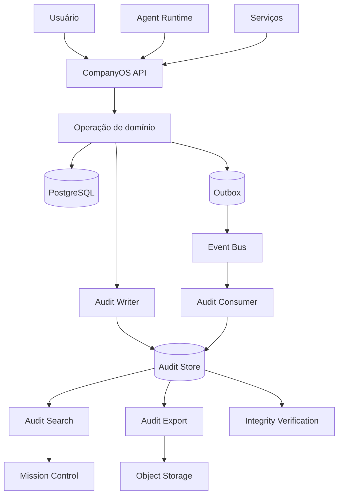

# Arquitetura de Auditoria da Stieve Software Company

## Objetivo

Definir a arquitetura oficial de auditoria do CompanyOS.

Este documento estabelece:

- eventos auditáveis;
- estrutura dos registros;
- origem;
- integridade;
- imutabilidade;
- armazenamento;
- retenção;
- busca;
- exportação;
- correlação;
- segurança;
- privacidade;
- observabilidade;
- recuperação;
- governança;
- critérios de teste.

A auditoria deverá permitir reconstruir ações relevantes executadas por usuários, agentes, serviços e processos internos.

---

# Princípios

## Imutabilidade

Registros de auditoria não deverão ser alterados após a gravação.

Correções deverão gerar um novo registro relacionado.

## Rastreabilidade

Todo registro deverá permitir identificar:

```text
quem
fez o quê
em qual recurso
em qual projeto
em qual momento
por qual motivo
com qual resultado
```

## Correlação

A auditoria deverá utilizar:

```text
correlation_id
causation_id
request_id
execution_id
workflow_instance_id
```

quando aplicável.

## Menor exposição

A auditoria não deverá armazenar segredos ou dados sensíveis desnecessários.

## Independência

O ator que executa uma ação não deverá conseguir apagar ou alterar seu próprio registro.

## Cobertura de ações críticas

Toda ação com impacto em segurança, produção, permissões, dados, agentes, releases e deployments deverá gerar auditoria.

---

# Visão geral



---

# Responsabilidades

O sistema de auditoria deverá:

- registrar ações;
- registrar decisões de autorização;
- registrar mudanças de estado;
- registrar aprovações;
- registrar operações críticas;
- preservar histórico;
- permitir busca;
- permitir exportação;
- validar integridade;
- aplicar retenção;
- gerar alertas;
- registrar tentativas negadas;
- permitir reconstrução cronológica.

O sistema de auditoria não deverá:

- substituir logs operacionais;
- substituir eventos de domínio;
- armazenar stack trace completo;
- armazenar segredos;
- permitir edição direta;
- confiar exclusivamente em mensagens assíncronas para ações críticas.

---

# Diferença entre logs, eventos e auditoria

## Logs

Usados para diagnóstico técnico.

Exemplo:

```text
conexão com banco falhou
```

## Eventos

Representam fatos de domínio ou integração.

Exemplo:

```text
ProjectCreated
```

## Auditoria

Registra responsabilidade e contexto da ação.

Exemplo:

```text
Usuário usr_01 criou o projeto prj_01 utilizando project.create.
```

Uma mesma operação poderá gerar:

```text
log
+
evento
+
registro de auditoria
```

---

# Tipos de ator

```text
USER
AGENT
SERVICE
SYSTEM
PLUGIN
```

## USER

Pessoa autenticada.

## AGENT

Agente de IA registrado.

## SERVICE

Serviço interno.

## SYSTEM

Processo automático do CompanyOS.

## PLUGIN

Instalação de plugin autorizada.

---

# AuditRecord

## Campos

```text
id
organization_id
project_id
occurred_at
recorded_at
actor_type
actor_id
actor_display
action
permission
scope_type
scope_id
resource_type
resource_id
resource_version
operation_type
decision
result
reason
previous_state
current_state
changes
metadata
environment
service_name
service_version
source_ip
user_agent
request_id
correlation_id
causation_id
workflow_instance_id
workflow_step_instance_id
agent_execution_id
plugin_installation_id
integrity_hash
previous_record_hash
retention_class
confidentiality_level
```

---

# Identificador

Formato recomendado:

```text
aud_<ulid>
```

---

# Action

Formato:

```text
resource.action
```

Exemplos:

```text
project.create
project.archive
requirement.approve
agent.tool.execute
release.publish
deployment.production
security.risk.accept
plugin.install
```

---

# Operation type

```text
CREATE
READ
UPDATE
DELETE
TRANSITION
APPROVE
REJECT
EXECUTE
EXPORT
LOGIN
LOGOUT
ACCESS
GRANT
REVOKE
INSTALL
ACTIVATE
DISABLE
ROLLBACK
```

---

# Decision

Representa decisão de autorização.

```text
ALLOW
DENY
NOT_APPLICABLE
```

---

# Result

Representa o resultado da operação.

```text
SUCCESS
FAILURE
PARTIAL
CANCELLED
TIMEOUT
```

---

# Mudanças

O campo `changes` deverá registrar alterações relevantes.

Exemplo:

```json
{
  "status": {
    "from": "STAGING",
    "to": "PRODUCTION"
  },
  "version": {
    "from": 8,
    "to": 9
  }
}
```

## Regras

- não registrar senha;
- não registrar token;
- mascarar valor sensível;
- limitar tamanho;
- registrar somente campos relevantes;
- preservar tipos.

---

# Metadata

Exemplo:

```json
{
  "approval_id": "apr_01",
  "release_id": "rel_01",
  "deployment_id": "dep_01",
  "risk_level": "CRITICAL"
}
```

---

# Eventos auditáveis obrigatórios

## Autenticação

```text
auth.login.success
auth.login.failure
auth.logout
auth.session.revoke
auth.token.refresh.failure
```

## Usuários

```text
user.create
user.invite
user.update
user.disable
user.enable
```

## Papéis e permissões

```text
role.create
role.update
role.assign
role.revoke
permission.grant
permission.revoke
permission.deny
```

## Projetos

```text
project.create
project.update
project.pause
project.resume
project.archive
project.cancel
project.delete
project.member.add
project.member.remove
project.agent.assign
project.agent.remove
```

## Discovery

```text
discovery.start
discovery.submit
discovery.approve
discovery.reject
discovery.request_changes
```

## Referências

```text
reference.upload
reference.process
reference.quarantine
reference.release_from_quarantine
reference.archive
reference.delete
```

## Requisitos e decisões

```text
requirement.approve
requirement.reject
requirement.deprecate
decision.approve
decision.reject
decision.supersede
```

## Tarefas e workflows

```text
task.assign
task.start
task.complete
task.fail
task.cancel
workflow.start
workflow.pause
workflow.resume
workflow.cancel
workflow.retry
workflow.compensate
```

## Agentes

```text
agent.register
agent.start
agent.stop
agent.block
agent.unblock
agent.execute
agent.tool.request
agent.tool.allow
agent.tool.deny
agent.execution.cancel
```

## Segurança

```text
security.finding.confirm
security.finding.resolve
security.false_positive.mark
security.risk.accept
security.review.approve
security.review.reject
```

## Releases e deployments

```text
release.create
release.validate
release.approve
release.reject
release.publish
deployment.request
deployment.approve
deployment.start
deployment.complete
deployment.fail
deployment.rollback
```

## Plugins

```text
plugin.register
plugin.approve
plugin.install
plugin.activate
plugin.disable
plugin.update
plugin.rollback
plugin.remove
plugin.permission.grant
plugin.permission.revoke
plugin.secret.grant
```

## Auditoria

```text
audit.read
audit.export
audit.retention.update
audit.integrity.verify
```

---

# Tentativas negadas

Ações negadas relevantes deverão gerar auditoria.

Exemplos:

- acesso a outro projeto;
- ferramenta proibida;
- produção sem aprovação;
- permissão insuficiente;
- tentativa de alterar auditoria;
- segredo solicitado sem autorização;
- plugin acessando recurso não permitido.

## Resultado

```text
decision = DENY
result = FAILURE
```

---

# Leituras auditáveis

Nem toda leitura precisa de registro detalhado.

Leituras que deverão ser auditadas:

- auditoria;
- segredos;
- dados restritos;
- exportações;
- configurações críticas;
- dados de produção;
- relatórios confidenciais;
- informações de segurança.

---

# Escrita síncrona

Ações críticas deverão registrar auditoria na mesma transação lógica da operação quando possível.

Exemplo:

```text
alteração do recurso
+
registro de auditoria
+
outbox
```

Se a auditoria obrigatória não puder ser registrada, a operação crítica deverá falhar.

---

# Escrita assíncrona

Eventos secundários poderão ser auditados por consumidor do Event Bus.

Exemplos:

- processamento concluído;
- health check;
- notificação entregue;
- métrica operacional relevante.

Ações críticas não deverão depender apenas da escrita assíncrona.

---

# Audit Writer

## Responsabilidade

Receber registros estruturados e persistir com integridade.

## Funções

- validar schema;
- aplicar mascaramento;
- calcular hash;
- vincular registro anterior;
- persistir;
- publicar confirmação;
- registrar erro.

---

# Cadeia de integridade

Cada registro poderá possuir:

```text
previous_record_hash
integrity_hash
```

Exemplo conceitual:

```text
integrity_hash =
hash(
  conteúdo normalizado
  +
  previous_record_hash
)
```

Isso permite detectar alterações na sequência.

---

# Segmentação da cadeia

A cadeia poderá ser separada por:

```text
organization_id
project_id
retention_class
dia
```

A estratégia final deverá equilibrar:

- verificação;
- concorrência;
- desempenho;
- recuperação.

---

# Assinatura futura

A arquitetura deverá permitir assinatura digital periódica de lotes.

Exemplo:

```text
daily_audit_digest
```

O digest poderá ser armazenado em local separado.

---

# Audit Store

## Estratégia inicial

PostgreSQL com tabelas dedicadas.

## Evolução possível

- storage append-only;
- banco dedicado;
- object storage com arquivos assinados;
- mecanismo externo de compliance.

---

# Tabelas

```text
audit_records
audit_integrity_checkpoints
audit_exports
audit_retention_policies
audit_access_records
audit_verification_runs
```

---

# Particionamento

A tabela principal deverá permitir particionamento por data.

Exemplo:

```text
occurred_at
```

Benefícios:

- desempenho;
- retenção;
- exportação;
- manutenção.

---

# Índices

```text
audit_records(organization_id, occurred_at)
audit_records(project_id, occurred_at)
audit_records(actor_type, actor_id, occurred_at)
audit_records(resource_type, resource_id, occurred_at)
audit_records(action, occurred_at)
audit_records(correlation_id)
audit_records(request_id)
audit_records(result, occurred_at)
audit_records(confidentiality_level, occurred_at)
```

---

# Retenção

## Classes

```text
SHORT
STANDARD
LONG
PERMANENT
LEGAL_HOLD
```

## Exemplo inicial

```text
SHORT: 30 dias
STANDARD: 1 ano
LONG: 5 anos
PERMANENT: sem exclusão automática
LEGAL_HOLD: retenção suspensa
```

Os prazos finais deverão ser configuráveis e aprovados.

---

# Legal hold

Registros sob `LEGAL_HOLD` não poderão ser removidos por retenção automática.

A ativação e remoção do hold deverão gerar auditoria.

---

# Exclusão por retenção

A remoção deverá:

- seguir política;
- verificar legal hold;
- gerar relatório;
- ser autorizada;
- ser auditada;
- preservar digest de integridade quando aplicável.

---

# Confidencialidade

Níveis:

```text
PUBLIC
INTERNAL
CONFIDENTIAL
RESTRICTED
```

Registros de segurança, segredos, produção e permissões poderão ser `RESTRICTED`.

---

# Mascaramento

Campos sensíveis deverão ser substituídos.

Exemplo:

```text
token = [REDACTED]
password = [REDACTED]
secret = [REDACTED]
```

Dados pessoais poderão ser reduzidos ou pseudonimizados conforme necessidade.

---

# Source IP e User Agent

Poderão ser registrados para usuários externos.

Para serviços internos, deverão ser priorizados:

```text
service_name
instance_id
workload_identity
```

---

# Busca

Filtros:

```text
organization_id
project_id
actor_type
actor_id
action
resource_type
resource_id
result
decision
environment
correlation_id
occurred_from
occurred_to
confidentiality_level
```

---

# Paginação

Para auditoria, a estratégia preferencial será cursor.

```text
cursor
limit
```

Motivo:

- grande volume;
- ordenação estável;
- consultas cronológicas;
- melhor desempenho.

---

# Ordenação

Padrão:

```text
occurred_at DESC
```

Critério de desempate:

```text
id DESC
```

---

# APIs iniciais

## Listar

```text
GET /api/v1/audit-records
```

## Consultar

```text
GET /api/v1/audit-records/{audit_id}
```

## Linha do tempo de recurso

```text
GET /api/v1/resources/{resource_type}/{resource_id}/audit
```

## Linha do tempo de correlação

```text
GET /api/v1/audit-records?correlation_id=cor_01
```

## Exportar

```text
POST /api/v1/audit-exports
```

## Consultar exportação

```text
GET /api/v1/audit-exports/{export_id}
```

## Verificar integridade

```text
POST /api/v1/audit-verifications
```

---

# Permissões

```text
audit.read
audit.read.restricted
audit.export
audit.integrity.verify
audit.retention.manage
audit.legal_hold.manage
audit.configuration.read
audit.configuration.update
```

---

# Exportação

Formatos iniciais:

```text
JSON
CSV
JSONL
```

Formato futuro:

```text
PDF
```

## Regras

- filtros obrigatórios;
- limite de período;
- execução assíncrona;
- arquivo no Object Storage;
- URL temporária;
- hash;
- expiração;
- auditoria da exportação.

---

# AuditExport

## Campos

```text
id
organization_id
project_id
requested_by
filters
format
status
storage_key
file_hash
record_count
created_at
completed_at
expires_at
error
```

## Estados

```text
REQUESTED
PROCESSING
COMPLETED
FAILED
EXPIRED
```

---

# Verificação de integridade

## Processo

```text
1. selecionar segmento
2. carregar registros em ordem
3. recalcular hashes
4. comparar cadeia
5. gerar relatório
6. registrar resultado
7. alertar em caso de divergência
```

---

# AuditVerificationRun

## Campos

```text
id
scope_type
scope_id
started_at
completed_at
status
records_checked
first_invalid_record_id
report
requested_by
```

## Estados

```text
QUEUED
RUNNING
PASSED
FAILED
```

---

# Correlação com eventos

O registro poderá referenciar:

```text
event_id
command_id
```

A auditoria não precisa copiar todo o payload do evento.

---

# Correlação com workflows

Campos:

```text
workflow_instance_id
workflow_step_instance_id
```

Isso permite reconstruir decisões e etapas.

---

# Correlação com agentes

Campos:

```text
agent_definition
agent_instance_id
agent_execution_id
tool_code
```

---

# Correlação com plugins

Campos:

```text
plugin_code
plugin_version
plugin_installation_id
```

---

# Auditoria de autorização

Toda decisão crítica de autorização deverá registrar:

```text
actor
permission
scope
resource
decision
reason
policy
approval_id
```

---

# Auditoria de aprovação

Registrar:

```text
approval_id
approval_type
resource_version
approver
decision
reason
decided_at
```

---

# Auditoria de ferramenta

Registrar:

```text
execution_id
agent_id
tool_code
arguments_summary
path
command_summary
decision
result
duration
```

Argumentos sensíveis deverão ser mascarados.

---

# Auditoria de deployment

Registrar:

```text
release_id
deployment_id
environment
previous_version
target_version
approval_id
backup_id
health_check_result
rollback_id
```

---

# Audit Service

## Responsabilidade

Expor leitura, exportação, verificação e políticas.

## Separação inicial

Poderá iniciar como módulo do `companyos-api`.

## Extração futura

Será candidato a serviço separado quando houver:

- grande volume;
- retenção longa;
- requisitos regulatórios;
- storage dedicado;
- necessidade de independência operacional.

---

# Segurança

## Escrita

Somente componentes autorizados poderão escrever.

## Leitura

A leitura deverá respeitar:

```text
organização
projeto
confidencialidade
permissão
```

## Alteração

Não haverá endpoint de atualização de registros.

## Exclusão

Somente política de retenção controlada.

---

# Acesso do administrador

Administradores não deverão possuir acesso irrestrito a registros `RESTRICTED` sem permissão específica.

---

# Acesso de agentes

Agentes poderão consultar auditoria apenas quando:

- a tarefa exigir;
- o projeto corresponder;
- houver permissão;
- o contexto for filtrado;
- dados sensíveis forem removidos.

---

# Observabilidade

## Métricas

```text
audit_records_written_total
audit_write_failures_total
audit_write_duration_seconds
audit_queries_total
audit_query_duration_seconds
audit_exports_total
audit_export_failures_total
audit_integrity_checks_total
audit_integrity_failures_total
audit_denied_access_total
audit_retention_deleted_total
```

## Logs

Campos:

```text
audit_id
actor_type
actor_id
action
resource_type
resource_id
project_id
correlation_id
result
error_code
```

## Alertas

- falha de escrita;
- divergência de integridade;
- tentativa de alteração;
- alta taxa de acesso negado;
- exportação muito grande;
- retenção falha;
- crescimento anormal;
- ausência de registros críticos.

---

# Health checks

O serviço deverá verificar:

- conexão com banco;
- capacidade de escrita;
- capacidade de leitura;
- estado de partições;
- Object Storage para exportações;
- integridade do último checkpoint.

---

# Backup

Deverá incluir:

```text
audit_records
checkpoints de integridade
políticas
legal holds
export metadata
```

Exportações expiradas não precisam integrar backup permanente.

---

# Recuperação

Após restauração:

```text
1. restaurar registros
2. restaurar checkpoints
3. verificar sequência
4. recalcular índices
5. validar partições
6. executar verificação de integridade
7. registrar relatório
```

---

# Mission Control

A interface deverá permitir:

- busca;
- filtros;
- linha do tempo;
- correlação;
- comparação de mudanças;
- visualização de ator;
- resultado;
- motivo;
- exportação;
- verificação de integridade;
- políticas de retenção autorizadas.

---

# Linha do tempo

Exemplo:

```text
18:00 ProjectCreated
18:05 DiscoveryStarted
18:40 DiscoverySubmitted
18:55 HumanApprovalGranted
19:00 ProjectMovedToPlanning
```

---

# Governança

## Proprietário

O Audit Service será responsável pelo modelo e integridade.

## Security Reviewer

Revisa:

- cobertura;
- acessos;
- retenção;
- alertas;
- tentativas negadas.

## Auditor

Consulta e exporta conforme escopo.

## Administrador

Configura políticas dentro das permissões.

---

# Revisão de cobertura

Periodicamente, o sistema deverá verificar se operações críticas possuem auditoria.

Exemplo:

```text
endpoint crítico
+
evento de auditoria esperado
+
teste obrigatório
```

---

# Anti-padrões proibidos

```text
registro editável
auditoria apenas em log de texto
segredo armazenado
ação crítica sem auditoria
ator sem identificação
registro sem correlation_id quando disponível
usuário apagando seu próprio registro
retenção sem relatório
exportação sem auditoria
agente com acesso irrestrito
```

---

# Primeira implementação

A primeira versão deverá suportar:

```text
AuditRecord
escrita síncrona para ações críticas
escrita assíncrona para eventos secundários
busca por filtros
linha do tempo
permissões
mascaramento
exportação JSON e CSV
retenção configurável
integrity_hash
logs
métricas
```

---

# Testes obrigatórios

## Escrita

- registro válido;
- ator;
- recurso;
- correlação;
- ação crítica;
- falha de escrita.

## Imutabilidade

- atualização bloqueada;
- exclusão direta bloqueada;
- correção por novo registro;
- hash alterado detectado.

## Segurança

- segredo mascarado;
- projeto isolado;
- acesso restrito;
- agente sem permissão;
- exportação negada.

## Busca

- ator;
- ação;
- recurso;
- projeto;
- período;
- correlação;
- paginação.

## Exportação

- geração;
- hash;
- expiração;
- filtros;
- auditoria da exportação.

## Retenção

- classe;
- legal hold;
- remoção;
- relatório;
- registro preservado.

## Integridade

- cadeia válida;
- registro alterado;
- registro removido;
- segmento corrompido.

## Recuperação

- restauração;
- índices;
- partições;
- verificação posterior.

---

# Critérios de aceite da Sprint

Este documento será considerado aprovado quando:

- princípios de auditoria estiverem definidos;
- eventos auditáveis estiverem catalogados;
- estrutura do registro estiver definida;
- atores estiverem definidos;
- mudanças estiverem estruturadas;
- escrita síncrona e assíncrona estiverem separadas;
- imutabilidade estiver definida;
- integridade por hash estiver prevista;
- armazenamento estiver definido;
- retenção estiver definida;
- legal hold estiver previsto;
- busca e exportação estiverem definidas;
- segurança e mascaramento estiverem definidos;
- observabilidade estiver definida;
- recuperação estiver definida;
- testes obrigatórios estiverem documentados.
