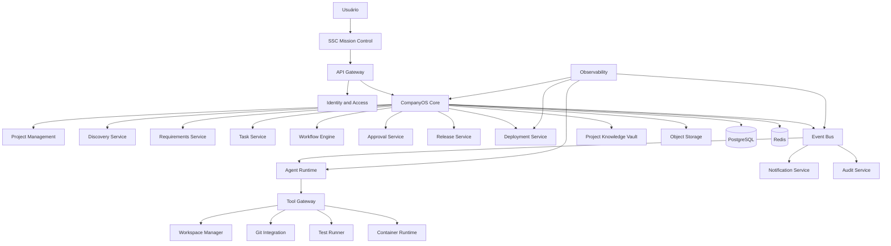

# Arquitetura de Componentes da Stieve Software Company

## Objetivo

Definir a arquitetura detalhada de componentes do CompanyOS e do SSC Mission Control.

Este documento estabelece:

- componentes principais;
- responsabilidades;
- limites;
- interfaces;
- dependências;
- comunicação;
- dados controlados;
- eventos publicados e consumidos;
- requisitos de segurança;
- requisitos de observabilidade;
- critérios de evolução;
- critérios de teste.

A arquitetura deverá permitir que a Stieve Software Company administre múltiplos projetos de software com isolamento, rastreabilidade, segurança e aprovação humana para ações críticas.

---

# Princípios arquiteturais

## Separação de responsabilidades

Cada componente deverá possuir uma responsabilidade principal clara.

Um componente não deverá concentrar:

- regras de domínio;
- persistência;
- execução de agentes;
- autenticação;
- mensageria;
- observabilidade;
- interface de usuário.

## API-first

Toda comunicação externa deverá passar por contratos versionados.

```text
/api/v1
```

## Event-driven

Processos de longa duração e integração entre domínios deverão utilizar eventos sempre que apropriado.

## Isolamento por projeto

Toda operação vinculada a projeto deverá transportar:

```text
organization_id
project_id
correlation_id
actor_id
```

## Segurança por padrão

O acesso deverá aplicar:

```text
autenticação
+
autorização
+
escopo
+
estado
+
risco
+
aprovação
```

## Stateless quando possível

Serviços de API e agentes deverão ser preferencialmente stateless.

O estado persistente deverá permanecer em:

- PostgreSQL;
- armazenamento de objetos;
- Event Bus;
- Knowledge Vault;
- logs;
- auditoria.

## Falhas controladas

Falhas deverão ser:

- registradas;
- correlacionadas;
- classificadas;
- tratadas;
- reenfileiradas quando temporárias;
- encaminhadas para dead-letter queue quando permanentes.

---

# Visão geral



---

# Camadas

## Camada de Experiência

Responsável pela interação com usuários.

Componentes:

- SSC Mission Control;
- documentação interativa;
- painéis operacionais;
- interfaces de aprovação.

## Camada de Entrada

Responsável por receber e controlar requisições.

Componentes:

- API Gateway;
- autenticação;
- rate limiting;
- correlação;
- validação inicial.

## Camada de Domínio

Responsável pelas regras de negócio da empresa.

Componentes:

- CompanyOS Core;
- Project Management;
- Discovery;
- Requirements;
- Tasks;
- Approvals;
- Releases;
- Deployments;
- Incidents.

## Camada de Orquestração

Responsável por processos longos e assíncronos.

Componentes:

- Workflow Engine;
- Event Bus;
- Scheduler;
- Retry Manager;
- Dead-letter Manager.

## Camada de Agentes

Responsável pela execução controlada dos agentes.

Componentes:

- Agent Registry;
- Agent Runtime;
- Tool Gateway;
- Workspace Manager;
- Provider Gateway;
- Execution Sandbox.

## Camada de Dados

Responsável pela persistência.

Componentes:

- PostgreSQL;
- Redis;
- Object Storage;
- Knowledge Vault;
- Audit Store.

## Camada Operacional

Responsável por execução e observabilidade.

Componentes:

- Deployment Manager;
- Infrastructure Manager;
- Metrics;
- Logs;
- Traces;
- Alerts;
- Backups.

---

# SSC Mission Control

## Responsabilidade

Fornecer a interface web para gestão da Stieve Software Company.

## Funções

- autenticação;
- dashboard;
- projetos;
- Discovery;
- referências;
- requisitos;
- backlog;
- agentes;
- tarefas;
- workflows;
- aprovações;
- releases;
- deployments;
- auditoria;
- observabilidade;
- incidentes.

## Dependências

```text
API Gateway
SSE ou WebSocket
serviço de autenticação
```

## Restrições

O Mission Control não deverá:

- acessar diretamente o banco;
- executar comandos;
- acessar workspaces;
- publicar eventos diretamente;
- acessar segredos;
- alterar estado sem API.

## Dados locais

Apenas dados temporários de interface:

- sessão;
- preferências;
- filtros;
- cache visual;
- estado de navegação.

---

# API Gateway

## Responsabilidade

Ser o ponto de entrada oficial da plataforma.

## Funções

- receber requisições;
- validar cabeçalhos;
- validar token;
- aplicar rate limiting;
- gerar ou propagar `correlation_id`;
- direcionar requisições;
- aplicar limites de payload;
- registrar métricas;
- bloquear origens não permitidas.

## Entradas

```text
HTTP
HTTPS
SSE
WebSocket futuro
```

## Saídas

```text
serviços internos
```

## Requisitos

- versionamento;
- CORS controlado;
- limites de tamanho;
- timeouts;
- logs estruturados;
- mascaramento de dados sensíveis.

---

# Identity and Access Service

## Responsabilidade

Gerenciar identidade, sessão, autenticação e autorização.

## Funções

- login;
- refresh token;
- logout;
- revogação de sessão;
- usuários;
- papéis;
- permissões;
- escopos;
- negações explícitas;
- acesso temporário;
- segregação de funções.

## Dados controlados

```text
User
Role
Permission
RolePermission
UserRoleAssignment
AgentPermissionAssignment
PermissionOverride
Session
RefreshToken
```

## Eventos publicados

```text
UserCreated
UserBlocked
UserUnblocked
RoleAssigned
RoleRevoked
PermissionGranted
PermissionRevoked
CriticalAccessAttempted
```

## Restrições

- não armazenar senha em texto puro;
- não retornar hashes;
- invalidar sessões ao bloquear usuário;
- não permitir remoção do último proprietário.

---

# CompanyOS Core

## Responsabilidade

Coordenar as regras centrais da empresa.

## Funções

- validar operações;
- aplicar regras de domínio;
- iniciar workflows;
- criar eventos;
- registrar auditoria;
- aplicar idempotência;
- aplicar concorrência otimista;
- coordenar serviços de domínio.

## Limite

O CompanyOS Core não deverá:

- executar agente diretamente;
- executar shell;
- armazenar arquivo binário;
- realizar deploy diretamente;
- conter lógica de interface.

## Dependências

```text
PostgreSQL
Event Bus
Workflow Engine
Approval Service
Audit Service
Knowledge Vault
```

---

# Project Management Service

## Responsabilidade

Gerenciar o ciclo de vida dos projetos.

## Funções

- criar projeto;
- atualizar metadados;
- administrar membros;
- administrar agentes do projeto;
- pausar;
- retomar;
- arquivar;
- cancelar;
- controlar estados.

## Dados controlados

```text
Project
ProjectMember
ProjectAgent
ProjectSettings
```

## Eventos publicados

```text
ProjectCreated
ProjectUpdated
ProjectApproved
ProjectPaused
ProjectResumed
ProjectArchived
ProjectCancelled
```

## Regras

- todo projeto pertence a uma organização;
- todo recurso de projeto possui `project_id`;
- projeto arquivado não recebe novas tarefas;
- transições passam pela máquina de estados.

---

# Discovery Service

## Responsabilidade

Transformar uma ideia em especificação aprovada.

## Funções

- criar sessão;
- receber referências;
- gerar perguntas;
- registrar respostas;
- extrair requisitos;
- identificar riscos;
- gerar Discovery Report;
- solicitar aprovação.

## Dados controlados

```text
DiscoverySession
InterviewQuestion
InterviewAnswer
DiscoveryReport
ExtractedInformation
```

## Eventos publicados

```text
DiscoveryStarted
InterviewQuestionCreated
InterviewAnswerReceived
RequirementExtracted
DiscoveryReportGenerated
DiscoveryChangesRequested
DiscoveryApproved
```

## Dependências

```text
Reference Service
Knowledge Vault
Agent Runtime
Approval Service
```

---

# Reference Service

## Responsabilidade

Gerenciar arquivos, links e outras fontes de informação.

## Funções

- upload;
- validação;
- hash;
- deduplicação;
- quarentena;
- processamento;
- extração;
- versionamento;
- arquivamento.

## Dados controlados

```text
Reference
ExtractedInformation
```

## Armazenamento

Metadados:

```text
PostgreSQL
```

Binários:

```text
Object Storage
```

## Eventos publicados

```text
ReferenceUploaded
ReferenceProcessingStarted
ReferenceProcessed
ReferenceProcessingFailed
ReferenceQuarantined
ReferenceArchived
```

## Segurança

- validar MIME real;
- limitar tamanho;
- não confiar no nome do arquivo;
- impedir execução;
- aplicar quarentena;
- calcular hash.

---

# Requirements Service

## Responsabilidade

Gerenciar requisitos e rastreabilidade.

## Funções

- criar requisito;
- revisar;
- aprovar;
- rejeitar;
- deprecar;
- vincular referências;
- vincular tarefas;
- validar critérios de aceite.

## Dados controlados

```text
Requirement
RequirementReference
RequirementDependency
```

## Eventos publicados

```text
RequirementCreated
RequirementProposed
RequirementApproved
RequirementRejected
RequirementImplemented
RequirementVerified
RequirementDeprecated
```

---

# Decision Service

## Responsabilidade

Gerenciar decisões arquiteturais, funcionais e operacionais.

## Funções

- criar ADR;
- criar RFC;
- revisar;
- aprovar;
- rejeitar;
- substituir decisão;
- manter histórico.

## Dados controlados

```text
Decision
DecisionRelation
```

## Eventos publicados

```text
DecisionCreated
DecisionSubmitted
DecisionApproved
DecisionRejected
DecisionSuperseded
```

---

# Backlog Service

## Responsabilidade

Gerenciar épicos, histórias e priorização.

## Funções

- criar épicos;
- criar histórias;
- definir critérios de aceite;
- priorizar;
- estimar;
- relacionar requisitos;
- gerar backlog inicial.

## Dados controlados

```text
Epic
UserStory
BacklogPriority
```

## Dependências

```text
Requirements Service
Project Management
Product Manager Agent
```

---

# Task Service

## Responsabilidade

Gerenciar unidades executáveis de trabalho.

## Funções

- criar tarefa;
- validar dependências;
- enfileirar;
- atribuir;
- iniciar;
- bloquear;
- concluir;
- falhar;
- cancelar;
- agendar retry.

## Dados controlados

```text
Task
TaskDependency
TaskAssignment
TaskResult
```

## Eventos publicados

```text
TaskCreated
TaskQueued
TaskAssigned
TaskStarted
TaskBlocked
TaskWaitingApproval
TaskCompleted
TaskFailed
TaskRetryScheduled
TaskCancelled
```

## Regras

- tarefa concluída exige resultado;
- tarefa em execução exige responsável;
- retry respeita limite;
- tarefa concluída é terminal.

---

# Workflow Engine

## Responsabilidade

Executar processos de longa duração com persistência.

## Funções

- criar workflow;
- iniciar;
- persistir etapas;
- pausar;
- retomar;
- aguardar aprovação;
- executar compensação;
- concluir;
- falhar;
- cancelar.

## Dados controlados

```text
Workflow
WorkflowStep
WorkflowDefinition
WorkflowCheckpoint
WorkflowCompensation
```

## Requisitos

- persistência;
- idempotência;
- retry;
- timeout;
- compensação;
- correlação;
- histórico.

## Eventos publicados

```text
WorkflowCreated
WorkflowStarted
WorkflowPaused
WorkflowResumed
WorkflowWaitingApproval
WorkflowCompleted
WorkflowFailed
WorkflowCancelled
```

---

# Approval Service

## Responsabilidade

Gerenciar decisões humanas obrigatórias.

## Funções

- criar solicitação;
- atribuir aprovador;
- aprovar;
- rejeitar;
- expirar;
- cancelar;
- invalidar aprovação após alteração do recurso.

## Dados controlados

```text
ApprovalRequest
ApprovalDecision
ApprovalPolicy
```

## Eventos publicados

```text
HumanApprovalRequested
HumanApprovalGranted
HumanApprovalRejected
HumanApprovalExpired
HumanApprovalCancelled
```

## Regras

- aprovação não substitui permissão;
- apenas estado `PENDING` recebe decisão;
- recurso alterado invalida aprovação;
- segregação de funções deve ser validada.

---

# Agent Registry

## Responsabilidade

Manter o catálogo de agentes e suas capacidades.

## Funções

- registrar definição;
- registrar instância;
- configurar modelo;
- configurar ferramentas;
- configurar limites;
- acompanhar heartbeat;
- bloquear agente.

## Dados controlados

```text
AgentDefinition
AgentInstance
AgentCapability
AgentToolPolicy
AgentResourceLimit
```

---

# Agent Runtime

## Responsabilidade

Executar agentes de forma controlada e isolada.

## Funções

- reservar agente;
- carregar contexto;
- iniciar execução;
- solicitar ferramentas;
- registrar consumo;
- aguardar aprovação;
- registrar resultado;
- liberar agente.

## Dados controlados

```text
AgentExecution
AgentExecutionStep
AgentUsage
AgentContextManifest
```

## Dependências

```text
Provider Gateway
Tool Gateway
Workspace Manager
Task Service
Workflow Engine
Event Bus
Audit Service
```

## Restrições

- sem shell irrestrito;
- sem acesso entre projetos;
- sem acesso direto a segredos;
- sem deploy direto em produção;
- sem alteração da própria permissão.

---

# Provider Gateway

## Responsabilidade

Abstrair provedores de IA.

## Funções

- selecionar provedor;
- selecionar modelo;
- enviar prompt;
- aplicar timeout;
- aplicar limite;
- registrar consumo;
- fallback;
- normalizar respostas.

## Provedores iniciais

```text
Ollama
```

## Provedores futuros

```text
outros servidores locais
APIs externas opcionais
```

## Interface

```text
generate
stream
embed
health
models
```

## Regras

- nenhum domínio depende diretamente de um modelo;
- o modelo é selecionado por política;
- falha temporária pode permitir fallback;
- consumo deverá ser auditável.

---

# Tool Gateway

## Responsabilidade

Controlar as ferramentas usadas pelos agentes.

## Ferramentas previstas

```text
file.read
file.write
git.status
git.diff
git.branch.create
git.commit
test.execute
container.run
database.read
database.migrate
artifact.create
```

## Funções

- validar permissão;
- validar escopo;
- validar caminho;
- validar comando;
- solicitar aprovação quando necessário;
- executar;
- registrar evidência;
- devolver resultado.

## Regras

- toda ferramenta possui política própria;
- toda execução possui timeout;
- caminhos permitidos são explícitos;
- comandos bloqueados são explícitos;
- saída sensível deve ser mascarada.

---

# Workspace Manager

## Responsabilidade

Criar e administrar workspaces isolados.

## Estrutura recomendada

```text
/workspaces/
└── {organization_id}/
    └── {project_id}/
        ├── repository/
        ├── artifacts/
        ├── temp/
        └── executions/
```

## Funções

- criar workspace;
- preparar repositório;
- controlar permissões;
- criar diretório de execução;
- limpar temporários;
- preservar artefatos;
- impedir acesso externo ao projeto.

## Regras

- nenhum caminho pode escapar do workspace;
- cada execução possui diretório próprio;
- arquivos temporários possuem retenção;
- segredos não ficam no workspace.

---

# Git Integration Service

## Responsabilidade

Executar operações Git controladas.

## Funções

- clone;
- fetch;
- branch;
- status;
- diff;
- commit;
- tag;
- push autorizado;
- leitura de histórico.

## Regras

- proibir `push --force` na branch principal;
- commits deverão incluir tarefa;
- branch deverá possuir padrão;
- credenciais devem ser obtidas por mecanismo seguro;
- ações devem ser auditadas.

---

# Test Runner

## Responsabilidade

Executar testes controlados.

## Tipos

```text
UNIT
INTEGRATION
END_TO_END
REGRESSION
PERFORMANCE
SECURITY
SMOKE
```

## Funções

- preparar ambiente;
- executar comando permitido;
- coletar saída;
- calcular cobertura;
- armazenar relatório;
- publicar resultado.

## Eventos

```text
TestSuiteQueued
TestSuiteStarted
TestSuitePassed
TestSuiteFailed
CoverageCalculated
```

---

# Execution Sandbox

## Responsabilidade

Executar tarefas técnicas em isolamento.

## Tecnologia inicial

```text
containers
```

## Controles

- CPU;
- memória;
- GPU;
- disco;
- rede;
- timeout;
- usuário não privilegiado;
- filesystem;
- capabilities;
- logs.

## Restrições

- sem modo privilegiado;
- sem acesso ao socket Docker;
- sem acesso ao host;
- sem acesso a outros projetos;
- sem segredos persistentes.

---

# Release Service

## Responsabilidade

Gerenciar versões entregáveis.

## Funções

- criar release;
- validar;
- associar commit;
- associar artefatos;
- associar testes;
- associar segurança;
- solicitar aprovação;
- publicar;
- depreciar.

## Dados controlados

```text
Release
ReleaseArtifact
ReleaseValidation
ReleaseApproval
```

## Eventos publicados

```text
ReleaseCreated
ReleaseValidationStarted
ReleaseValidationPassed
ReleaseValidationFailed
ReleaseApproved
ReleaseRejected
ReleasePublished
ReleaseDeprecated
```

---

# Deployment Service

## Responsabilidade

Gerenciar deployments e rollbacks.

## Funções

- solicitar deployment;
- validar release;
- solicitar aprovação;
- executar;
- acompanhar;
- executar health check;
- registrar sucesso;
- registrar falha;
- executar rollback.

## Dados controlados

```text
Deployment
DeploymentStep
DeploymentLog
HealthCheck
RollbackPlan
```

## Ambientes

```text
DEVELOPMENT
TESTING
STAGING
PRODUCTION
```

## Regras

- produção exige aprovação humana;
- release deve estar aprovada;
- versão anterior deve ser conhecida;
- falha crítica deve permitir rollback;
- deployment concluído é imutável.

---

# Incident Service

## Responsabilidade

Gerenciar incidentes operacionais e de segurança.

## Funções

- registrar;
- classificar;
- atribuir;
- investigar;
- conter;
- resolver;
- reabrir;
- fechar;
- gerar postmortem.

## Dados controlados

```text
Incident
IncidentEvidence
IncidentAction
Postmortem
```

## Eventos publicados

```text
IncidentCreated
IncidentAssigned
IncidentContained
IncidentResolved
IncidentReopened
IncidentClosed
```

---

# Event Bus

## Responsabilidade

Transportar eventos entre componentes.

## Tecnologia inicial

```text
RabbitMQ
```

## Conceitos

```text
exchange
queue
routing key
consumer
dead-letter queue
retry queue
outbox
```

## Requisitos

- persistência;
- confirmação;
- idempotência;
- versionamento;
- retry;
- DLQ;
- correlação;
- monitoramento.

## Regra principal

A publicação deverá usar:

```text
Transactional Outbox
```

---

# Scheduler

## Responsabilidade

Disparar tarefas futuras e recorrentes internas.

## Usos

- expirar aprovações;
- verificar heartbeats;
- agendar retry;
- limpar temporários;
- executar retenção;
- verificar health checks;
- criar backups.

## Regras

- execução idempotente;
- bloqueio distribuído quando necessário;
- auditoria;
- limite de concorrência.

---

# Notification Service

## Responsabilidade

Entregar notificações aos usuários.

## Canais iniciais

```text
Mission Control
SSE
```

## Canais futuros

```text
e-mail
mensageria externa
webhooks autorizados
```

## Eventos consumidos

```text
HumanApprovalRequested
TaskBlocked
DeploymentFailed
SecurityFindingConfirmed
IncidentCreated
```

---

# Project Knowledge Vault

## Responsabilidade

Armazenar o conhecimento persistente de cada projeto.

## Conteúdos

- ideia original;
- referências;
- respostas;
- requisitos;
- regras;
- decisões;
- arquitetura;
- backlog;
- conhecimento do código;
- testes;
- releases;
- incidentes;
- lições aprendidas.

## Dados controlados

```text
KnowledgeItem
KnowledgeVersion
KnowledgeRelation
EmbeddingReference
```

## Regras

- isolamento por projeto;
- versionamento;
- rastreabilidade;
- origem obrigatória;
- atualização controlada;
- itens aprovados não são alterados silenciosamente.

---

# Object Storage

## Responsabilidade

Armazenar objetos binários.

## Tecnologia inicial

```text
MinIO ou compatível
```

## Conteúdos

- referências;
- artefatos;
- relatórios;
- logs grandes;
- exports;
- backups;
- postmortems.

## Regras

- nomes físicos não usam nome original;
- hash;
- versionamento quando necessário;
- política de retenção;
- acesso por URL controlada;
- criptografia quando disponível.

---

# PostgreSQL

## Responsabilidade

Ser a fonte principal dos dados estruturados.

## Conteúdos

- usuários;
- papéis;
- projetos;
- requisitos;
- tarefas;
- workflows;
- aprovações;
- agentes;
- releases;
- deployments;
- eventos;
- auditoria;
- conhecimento estruturado.

## Requisitos

- migrações Alembic;
- integridade referencial;
- transações;
- índices;
- backups;
- recuperação;
- versionamento otimista.

---

# Redis

## Responsabilidade

Armazenar dados temporários e de alto acesso.

## Usos

- cache;
- sessão temporária;
- rate limiting;
- locks;
- presença;
- progresso temporário.

## Regra

Redis não será fonte definitiva de dados críticos.

---

# Audit Service

## Responsabilidade

Registrar ações auditáveis de forma imutável.

## Dados controlados

```text
AuditLog
AuthorizationDecision
CriticalOperationRecord
```

## Funções

- registrar ação;
- registrar decisão de acesso;
- registrar antes e depois;
- exportar;
- aplicar retenção;
- proteger integridade.

## Restrições

- usuários comuns não alteram auditoria;
- agentes não removem auditoria;
- segredos devem ser mascarados.

---

# Observability Service

## Responsabilidade

Fornecer visibilidade operacional.

## Pilares

```text
metrics
logs
traces
alerts
```

## Tecnologias previstas

```text
Prometheus
Grafana
Loki
OpenTelemetry futuro
```

## Requisitos

Todo serviço deverá expor:

- health;
- readiness;
- métricas;
- logs estruturados;
- correlation ID;
- versão;
- dependências.

---

# Configuration Service

## Responsabilidade

Gerenciar configuração da plataforma.

## Tipos de configuração

```text
SYSTEM
ORGANIZATION
PROJECT
ENVIRONMENT
AGENT
WORKFLOW
```

## Regras

- configuração sensível não fica em texto puro;
- alterações críticas exigem auditoria;
- configuração possui versão;
- validação de schema;
- fallback seguro.

---

# Secret Management

## Responsabilidade

Fornecer segredos temporários aos componentes autorizados.

## Segredos

- credenciais Git;
- tokens;
- senhas de banco;
- chaves externas;
- certificados.

## Regras

- nunca armazenar em repositório;
- nunca registrar em log;
- acesso por identidade;
- entrega temporária;
- rotação;
- revogação;
- auditoria.

Na primeira versão, poderá utilizar mecanismo simples protegido, desde que a interface permita evolução para um cofre dedicado.

---

# Plugin System

## Responsabilidade

Permitir extensão controlada da plataforma.

## Tipos de plugin

```text
TOOL
EVENT_CONSUMER
AI_PROVIDER
NOTIFICATION
STORAGE
INTEGRATION
WORKFLOW_STEP
```

## Requisitos

- manifesto;
- versão;
- permissões;
- capacidades;
- compatibilidade;
- assinatura futura;
- isolamento;
- auditoria.

## Restrições

Plugins não deverão:

- acessar tudo por padrão;
- alterar políticas;
- acessar segredos sem permissão;
- executar no host sem isolamento;
- ignorar contratos.

---

# Relações de dependência

## Dependências permitidas

```text
Mission Control → API Gateway
API Gateway → Services
Services → Domain
Domain → Repositories
Domain → Event Publisher
Workflow Engine → Domain APIs
Agent Runtime → Tool Gateway
Tool Gateway → Sandboxes
```

## Dependências proibidas

```text
Mission Control → Database
Agent → Database direto
Agent → Production direto
Plugin → Host irrestrito
Service → outro banco privado
Domain → framework de interface
```

---

# Comunicação síncrona

Usar quando:

- resposta imediata é necessária;
- operação é curta;
- validação é obrigatória;
- consulta é simples.

Tecnologia:

```text
HTTP interno
```

---

# Comunicação assíncrona

Usar quando:

- processo é longo;
- retry é necessário;
- múltiplos consumidores;
- desacoplamento;
- aprovação futura;
- execução de agente;
- processamento de referência;
- release;
- deployment.

Tecnologia:

```text
Event Bus
```

---

# Propriedade dos dados

Cada entidade deverá possuir um único componente proprietário.

Outros componentes deverão acessar por:

- API;
- evento;
- projeção autorizada.

Exemplo:

```text
Task Service é proprietário de Task.
Agent Runtime não altera Task diretamente.
Agent Runtime publica resultado.
Task Service valida e atualiza Task.
```

---

# Transações distribuídas

Transações entre serviços não deverão depender de transação global.

Estratégias:

- workflow;
- saga;
- compensação;
- idempotência;
- transactional outbox.

---

# Isolamento

## Organização

Todos os recursos pertencem a uma organização.

## Projeto

Recursos de projeto possuem `project_id`.

## Workspace

Cada projeto possui workspace separado.

## Execução

Cada execução possui diretório e container próprios.

## Dados

Consultas deverão sempre filtrar organização e projeto.

## Eventos

Eventos deverão transportar organização e projeto quando aplicável.

---

# Segurança entre componentes

Cada comunicação deverá possuir:

- identidade;
- autenticação;
- autorização;
- escopo;
- TLS quando aplicável;
- timeout;
- correlação;
- auditoria para ação crítica.

---

# Observabilidade mínima por componente

Cada componente deverá expor:

```text
service_name
service_version
environment
status
uptime
request_count
error_count
latency
dependency_status
```

Agentes deverão expor adicionalmente:

```text
current_state
active_execution
last_heartbeat
resource_usage
```

Filas deverão expor:

```text
queue_depth
consumer_count
retry_count
dead_letter_count
oldest_message_age
```

---

# Implantação inicial

A primeira implantação será em uma única VM Ubuntu Server.

## Docker Compose

Serviços iniciais previstos:

```text
mission-control
api-gateway
companyos-api
workflow-engine
agent-runtime
postgres
rabbitmq
redis
minio
prometheus
grafana
loki
ollama
```

Alguns componentes de domínio poderão iniciar como módulos internos do `companyos-api`.

---

# Modular Monolith inicial

A implementação inicial deverá priorizar um monólito modular para o CompanyOS Core.

Motivos:

- menor complexidade operacional;
- desenvolvimento mais rápido;
- transações locais;
- observabilidade mais simples;
- equipe inicial pequena.

Módulos internos:

```text
identity
projects
discovery
references
requirements
decisions
backlog
tasks
workflows
approvals
agents
releases
deployments
audit
knowledge
incidents
```

---

# Evolução para serviços separados

Um módulo poderá ser extraído quando houver:

- escala independente;
- carga elevada;
- necessidade de isolamento;
- tecnologia distinta;
- risco operacional;
- ciclo de deploy diferente;
- fronteira de domínio estável.

A extração deverá preservar contratos e eventos.

---

# Critérios de decisão de tecnologia

Toda tecnologia deverá ser avaliada por:

- licença;
- custo;
- maturidade;
- manutenção;
- segurança;
- documentação;
- comunidade;
- compatibilidade;
- observabilidade;
- execução local;
- possibilidade de migração.

---

# Testes arquiteturais

## Testes de dependência

Validar que:

- domínio não depende da interface;
- agentes não acessam banco;
- módulos não acessam dados privados diretamente;
- plugins respeitam contratos.

## Testes de isolamento

Validar que:

- projeto A não acessa projeto B;
- agente A não usa workspace B;
- evento incorreto é rejeitado;
- permissão de projeto é aplicada.

## Testes de resiliência

Validar:

- RabbitMQ indisponível;
- Redis indisponível;
- Ollama indisponível;
- MinIO indisponível;
- timeout;
- retry;
- DLQ;
- rollback.

## Testes de segurança

Validar:

- comando bloqueado;
- caminho bloqueado;
- segredo mascarado;
- produção sem aprovação;
- token inválido;
- agente sem permissão.

---

# Critérios de aceite da Sprint

Este documento será considerado aprovado quando:

- componentes principais estiverem definidos;
- responsabilidades estiverem separadas;
- dependências permitidas estiverem claras;
- dependências proibidas estiverem claras;
- propriedade dos dados estiver definida;
- comunicação síncrona e assíncrona estiver definida;
- isolamento estiver incorporado;
- Agent Runtime estiver delimitado;
- Tool Gateway estiver delimitado;
- Workflow Engine estiver delimitado;
- Event Bus estiver delimitado;
- Knowledge Vault estiver delimitado;
- segurança entre componentes estiver definida;
- observabilidade mínima estiver definida;
- estratégia de implantação inicial estiver definida;
- evolução de monólito modular para serviços estiver prevista.
