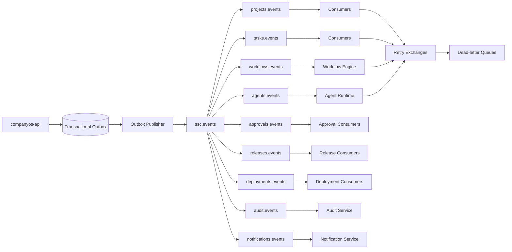

# Arquitetura do Event Bus da Stieve Software Company

## Objetivo

Definir a arquitetura oficial de eventos do CompanyOS.

Este documento estabelece:

- tecnologia inicial;
- topologia do Event Bus;
- exchanges;
- filas;
- routing keys;
- contratos de eventos;
- versionamento;
- publicação;
- consumo;
- idempotência;
- retry;
- dead-letter queue;
- transactional outbox;
- segurança;
- observabilidade;
- governança;
- critérios de teste.

O Event Bus será responsável por desacoplar componentes, coordenar processos assíncronos e permitir rastreabilidade entre projetos, agentes, workflows e serviços.

---

# Princípios

## Eventos representam fatos

Um evento representa algo que já ocorreu.

Exemplos:

```text
ProjectCreated
TaskQueued
DiscoveryApproved
ReleasePublished
DeploymentFailed
```

Eventos não deverão ser nomeados como comandos.

Exemplo incorreto:

```text
CreateProject
```

Exemplo correto:

```text
ProjectCreated
```

## Eventos são imutáveis

Após publicação, um evento não poderá ser alterado.

Correções deverão gerar:

- novo evento;
- nova versão;
- evento de compensação;
- evento de correção explicitamente relacionado.

## Entrega pelo menos uma vez

A arquitetura inicial assumirá:

```text
at-least-once delivery
```

Isso significa que consumidores poderão receber a mesma mensagem mais de uma vez.

Portanto, todo consumidor deverá ser idempotente.

## Desacoplamento

Produtores não deverão depender da implementação dos consumidores.

O produtor conhece:

```text
event_type
event_version
routing_key
schema
```

O produtor não conhece:

```text
quantidade de consumidores
tecnologia do consumidor
banco do consumidor
forma de processamento interno
```

## Correlação

Todo evento deverá transportar:

```text
event_id
correlation_id
causation_id
```

## Isolamento

Eventos de projeto deverão transportar:

```text
organization_id
project_id
```

## Segurança

Eventos não deverão conter:

- senhas;
- tokens;
- chaves privadas;
- segredos;
- conteúdo binário;
- dados pessoais desnecessários;
- stack traces completos.

---

# Tecnologia inicial

A tecnologia inicial será:

```text
RabbitMQ
```

Motivos:

- open source;
- execução local;
- maturidade;
- filas persistentes;
- exchanges;
- acknowledgements;
- dead-letter exchanges;
- prioridades;
- observabilidade;
- integração simples com Python.

---

# Responsabilidades do Event Bus

O Event Bus deverá:

- transportar eventos;
- transportar comandos assíncronos controlados;
- separar produtores e consumidores;
- suportar retry;
- suportar DLQ;
- suportar múltiplos consumidores;
- manter rastreabilidade;
- permitir escalabilidade;
- expor métricas;
- preservar ordem quando exigida por chave de negócio.

O Event Bus não deverá:

- ser banco de dados principal;
- armazenar domínio permanentemente;
- substituir auditoria;
- substituir o Workflow Engine;
- conter regras de negócio;
- expor RabbitMQ diretamente ao Mission Control.

---

# Visão geral



---

# Tipos de mensagem

## Domain Event

Representa uma alteração concluída no domínio.

Exemplos:

```text
ProjectCreated
RequirementApproved
TaskCompleted
ReleasePublished
```

## Integration Event

Representa um fato publicado para outros serviços.

Pode ser derivado de um evento de domínio.

## Command Message

Solicita execução assíncrona de uma ação.

Exemplos:

```text
ProcessReference
ExecuteTask
GenerateDiscoveryReport
RunTestSuite
PrepareRelease
```

Comandos deverão ser enviados para uma fila com um responsável claro.

## Notification Message

Solicita entrega de notificação.

Exemplo:

```text
DeliverUserNotification
```

## System Event

Representa condição operacional.

Exemplos:

```text
ServiceUnhealthy
AgentHeartbeatExpired
StorageLow
```

---

# Convenção de nomes

## Event type

Formato:

```text
PascalCase
```

Exemplos:

```text
ProjectCreated
TaskFailed
DeploymentCompleted
```

## Routing key

Formato:

```text
<domain>.<resource>.<event>
```

Exemplos:

```text
projects.project.created
tasks.task.completed
agents.execution.failed
deployments.deployment.started
```

## Command routing key

Formato:

```text
commands.<domain>.<action>
```

Exemplos:

```text
commands.references.process
commands.agents.execute
commands.tests.run
commands.deployments.start
```

## Nome das filas

Formato:

```text
<consumer>.<purpose>.v<version>
```

Exemplos:

```text
workflow-engine.tasks.v1
agent-runtime.executions.v1
notification-service.approvals.v1
audit-service.events.v1
```

## Exchanges

Formato:

```text
ssc.<purpose>
```

Exemplos:

```text
ssc.events
ssc.commands
ssc.retry
ssc.dead-letter
```

---

# Exchanges

## `ssc.events`

Tipo:

```text
topic
```

Responsabilidade:

- distribuir eventos de domínio e integração.

## `ssc.commands`

Tipo:

```text
direct
```

Responsabilidade:

- entregar comandos a um responsável específico.

## `ssc.retry`

Tipo:

```text
topic
```

Responsabilidade:

- receber mensagens temporariamente atrasadas.

## `ssc.dead-letter`

Tipo:

```text
topic
```

Responsabilidade:

- receber mensagens que excederam tentativas ou não podem ser processadas.

## `ssc.notifications`

Tipo:

```text
topic
```

Responsabilidade:

- distribuir notificações quando houver necessidade de separação operacional.

---

# Estrutura padrão do evento

```json
{
  "event_id": "evt_01JABC123",
  "event_type": "TaskCompleted",
  "event_version": 1,
  "occurred_at": "2026-08-02T21:00:00Z",
  "published_at": "2026-08-02T21:00:01Z",
  "source": "companyos-api",
  "environment": "development",
  "organization_id": "org_01",
  "project_id": "prj_01",
  "correlation_id": "cor_01",
  "causation_id": "evt_00",
  "actor": {
    "type": "AGENT",
    "id": "agt_01"
  },
  "subject": {
    "type": "task",
    "id": "tsk_01",
    "version": 8
  },
  "payload": {
    "result_summary": "Implementação concluída."
  },
  "metadata": {
    "schema": "events/tasks/TaskCompleted.v1.json"
  }
}
```

---

# Campos obrigatórios

```text
event_id
event_type
event_version
occurred_at
source
environment
correlation_id
actor
subject
payload
metadata
```

## Campos condicionais

```text
organization_id
project_id
causation_id
published_at
```

Eventos globais poderão não possuir `project_id`.

---

# `event_id`

Formato recomendado:

```text
evt_<ulid>
```

O identificador deverá ser único globalmente.

---

# `event_version`

Versão inteira positiva.

Exemplo:

```text
1
```

Alterações incompatíveis deverão incrementar a versão.

---

# `correlation_id`

Relaciona todas as operações de um mesmo fluxo.

Exemplo:

```text
criação do projeto
→ Discovery
→ aprovação
→ planejamento
```

Todos os eventos do fluxo poderão compartilhar o mesmo `correlation_id`.

---

# `causation_id`

Indica qual evento ou comando causou a mensagem atual.

Exemplo:

```text
TaskCompleted
causation_id = ExecuteTask.command_id
```

---

# Actor

Estrutura:

```json
{
  "type": "USER",
  "id": "usr_01"
}
```

Tipos:

```text
USER
AGENT
SERVICE
SYSTEM
```

---

# Subject

Identifica o recurso principal do evento.

```json
{
  "type": "project",
  "id": "prj_01",
  "version": 4
}
```

---

# Payload

O payload deverá conter apenas dados necessários ao consumidor.

Evitar publicar o recurso inteiro quando não for necessário.

Exemplo adequado:

```json
{
  "previous_state": "RUNNING",
  "current_state": "COMPLETED",
  "result_id": "res_01"
}
```

---

# Metadata

Informações técnicas adicionais.

Exemplos:

```text
schema
trace_id
retry_count
content_type
producer_version
```

---

# Estrutura padrão de comando

```json
{
  "command_id": "cmd_01JABC123",
  "command_type": "ExecuteTask",
  "command_version": 1,
  "requested_at": "2026-08-02T21:00:00Z",
  "source": "workflow-engine",
  "environment": "development",
  "organization_id": "org_01",
  "project_id": "prj_01",
  "correlation_id": "cor_01",
  "causation_id": "evt_01",
  "actor": {
    "type": "SYSTEM",
    "id": "workflow-engine"
  },
  "target": {
    "type": "agent-runtime"
  },
  "payload": {
    "task_id": "tsk_01",
    "agent_id": "agt_01"
  },
  "metadata": {
    "schema": "commands/agents/ExecuteTask.v1.json"
  }
}
```

---

# Catálogo inicial de domínios

```text
identity
organizations
projects
discovery
references
requirements
decisions
backlog
tasks
workflows
agents
approvals
tests
security
releases
deployments
incidents
knowledge
audit
infrastructure
notifications
```

---

# Filas iniciais

## Workflow Engine

```text
workflow-engine.commands.v1
workflow-engine.events.v1
workflow-engine.approvals.v1
```

## Agent Runtime

```text
agent-runtime.commands.v1
agent-runtime.tasks.v1
agent-runtime.events.v1
```

## Reference Worker

```text
reference-worker.commands.v1
reference-worker.retry.v1
```

## Notification Service

```text
notification-service.events.v1
```

## Audit Service

```text
audit-service.events.v1
```

## Release Worker

```text
release-worker.commands.v1
```

## Deployment Worker

```text
deployment-worker.commands.v1
```

---

# Bindings

Exemplo:

```text
queue: workflow-engine.events.v1
exchange: ssc.events
routing keys:
  tasks.task.completed
  tasks.task.failed
  approvals.approval.granted
  approvals.approval.rejected
```

Exemplo:

```text
queue: notification-service.events.v1
exchange: ssc.events
routing keys:
  approvals.approval.requested
  tasks.task.blocked
  deployments.deployment.failed
  incidents.incident.created
```

---

# Transactional Outbox

## Problema resolvido

Sem outbox, pode ocorrer:

```text
banco atualizado
+
evento não publicado
```

ou:

```text
evento publicado
+
banco não atualizado
```

## Estratégia

Na mesma transação do domínio:

```text
1. altera recurso
2. registra auditoria
3. grava evento na outbox
4. confirma transação
```

Depois:

```text
5. publicador lê a outbox
6. publica no RabbitMQ
7. marca como publicado
```

---

# Tabela de outbox

Campos mínimos:

```text
id
event_id
event_type
event_version
aggregate_type
aggregate_id
payload
headers
status
attempt_count
available_at
created_at
published_at
last_error
```

Estados:

```text
PENDING
PROCESSING
PUBLISHED
FAILED
```

---

# Outbox Publisher

## Responsabilidade

Publicar eventos pendentes.

## Regras

- buscar em lotes;
- usar lock seguro;
- publicar com confirmação;
- atualizar somente após confirmação;
- aplicar retry;
- não duplicar intencionalmente;
- manter idempotência do consumidor.

---

# Publisher confirms

O produtor deverá aguardar confirmação do RabbitMQ.

Sem confirmação:

```text
evento permanece pendente
```

Com confirmação:

```text
evento pode ser marcado como publicado
```

---

# Inbox do consumidor

Consumidores críticos deverão manter registro de mensagens processadas.

Campos:

```text
consumer_name
message_id
processed_at
result
```

Ao receber mensagem repetida:

```text
se já processada
  confirmar mensagem
  não repetir efeito
```

---

# Acknowledgement

## Ack

Enviar após processamento bem-sucedido.

## Nack com requeue

Usar somente em falha temporária controlada.

Evitar loops imediatos.

## Reject sem requeue

Usar quando:

- payload inválido;
- versão incompatível;
- regra permanente;
- mensagem corrompida.

A mensagem deverá seguir para DLQ quando configurado.

---

# Retry

## Estratégia

Usar filas de retry com TTL.

Exemplo:

```text
retry.10s
retry.1m
retry.5m
retry.30m
```

Fluxo:

```text
consumer falha
→ publica em retry
→ TTL expira
→ retorna para fila original
```

## Tentativas

Campos:

```text
retry_count
first_failed_at
last_failed_at
last_error_code
```

## Backoff

Exemplo inicial:

```text
10 segundos
1 minuto
5 minutos
30 minutos
```

O número máximo deverá ser configurável por tipo de mensagem.

---

# Erros temporários

Exemplos:

```text
DATABASE_UNAVAILABLE
AI_PROVIDER_UNAVAILABLE
OBJECT_STORAGE_UNAVAILABLE
UPSTREAM_TIMEOUT
SERVICE_UNAVAILABLE
```

Podem permitir retry.

---

# Erros permanentes

Exemplos:

```text
VALIDATION_ERROR
PERMISSION_DENIED
INVALID_STATE_TRANSITION
EVENT_VERSION_UNSUPPORTED
RESOURCE_NOT_FOUND
```

Não deverão entrar em retry automático indefinido.

---

# Dead-letter queue

## Responsabilidade

Armazenar mensagens não processadas.

## Motivos

- tentativas excedidas;
- payload inválido;
- versão não suportada;
- falha permanente;
- consumidor indisponível por período excessivo.

## Filas

```text
dlq.workflow-engine.v1
dlq.agent-runtime.v1
dlq.references.v1
dlq.notifications.v1
dlq.audit.v1
dlq.releases.v1
dlq.deployments.v1
```

---

# Reprocessamento da DLQ

Requer:

- permissão;
- motivo;
- análise do erro;
- validação do schema;
- verificação de idempotência;
- auditoria.

Fluxo:

```text
selecionar mensagem
→ revisar erro
→ corrigir causa
→ autorizar reprocessamento
→ publicar novamente
→ registrar resultado
```

---

# Poison message

Mensagem que sempre falha.

Deverá ser:

- identificada;
- removida da fila normal;
- enviada para DLQ;
- exibida no Mission Control;
- investigada.

---

# Ordenação

RabbitMQ preserva ordem dentro de uma fila, mas múltiplos consumidores podem alterar a ordem efetiva.

Quando a ordem for crítica:

- usar uma fila por chave lógica;
- usar somente um consumidor;
- aplicar versionamento otimista;
- rejeitar eventos antigos;
- controlar sequência no consumidor.

Exemplo:

```text
subject.version
```

O consumidor poderá rejeitar uma atualização com versão anterior.

---

# Prioridade

Filas de prioridade deverão ser usadas com cuidado.

Casos possíveis:

```text
incidente crítico
rollback
falha de produção
aprovação urgente
```

Evitar prioridade em todas as filas.

---

# Tamanho de mensagem

Eventos deverão ser pequenos.

Limite inicial recomendado:

```text
256 KB
```

Conteúdo maior deverá ser armazenado no Object Storage.

O evento transportará:

```text
storage_key
hash
content_type
size
```

---

# Binários

Nunca publicar binários diretamente no Event Bus.

Exemplo correto:

```json
{
  "reference_id": "ref_01",
  "storage_key": "references/org_01/prj_01/ref_01",
  "file_hash": "sha256:..."
}
```

---

# Versionamento de eventos

## Mudança compatível

Pode permanecer na mesma versão:

- adicionar campo opcional;
- adicionar metadata;
- adicionar valor não bloqueante quando consumidores toleram desconhecidos.

## Mudança incompatível

Exige nova versão:

- remover campo;
- renomear campo;
- alterar tipo;
- mudar significado;
- tornar campo opcional obrigatório;
- alterar estrutura do payload.

---

# Convivência de versões

Durante migração poderão existir:

```text
TaskCompleted v1
TaskCompleted v2
```

Consumidores deverão declarar versões suportadas.

---

# Schemas

Estrutura recomendada:

```text
events/
├── projects/
│   ├── ProjectCreated.v1.json
│   └── ProjectUpdated.v1.json
├── tasks/
│   ├── TaskQueued.v1.json
│   ├── TaskCompleted.v1.json
│   └── TaskFailed.v1.json
├── agents/
├── workflows/
├── approvals/
├── releases/
└── deployments/
```

---

# JSON Schema

Cada evento deverá possuir JSON Schema.

Validação deverá ocorrer:

- antes da publicação;
- opcionalmente no consumo;
- no pipeline;
- nos testes de contrato.

---

# Registro de schemas

Na primeira versão, os schemas ficarão no repositório.

Evolução futura:

```text
schema registry
```

---

# Segurança

## Usuários do RabbitMQ

Cada serviço deverá possuir credencial própria.

Exemplos:

```text
companyos-api
workflow-engine
agent-runtime
notification-service
audit-service
```

## Permissões

Cada identidade deverá ter acesso somente aos recursos necessários.

Exemplo:

```text
companyos-api:
  publish → ssc.events
  publish → ssc.commands
  consume → filas específicas
```

## Rede

RabbitMQ deverá permanecer em rede interna.

Não deverá ser exposto diretamente à internet.

## TLS

Deverá ser usado quando houver comunicação fora do host ou ambiente sensível.

---

# Virtual hosts

Estratégia inicial:

```text
/development
/testing
/staging
/production
```

Ambientes não deverão compartilhar mensagens.

---

# Isolamento de projetos

A separação física de fila por projeto não será padrão inicial.

O isolamento ocorrerá por:

- `organization_id`;
- `project_id`;
- autorização do consumidor;
- validação;
- escopo;
- auditoria.

Filas por projeto poderão ser usadas em casos especiais de carga ou confidencialidade.

---

# Observabilidade

## Métricas

```text
messages_published_total
messages_consumed_total
messages_failed_total
messages_retried_total
messages_dead_lettered_total
queue_depth
oldest_message_age_seconds
consumer_count
publish_latency_seconds
processing_duration_seconds
```

## Logs

Campos:

```text
event_id
event_type
event_version
routing_key
queue
consumer
correlation_id
organization_id
project_id
retry_count
result
error_code
```

## Alertas

Exemplos:

- fila crescendo continuamente;
- consumidor ausente;
- DLQ com mensagens;
- mensagem antiga;
- alta taxa de falha;
- publicação falhando;
- conexão indisponível.

---

# Painel no Mission Control

A Sala de Operações deverá exibir:

- exchanges;
- filas;
- profundidade;
- consumidores;
- retries;
- DLQs;
- mensagem mais antiga;
- taxa de processamento;
- falhas recentes;
- correlação.

A interface não deverá mostrar payload sensível sem permissão.

---

# Health check

Serviços dependentes do Event Bus deverão avaliar:

```text
conexão
canal
publicação
consumo
fila obrigatória
```

A indisponibilidade poderá afetar readiness conforme a criticidade do serviço.

---

# Inicialização

Ao iniciar, o componente responsável deverá declarar:

- exchanges;
- queues;
- bindings;
- DLXs;
- políticas;
- TTLs;
- limites.

A declaração deverá ser idempotente.

---

# Configuração como código

A topologia deverá ser versionada.

Estrutura possível:

```text
messaging/
├── topology.yaml
├── exchanges.yaml
├── queues.yaml
├── bindings.yaml
├── retry-policies.yaml
└── schemas/
```

---

# Governança

## Novo evento

Deverá incluir:

- nome;
- domínio;
- finalidade;
- produtor;
- consumidores;
- routing key;
- versão;
- schema;
- exemplo;
- classificação de dados;
- retenção;
- testes.

## Alteração de evento

Deverá incluir:

- compatibilidade;
- impacto;
- consumidores afetados;
- plano de migração;
- versão;
- aprovação técnica.

---

# Relação com o Workflow Engine

O Event Bus transporta mensagens.

O Workflow Engine controla:

- sequência;
- estado;
- compensação;
- espera;
- decisão;
- timeout.

O Event Bus não deverá ser usado como substituto de estado do workflow.

---

# Relação com a auditoria

A auditoria registra ações relevantes.

O Event Bus transporta eventos.

Nem todo evento é automaticamente um registro de auditoria.

Eventos críticos deverão gerar auditoria conforme política.

---

# Relação com notificações

Notification Service consome eventos relevantes e cria notificações.

O produtor não deverá enviar notificações diretamente ao usuário.

---

# Relação com agentes

Agent Runtime deverá consumir comandos de execução e publicar eventos de resultado.

Exemplo:

```text
ExecuteTask
→ AgentExecutionStarted
→ AgentToolRequested
→ AgentExecutionCompleted
```

---

# Relação com deployments

Deployments deverão possuir filas separadas por ambiente quando necessário.

Produção deverá ter:

- menor concorrência;
- consumidor autorizado;
- aprovação prévia;
- prioridade controlada;
- monitoramento específico.

---

# Recuperação de desastre

A estratégia deverá considerar:

- definições de topologia versionadas;
- mensagens persistentes;
- filas duráveis;
- consumidores idempotentes;
- reconstrução por eventos quando possível;
- outbox no PostgreSQL;
- DLQ auditável.

RabbitMQ não substitui backups do domínio.

---

# Anti-padrões proibidos

```text
evento sem versão
evento sem correlation_id
mensagem contendo arquivo binário
retry infinito
requeue imediato em loop
fila sem DLQ para processo crítico
consumidor não idempotente
produtor conhecendo consumidor
payload com segredo
evento usado como banco
nome de evento representando comando
```

---

# Testes obrigatórios

## Publicação

- schema válido;
- exchange correta;
- routing key correta;
- publisher confirm;
- outbox marcada após confirmação.

## Consumo

- processamento normal;
- mensagem duplicada;
- versão incompatível;
- payload inválido;
- erro temporário;
- erro permanente.

## Retry

- atraso correto;
- incremento de tentativa;
- retorno à fila;
- limite máximo.

## DLQ

- mensagem enviada após limite;
- erro registrado;
- reprocessamento autorizado;
- idempotência preservada.

## Segurança

- credencial sem permissão;
- acesso a fila proibida;
- payload sensível rejeitado;
- ambiente isolado.

## Observabilidade

- métricas geradas;
- logs correlacionados;
- alerta para DLQ;
- profundidade de fila visível.

---

# Primeira implementação

A primeira implementação deverá criar:

```text
ssc.events
ssc.commands
ssc.retry
ssc.dead-letter
```

Filas iniciais:

```text
workflow-engine.events.v1
workflow-engine.commands.v1
agent-runtime.commands.v1
notification-service.events.v1
audit-service.events.v1
reference-worker.commands.v1
```

Também deverá incluir:

- outbox;
- publicador;
- consumidor base;
- idempotência;
- retry;
- DLQ;
- métricas;
- health check.

---

# Critérios de aceite da Sprint

Este documento será considerado aprovado quando:

- tecnologia inicial estiver definida;
- exchanges estiverem definidas;
- convenções de filas e routing keys estiverem definidas;
- estrutura padrão do evento estiver definida;
- comandos estiverem separados de eventos;
- outbox estiver detalhada;
- consumidores idempotentes estiverem definidos;
- retry estiver definido;
- DLQ estiver definida;
- versionamento estiver definido;
- schemas estiverem previstos;
- segurança estiver definida;
- observabilidade estiver definida;
- governança estiver definida;
- anti-padrões estiverem registrados;
- testes obrigatórios estiverem documentados.
