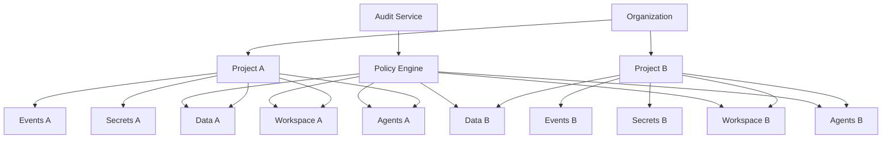

# Arquitetura de Isolamento da Stieve Software Company

## Objetivo

Definir a arquitetura oficial de isolamento do CompanyOS.

Este documento estabelece:

- isolamento entre organizações;
- isolamento entre projetos;
- isolamento entre ambientes;
- isolamento de dados;
- isolamento de agentes;
- isolamento de workspaces;
- isolamento de containers;
- isolamento de redes;
- isolamento de filas;
- isolamento de segredos;
- isolamento de plugins;
- isolamento de observabilidade;
- validações;
- auditoria;
- recuperação;
- critérios de teste.

O isolamento deverá impedir que dados, arquivos, eventos, agentes, segredos e execuções de um contexto sejam acessados por outro contexto sem autorização explícita.

---

# Princípios

## Negação por padrão

Todo acesso entre contextos deverá ser negado quando não existir autorização explícita.

## Isolamento em múltiplas camadas

O isolamento não deverá depender de uma única barreira.

Camadas:

```text
identidade
autorização
escopo
aplicação
banco
storage
mensageria
workspace
container
rede
segredos
observabilidade
auditoria
```

## Contexto obrigatório

Toda operação vinculada a organização ou projeto deverá transportar:

```text
organization_id
project_id
environment
actor_id
correlation_id
```

quando aplicável.

## Menor privilégio

Usuários, agentes, serviços e plugins deverão acessar somente os recursos necessários.

## Sem confiança implícita

Serviços internos, plugins e agentes não serão considerados confiáveis apenas por estarem na rede interna.

## Rastreabilidade

Toda tentativa de acesso entre contextos deverá ser:

- bloqueada;
- registrada;
- correlacionada;
- auditada;
- alertada quando relevante.

---

# Visão geral



---

# Dimensões de isolamento

## Organização

Separa empresas ou unidades administrativas.

## Projeto

Separa recursos, memória, arquivos, tarefas e agentes.

## Ambiente

Separa desenvolvimento, teste, homologação e produção.

## Execução

Separa uma execução de agente ou workflow das demais.

## Serviço

Separa identidades, permissões e segredos entre serviços.

## Plugin

Separa cada instalação de plugin.

## Usuário

Restringe acesso conforme papel e escopo.

---

# Isolamento por organização

Toda entidade global deverá possuir:

```text
organization_id
```

Exemplos:

```text
User
Role
Project
AgentDefinition
PluginInstallation
AuditRecord
```

## Regras

- usuários de uma organização não acessam outra;
- projetos pertencem a uma única organização;
- papéis são avaliados dentro da organização;
- segredos são escopados por organização;
- exports não misturam organizações;
- métricas e logs sensíveis respeitam organização.

---

# Isolamento por projeto

Toda entidade vinculada a projeto deverá possuir:

```text
project_id
```

Exemplos:

```text
Requirement
Task
Workflow
AgentExecution
Release
Deployment
KnowledgeItem
Reference
Incident
```

## Regras

- projeto A não consulta projeto B;
- agente atribuído ao projeto A não recebe contexto do projeto B;
- workspace de A não é montado em execução de B;
- eventos devem carregar `project_id`;
- objetos usam prefixo de projeto;
- consultas exigem filtro obrigatório;
- permissões são avaliadas por projeto.

---

# Contexto de autorização

Estrutura recomendada:

```json
{
  "actor_type": "AGENT",
  "actor_id": "agt_01",
  "organization_id": "org_01",
  "project_id": "prj_01",
  "environment": "development",
  "permissions": [
    "task.read",
    "file.write"
  ],
  "correlation_id": "cor_01"
}
```

O contexto deverá ser validado em cada fronteira.

---

# Isolamento na API

## Regras

- `organization_id` não deverá ser aceito cegamente do cliente;
- o valor deverá vir da identidade autenticada;
- `project_id` deverá ser validado contra o escopo do ator;
- endpoints deverão verificar ownership;
- objetos não pertencentes ao escopo poderão retornar `404`;
- operações críticas devem auditar negações.

---

# Prevenção de IDOR

O sistema deverá impedir acesso por simples alteração de identificador.

Exemplo proibido:

```text
usuário troca prj_01 por prj_02 na URL
e recebe dados do outro projeto
```

Controles:

- autorização por recurso;
- filtro por organização;
- filtro por projeto;
- testes automáticos;
- respostas que não revelem existência.

---

# Isolamento no PostgreSQL

## Filtros obrigatórios

Consultas de projeto deverão incluir:

```text
organization_id
project_id
```

## Repositórios

Cada repositório deverá receber contexto de escopo.

Exemplo conceitual:

```text
ProjectScopedRepository(
  organization_id,
  project_id
)
```

## Constraints

Relacionamentos deverão impedir referências entre projetos quando possível.

---

# Chaves compostas e integridade

Exemplo:

```text
(task.project_id = workflow.project_id)
```

Quando o banco não puder aplicar diretamente, a aplicação deverá validar antes da gravação.

---

# Row-Level Security

Poderá ser introduzida como defesa adicional.

Exemplo conceitual:

```sql
project_id = current_setting('companyos.project_id')
```

## Regras

- não substitui autorização na aplicação;
- deve possuir testes;
- conexões devem configurar contexto corretamente;
- acesso administrativo deve ser separado.

---

# Isolamento de schemas

Na primeira versão, schemas separarão domínios, não projetos.

Não será criado schema por projeto inicialmente devido à complexidade operacional.

O isolamento de projeto será lógico e validado em todas as consultas.

---

# Isolamento no Object Storage

Estrutura:

```text
{environment}/{organization_id}/{project_id}/{resource_type}/{resource_id}/
```

## Regras

- nenhum bucket público;
- URLs temporárias;
- prefixos validados;
- nomes físicos gerados;
- acesso administrativo separado;
- hash obrigatório;
- política por ambiente.

---

# Validação de storage key

O serviço não deverá aceitar uma `storage_key` arbitrária enviada pelo cliente.

Ela deverá ser:

- gerada;
- normalizada;
- comparada ao escopo;
- validada contra path traversal;
- auditada quando sensível.

---

# Isolamento de workspaces

Estrutura:

```text
/workspaces/
└── {organization_id}/
    └── {project_id}/
        └── executions/
            └── {execution_id}/
```

## Regras

- diretório por projeto;
- diretório por execução;
- usuário não privilegiado;
- permissões restritas;
- sem compartilhamento gravável;
- limpeza por execução;
- sem segredos persistentes.

---

# Path traversal

Bloquear entradas como:

```text
../
../../
/etc/passwd
C:\
```

O caminho final deverá permanecer dentro do diretório autorizado.

---

# Symlinks

Links simbólicos que apontem para fora do workspace deverão ser:

- bloqueados;
- ignorados;
- removidos;
- auditados quando suspeitos.

---

# Isolamento de containers

Cada execução técnica deverá ocorrer em container isolado.

## Controles

```text
non-root user
read-only root filesystem
drop capabilities
no privileged mode
no Docker socket
resource limits
process limits
network policy
mount allowlist
timeout
```

---

# Montagens

Somente diretórios necessários deverão ser montados.

Exemplo:

```text
workspace da execução → leitura e escrita
configuração → somente leitura
segredos temporários → memória ou arquivo efêmero
```

Não montar:

```text
/
var/run/docker.sock
/root
/etc
workspaces de outros projetos
```

---

# Isolamento de processos

Aplicar:

- PID namespace;
- usuário dedicado;
- limite de processos;
- sem acesso ao host;
- encerramento ao fim da execução.

---

# Isolamento de recursos

Limites:

```text
CPU
memory
disk
GPU
processes
network
duration
tool calls
model calls
```

O excesso deverá:

- interromper ou reduzir execução;
- registrar evento;
- auditar;
- liberar recursos.

---

# Isolamento de agentes

## Escopo do agente

Calculado a partir de:

```text
AgentDefinition
+
ProjectAgent
+
Task
+
AgentExecution
+
ToolGrant
```

## Regras

- agente não escolhe outro projeto;
- agente não amplia permissão;
- agente não acessa memória privada;
- agente não usa ferramenta não concedida;
- agente não acessa segredo fora do escopo;
- agente não executa em produção diretamente.

---

# Contexto dos agentes

O Context Builder deverá:

- filtrar organização;
- filtrar projeto;
- filtrar recurso;
- aplicar confidencialidade;
- limitar tamanho;
- registrar manifesto;
- remover segredos;
- preservar origem.

---

# Isolamento de memória

Agentes deverão ser stateless.

Memória persistente deverá ficar no Knowledge Vault e sempre conter:

```text
organization_id
project_id
source
status
version
```

Não haverá memória privada não auditada por agente.

---

# Isolamento de modelos

Modelos locais poderão ser compartilhados como infraestrutura.

Entretanto:

- prompts não devem ser reutilizados;
- contexto não deve ser armazenado entre execuções;
- cache sensível deve ser desabilitado ou escopado;
- logs não devem misturar conteúdo;
- filas devem preservar escopo.

---

# Isolamento de ferramentas

Toda ferramenta deverá validar:

```text
execution_id
agent_id
organization_id
project_id
tool_code
scope
paths
commands
expires_at
```

---

# Tool Grants

Concessões deverão ser temporárias.

Exemplo:

```text
file.write
scope = EXECUTION
scope_id = exe_01
expires_at = ...
```

Ao encerrar a execução, a concessão deverá expirar.

---

# Isolamento de segredos

Segredos deverão ser escopados por:

```text
SYSTEM
ORGANIZATION
PROJECT
ENVIRONMENT
PLUGIN
EXECUTION
```

## Regras

- entrega temporária;
- menor privilégio;
- não registrar;
- não persistir em workspace;
- não enviar ao modelo sem necessidade;
- revogar após uso;
- auditar acesso.

---

# Secret Broker

O Secret Broker deverá validar:

- identidade;
- permissão;
- escopo;
- ambiente;
- finalidade;
- expiração;
- aprovação quando necessária.

---

# Isolamento de ambientes

Ambientes:

```text
development
testing
staging
production
```

Cada ambiente deverá possuir separação de:

- banco;
- RabbitMQ vhost;
- Redis namespace ou instância;
- Object Storage;
- segredos;
- redes;
- logs;
- métricas;
- configurações;
- deployments.

---

# Produção

Produção deverá possuir controles adicionais:

- identidade específica;
- aprovação humana;
- credenciais separadas;
- rede restrita;
- logs restritos;
- backup;
- rollback;
- auditoria reforçada.

---

# Isolamento de redes

Redes Docker iniciais:

```text
public
application
data
execution
observability
```

## Public

```text
mission-control
api-gateway
```

## Application

```text
companyos-api
workflow-engine
worker
scheduler
notification-service
```

## Data

```text
postgres
rabbitmq
redis
minio
```

## Execution

```text
agent-runtime
tool-gateway
ollama
sandboxes
```

## Observability

```text
prometheus
grafana
loki
alertmanager
```

---

# Regras de comunicação

## Permitido

```text
Mission Control → API Gateway
API Gateway → CompanyOS API
CompanyOS API → Data Services
Workflow Engine → Event Bus
Agent Runtime → Tool Gateway
Tool Gateway → Sandbox
Prometheus → Metrics Endpoints
```

## Proibido

```text
Mission Control → PostgreSQL
Agent Runtime → PostgreSQL direto
Plugin → banco principal
Sandbox → Docker socket
Sandbox → rede de dados
Grafana → dados de domínio
```

---

# Network policies

Na primeira versão, Docker networks fornecerão separação básica.

Evolução futura:

- firewall;
- nftables;
- network policies;
- service mesh;
- Kubernetes NetworkPolicy.

---

# Isolamento no RabbitMQ

## Ambiente

Usar virtual hosts separados:

```text
/development
/testing
/staging
/production
```

## Serviço

Cada serviço possui usuário próprio.

## Filas

Consumidores possuem filas dedicadas.

## Projeto

O isolamento principal será lógico por `organization_id` e `project_id`.

---

# Validação de eventos

Consumidores deverão validar:

- ambiente;
- organização;
- projeto;
- versão;
- tipo;
- schema;
- autorização quando aplicável.

Evento sem contexto obrigatório deverá ser rejeitado.

---

# Filas por projeto

Não serão padrão inicial.

Poderão ser adotadas quando houver:

- alto volume;
- confidencialidade elevada;
- isolamento regulatório;
- necessidade de escala independente.

---

# Isolamento de workflows

Cada workflow deverá possuir:

```text
organization_id
project_id
correlation_id
```

Etapas não poderão alterar o escopo original.

Subworkflows deverão herdar o contexto, salvo política explícita e autorizada.

---

# Isolamento de plugins

Cada instalação de plugin possui:

- identidade;
- configuração;
- segredos;
- fila;
- escopo;
- limites;
- logs.

Plugins de projeto não poderão acessar outro projeto.

---

# Isolamento de UI extensions

Extensões visuais deverão receber apenas dados fornecidos por APIs autorizadas.

Não deverão:

- acessar token bruto;
- consultar banco;
- executar JavaScript irrestrito de origem externa;
- ler estado de outros projetos.

---

# Isolamento de observabilidade

Logs e métricas poderão compartilhar infraestrutura, mas o acesso deve respeitar:

- ambiente;
- organização;
- projeto;
- confidencialidade;
- permissão.

## Alta cardinalidade

IDs de projeto não deverão ser labels universais de métricas.

A segregação detalhada ocorrerá em logs e consultas autorizadas.

---

# Isolamento de auditoria

Registros possuem:

```text
organization_id
project_id
confidentiality_level
```

Leitura deverá aplicar escopo.

Nem administradores terão acesso automático a registros `RESTRICTED`.

---

# Isolamento de exports

Exports deverão:

- conter somente o escopo solicitado;
- usar arquivo separado;
- possuir hash;
- possuir expiração;
- usar URL temporária;
- ser auditados;
- não misturar projetos.

---

# Isolamento de backups

Backups deverão identificar:

```text
environment
organization scope
storage source
created_at
hash
```

Restauração parcial deverá validar que não mistura ambientes ou organizações.

---

# Identidade entre serviços

Cada serviço deverá possuir identidade própria.

Permissões deverão limitar:

- APIs;
- exchanges;
- filas;
- secrets;
- storage;
- banco.

---

# Tokens internos

Deverão possuir:

```text
service_id
environment
audience
scope
expires_at
```

Não deverão ser reutilizados entre ambientes.

---

# Isolamento de configuração

Configuração deverá ser escopada:

```text
SYSTEM
ORGANIZATION
PROJECT
ENVIRONMENT
AGENT
PLUGIN
```

Precedência deverá ser documentada.

Configuração de projeto não poderá alterar política global de segurança.

---

# Precedência de políticas

Exemplo:

```text
SYSTEM DENY
>
ENVIRONMENT DENY
>
ORGANIZATION DENY
>
PROJECT DENY
>
ALLOW específico
```

Negações explícitas deverão prevalecer.

---

# Cross-project operations

Operações envolvendo mais de um projeto serão proibidas por padrão.

Quando necessárias, deverão:

- ser executadas por serviço autorizado;
- declarar projetos envolvidos;
- possuir permissão específica;
- registrar auditoria;
- evitar exposição de conteúdo desnecessário.

---

# Shared Knowledge futuro

Conhecimento compartilhado entre projetos deverá ser uma funcionalidade explícita.

Não deverá ocorrer por acesso direto ao Knowledge Vault de outro projeto.

Modelos possíveis:

```text
publicação controlada
biblioteca organizacional
snapshot
referência somente leitura
```

---

# Cross-organization operations

Serão proibidas na primeira versão, exceto operações administrativas da plataforma explicitamente definidas.

---

# Detecção de violação

Sinais:

- consulta com projeto divergente;
- path traversal;
- storage key de outro projeto;
- evento com contexto incompatível;
- segredo fora do escopo;
- ferramenta acessando caminho externo;
- plugin chamando API proibida;
- token de ambiente incorreto.

---

# Resposta à violação

Fluxo:

```text
1. negar
2. registrar log
3. gerar auditoria
4. incrementar métrica
5. alertar quando risco alto
6. bloquear identidade em repetição grave
7. criar incidente quando necessário
```

---

# Códigos de erro

```text
SCOPE_ACCESS_DENIED
AGENT_PROJECT_ACCESS_DENIED
CROSS_PROJECT_ACCESS_DENIED
ENVIRONMENT_ACCESS_DENIED
WORKSPACE_ACCESS_DENIED
STORAGE_SCOPE_MISMATCH
SECRET_SCOPE_DENIED
PLUGIN_SCOPE_DENIED
EVENT_SCOPE_MISMATCH
```

---

# Auditoria obrigatória

Registrar:

- tentativas entre projetos;
- acesso a ambiente incorreto;
- acesso a segredo negado;
- ferramenta bloqueada;
- path traversal;
- plugin fora do escopo;
- alteração de política;
- concessão temporária;
- operação cross-project autorizada.

---

# Métricas

```text
companyos_isolation_access_denied_total
companyos_isolation_cross_project_attempts_total
companyos_isolation_environment_mismatch_total
companyos_isolation_workspace_violations_total
companyos_isolation_storage_violations_total
companyos_isolation_secret_denials_total
companyos_isolation_event_mismatch_total
companyos_isolation_plugin_violations_total
```

---

# Alertas

```text
CrossProjectAccessAttempt
RepeatedScopeViolation
WorkspaceEscapeAttempt
SecretScopeViolation
PluginIsolationViolation
EnvironmentCredentialMismatch
StorageScopeMismatch
```

---

# Testes de isolamento

## API

- usuário acessando outro projeto;
- agente acessando outro projeto;
- identificador alterado;
- organização incorreta;
- recurso inexistente ou oculto.

## Banco

- consulta sem filtro;
- foreign key entre projetos;
- repository com escopo incorreto;
- RLS futura.

## Object Storage

- chave de outro projeto;
- URL expirada;
- prefixo manipulado;
- objeto restrito.

## Workspace

- path traversal;
- symlink externo;
- mount incorreto;
- diretório de outra execução.

## Container

- usuário root;
- socket Docker;
- acesso ao host;
- rede proibida;
- excesso de recurso.

## Event Bus

- evento de ambiente diferente;
- evento sem projeto;
- consumidor recebendo escopo incorreto;
- fila proibida.

## Segredos

- segredo de outro projeto;
- segredo de produção em desenvolvimento;
- token expirado;
- escopo inadequado.

## Plugins

- instalação de outro projeto;
- fila de outra instalação;
- configuração compartilhada;
- rede não autorizada.

## Observabilidade

- log restrito;
- export entre projetos;
- dashboard sem escopo;
- auditoria restrita.

---

# Testes de regressão

Toda nova funcionalidade deverá incluir ao menos:

```text
teste de projeto correto
teste de projeto incorreto
teste de organização incorreta
teste de ambiente incorreto
```

---

# Property-based testing

Poderá ser usado para gerar combinações de:

- organizações;
- projetos;
- atores;
- permissões;
- recursos.

Objetivo:

```text
nenhuma combinação não autorizada deve obter acesso
```

---

# Testes de caos

Exemplos:

- container reiniciado;
- credencial revogada;
- rede bloqueada;
- Redis perdido;
- RabbitMQ reiniciado;
- workspace removido.

O isolamento deverá permanecer válido durante falhas.

---

# Recuperação

Após incidente de isolamento:

```text
1. bloquear identidade
2. preservar logs e auditoria
3. identificar recursos acessados
4. revogar tokens e segredos
5. validar integridade
6. corrigir política
7. testar novamente
8. gerar postmortem
```

---

# Governança

## Nova funcionalidade

Deverá responder:

- qual organização?
- qual projeto?
- qual ambiente?
- qual identidade?
- qual storage?
- qual rede?
- quais segredos?
- quais eventos?
- quais logs?
- quais testes de isolamento?

## Revisão arquitetural

Mudanças que reduzem isolamento deverão exigir ADR e aprovação de segurança.

---

# Defense in depth

Camadas mínimas:

```text
1. autenticação
2. autorização
3. escopo
4. filtro de aplicação
5. integridade de banco
6. storage prefix
7. workspace path
8. container
9. rede
10. auditoria
```

---

# Anti-padrões proibidos

```text
consulta sem organization_id
consulta de projeto sem project_id
workspace compartilhado
container privilegiado
segredo global para todos os serviços
bucket público
token reutilizado entre ambientes
agente escolhendo escopo
plugin acessando banco
evento sem contexto
admin com acesso irrestrito implícito
```

---

# Primeira implementação

A primeira versão deverá incluir:

```text
isolamento lógico por organization_id
isolamento lógico por project_id
filtros obrigatórios
repositories escopados
prefixos de Object Storage
workspaces separados
containers não privilegiados
redes Docker separadas
RabbitMQ vhosts por ambiente
credenciais por serviço
segredos escopados
auditoria de violações
testes automatizados
```

---

# Critérios de aceite da Sprint

Este documento será considerado aprovado quando:

- dimensões de isolamento estiverem definidas;
- organização e projeto estiverem separados;
- API estiver protegida contra IDOR;
- banco estiver escopado;
- Object Storage estiver escopado;
- workspaces estiverem isolados;
- containers estiverem isolados;
- agentes estiverem limitados;
- ferramentas estiverem escopadas;
- segredos estiverem escopados;
- ambientes estiverem separados;
- redes estiverem definidas;
- RabbitMQ estiver isolado por ambiente;
- workflows e plugins estiverem isolados;
- observabilidade e auditoria estiverem escopadas;
- violações estiverem detectáveis;
- testes obrigatórios estiverem documentados.
