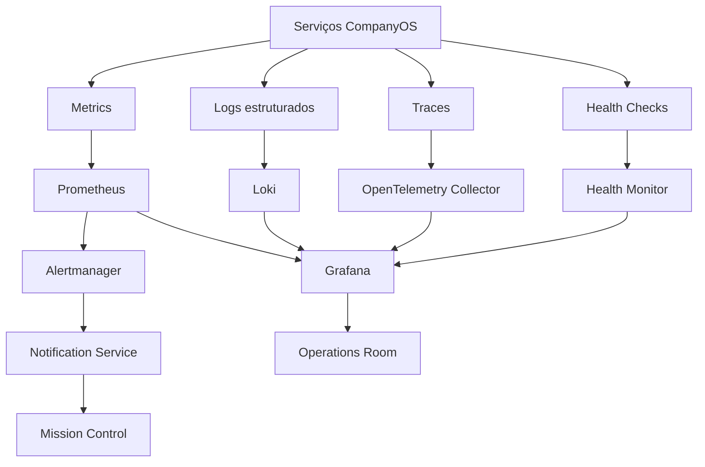

# Arquitetura de Observabilidade da Stieve Software Company

## Objetivo

Definir a arquitetura oficial de observabilidade do CompanyOS.

Este documento estabelece:

- métricas;
- logs;
- traces;
- correlação;
- health checks;
- readiness;
- alertas;
- dashboards;
- retenção;
- segurança;
- custos;
- governança;
- integração com serviços;
- integração com agentes;
- integração com workflows;
- critérios de teste.

A observabilidade deverá permitir compreender o estado da plataforma, diagnosticar falhas, acompanhar desempenho, medir capacidade e reagir a incidentes.

---

# Princípios

## Observabilidade por padrão

Todo serviço deverá nascer com:

```text
logs estruturados
métricas
health check
readiness
correlation_id
service_name
service_version
environment
```

## Correlação ponta a ponta

Uma operação deverá ser rastreável desde a interface até os serviços, filas, workflows, agentes e ferramentas.

Exemplo:

```text
Mission Control
→ API Gateway
→ CompanyOS API
→ Event Bus
→ Workflow Engine
→ Agent Runtime
→ Tool Gateway
→ Sandbox
```

## Segurança

Dados observáveis não deverão expor:

- senhas;
- tokens;
- chaves;
- segredos;
- prompts sensíveis;
- arquivos confidenciais;
- dados pessoais desnecessários.

## Sinais acionáveis

Alertas deverão representar condições que exigem ação.

Não deverão existir alertas apenas por existirem métricas.

## Baixo acoplamento

Aplicações deverão produzir sinais por interfaces padronizadas.

A observabilidade não deverá conter regras de domínio.

## Degradação controlada

Falha da pilha de observabilidade não deverá derrubar o sistema principal.

A perda de observabilidade crítica deverá gerar alerta e reduzir a confiança operacional.

---

# Visão geral



---

# Pilares

## Métricas

Valores numéricos agregados ao longo do tempo.

Exemplos:

```text
requests_total
request_duration_seconds
queue_depth
active_agent_executions
workflow_failures_total
```

## Logs

Registros estruturados de eventos técnicos e operacionais.

## Traces

Representação da trajetória de uma operação distribuída.

## Health

Estado atual de um processo e suas dependências.

## Eventos operacionais

Eventos relevantes para operação.

Exemplos:

```text
ServiceUnhealthy
QueueBacklogDetected
AgentHeartbeatExpired
StorageLow
```

---

# Tecnologias iniciais

```text
Prometheus
Grafana
Loki
Promtail ou agente equivalente
Alertmanager
```

Tecnologia futura:

```text
OpenTelemetry Collector
Tempo ou backend compatível
```

A escolha final de tracing deverá ser registrada em ADR.

---

# Componentes

## Prometheus

Responsável por:

- coletar métricas;
- armazenar séries temporais;
- executar regras;
- alimentar alertas;
- permitir consultas.

## Grafana

Responsável por:

- dashboards;
- exploração;
- visualização;
- correlação;
- painéis operacionais.

## Loki

Responsável por:

- armazenar logs;
- indexar metadados;
- permitir consulta;
- integrar com Grafana.

## Log Collector

Responsável por:

- coletar stdout e arquivos autorizados;
- anexar labels;
- encaminhar para Loki;
- aplicar limites.

## Alertmanager

Responsável por:

- receber alertas;
- agrupar;
- deduplicar;
- silenciar;
- rotear notificações.

## OpenTelemetry Collector

Responsável futuramente por:

- receber traces;
- processar;
- amostrar;
- exportar;
- padronizar telemetria.

---

# Identidade de serviço

Todo sinal deverá conter, quando aplicável:

```text
service_name
service_version
instance_id
environment
organization_id
project_id
```

`organization_id` e `project_id` não deverão ser usados como labels de alta cardinalidade em todas as métricas.

---

# Correlação

Identificadores:

```text
correlation_id
request_id
trace_id
span_id
event_id
workflow_instance_id
agent_execution_id
task_id
deployment_id
```

## Regra

`correlation_id` deverá ser propagado entre:

- HTTP;
- eventos;
- comandos;
- workflows;
- agentes;
- ferramentas;
- logs;
- auditoria.

---

# Cabeçalhos HTTP

```text
X-Correlation-ID
X-Request-ID
traceparent
tracestate
```

O gateway deverá gerar identificadores quando ausentes.

---

# Logs estruturados

Formato recomendado:

```text
JSON
```

Exemplo:

```json
{
  "timestamp": "2026-08-02T21:20:00Z",
  "level": "INFO",
  "service_name": "companyos-api",
  "service_version": "0.1.0",
  "environment": "development",
  "message": "Project created",
  "correlation_id": "cor_01",
  "request_id": "req_01",
  "actor_type": "USER",
  "actor_id": "usr_01",
  "project_id": "prj_01",
  "resource_type": "project",
  "resource_id": "prj_01",
  "operation": "project.create",
  "duration_ms": 84,
  "result": "SUCCESS"
}
```

---

# Campos mínimos de log

```text
timestamp
level
service_name
service_version
environment
message
correlation_id
result
```

Campos adicionais quando aplicáveis:

```text
request_id
trace_id
span_id
organization_id
project_id
actor_type
actor_id
resource_type
resource_id
operation
event_id
workflow_instance_id
agent_execution_id
tool_code
error_code
duration_ms
```

---

# Níveis de log

```text
TRACE
DEBUG
INFO
WARN
ERROR
CRITICAL
```

## TRACE

Uso restrito em diagnóstico temporário.

## DEBUG

Informação técnica detalhada em ambientes controlados.

## INFO

Eventos normais relevantes.

## WARN

Condição anormal não fatal.

## ERROR

Operação falhou.

## CRITICAL

Falha grave que ameaça disponibilidade, segurança ou integridade.

---

# Regras de logging

- não concatenar segredos;
- usar campos estruturados;
- evitar payload completo;
- evitar repetição excessiva;
- limitar stack trace;
- registrar código de erro;
- registrar duração;
- registrar correlação;
- mascarar dados sensíveis.

---

# Redação de dados sensíveis

Campos conhecidos deverão ser filtrados.

Exemplos:

```text
password
access_token
refresh_token
authorization
cookie
secret
private_key
api_key
```

Valor de saída:

```text
[REDACTED]
```

---

# Logs de agentes

Registrar:

```text
agent_definition
agent_instance_id
agent_execution_id
task_id
phase
provider
model
tool_code
status
duration
error_code
```

Não registrar raciocínio interno detalhado do modelo.

Registrar apenas:

- objetivo;
- plano explícito;
- ações;
- ferramentas;
- resultados;
- evidências;
- resumo.

---

# Logs de prompts

A política padrão deverá ser:

```text
não registrar prompt completo
```

Poderão ser registrados:

- hash;
- tamanho;
- template_version;
- contexto_manifest_id;
- quantidade de tokens;
- classificação de confidencialidade.

---

# Logs de ferramentas

Registrar:

```text
tool_code
arguments_summary
execution_id
workspace_id
decision
result
duration
output_size
```

Comandos e caminhos sensíveis deverão ser resumidos ou mascarados.

---

# Logs de eventos

Registrar:

```text
event_id
event_type
event_version
routing_key
queue
consumer
retry_count
correlation_id
result
```

---

# Logs de workflows

Registrar:

```text
workflow_definition
workflow_version
workflow_instance_id
step_code
step_instance_id
attempt_count
status
duration
error_code
```

---

# Logs de deployments

Registrar:

```text
deployment_id
release_id
environment
step
status
duration
health_check
rollback_id
```

---

# Métricas

## Convenção de nomes

Formato:

```text
companyos_<domain>_<metric>_<unit>
```

Exemplos:

```text
companyos_http_requests_total
companyos_http_request_duration_seconds
companyos_agent_active_executions
companyos_workflow_failures_total
```

---

# Tipos de métricas

```text
Counter
Gauge
Histogram
Summary
```

## Counter

Valor acumulativo.

## Gauge

Valor atual.

## Histogram

Distribuição de duração ou tamanho.

## Summary

Distribuição calculada no cliente; usar com cuidado.

---

# Métricas HTTP

```text
companyos_http_requests_total
companyos_http_request_duration_seconds
companyos_http_requests_in_progress
companyos_http_response_size_bytes
companyos_http_errors_total
```

Labels recomendadas:

```text
service
method
route
status_class
environment
```

Não usar URL completa como label.

---

# Métricas de banco

```text
companyos_db_connections_active
companyos_db_connections_idle
companyos_db_query_duration_seconds
companyos_db_query_errors_total
companyos_db_transaction_duration_seconds
companyos_db_deadlocks_total
```

---

# Métricas do Event Bus

```text
companyos_event_messages_published_total
companyos_event_messages_consumed_total
companyos_event_messages_failed_total
companyos_event_messages_retried_total
companyos_event_dead_letter_total
companyos_event_queue_depth
companyos_event_oldest_message_age_seconds
companyos_event_processing_duration_seconds
```

---

# Métricas de workflows

```text
companyos_workflows_started_total
companyos_workflows_completed_total
companyos_workflows_failed_total
companyos_workflows_timed_out_total
companyos_workflows_active
companyos_workflow_duration_seconds
companyos_workflow_steps_failed_total
companyos_workflow_waiting_approval
companyos_workflow_waiting_event
```

---

# Métricas de agentes

```text
companyos_agent_executions_started_total
companyos_agent_executions_completed_total
companyos_agent_executions_failed_total
companyos_agent_executions_timed_out_total
companyos_agent_active_executions
companyos_agent_execution_duration_seconds
companyos_agent_provider_calls_total
companyos_agent_provider_failures_total
companyos_agent_tool_calls_total
companyos_agent_tool_failures_total
companyos_agent_input_tokens_total
companyos_agent_output_tokens_total
companyos_agent_queue_depth
```

---

# Métricas do Knowledge Vault

```text
companyos_knowledge_items_total
companyos_knowledge_proposals_total
companyos_knowledge_contradictions_total
companyos_knowledge_search_duration_seconds
companyos_context_packages_total
companyos_context_tokens_total
companyos_embedding_failures_total
```

---

# Métricas de plugins

```text
companyos_plugin_active
companyos_plugin_failures_total
companyos_plugin_requests_total
companyos_plugin_request_duration_seconds
companyos_plugin_dead_letter_total
companyos_plugin_resource_usage
```

---

# Métricas de auditoria

```text
companyos_audit_records_written_total
companyos_audit_write_failures_total
companyos_audit_integrity_failures_total
companyos_audit_exports_total
```

---

# Métricas de infraestrutura

```text
cpu_usage
memory_usage
disk_usage
filesystem_free_bytes
network_receive_bytes
network_transmit_bytes
container_restarts_total
container_status
```

---

# Cardinalidade

Labels de alta cardinalidade podem tornar a plataforma instável.

Evitar como labels globais:

```text
user_id
project_id
task_id
event_id
correlation_id
request_id
file_path
error_message
```

Esses valores devem aparecer em logs e traces.

---

# Health checks

## Liveness

Endpoint:

```text
/health
```

Responde se o processo está vivo.

Não deverá executar verificações caras.

## Readiness

Endpoint:

```text
/ready
```

Responde se o serviço está apto a receber trabalho.

Deverá verificar dependências críticas.

## Startup

Poderá ser usado para serviços com inicialização longa.

---

# Estrutura de health response

```json
{
  "status": "UP",
  "service": "companyos-api",
  "version": "0.1.0",
  "environment": "development",
  "dependencies": {
    "postgres": "UP",
    "rabbitmq": "UP",
    "redis": "UP"
  },
  "timestamp": "2026-08-02T21:20:00Z"
}
```

---

# Estados de saúde

```text
UP
DEGRADED
DOWN
UNKNOWN
```

---

# Readiness por serviço

## companyos-api

Dependências críticas:

```text
PostgreSQL
```

Dependências condicionais:

```text
RabbitMQ
Redis
MinIO
```

## workflow-engine

Dependências críticas:

```text
PostgreSQL
RabbitMQ
```

## agent-runtime

Dependências críticas:

```text
RabbitMQ
Provider Gateway
```

## tool-gateway

Dependências críticas:

```text
Workspace
Sandbox Runtime
```

---

# Tracing

## Objetivo

Acompanhar a trajetória de uma operação entre componentes.

## Span

Cada ação relevante deverá gerar um span.

Exemplos:

```text
http.request
db.query
event.publish
event.consume
workflow.step
agent.provider.call
tool.execute
object_storage.get
```

---

# Atributos de trace

```text
service.name
service.version
deployment.environment
http.method
http.route
http.status_code
messaging.system
messaging.destination
workflow.instance_id
agent.execution_id
tool.code
error.code
```

---

# Amostragem

A estratégia inicial poderá ser:

```text
100% em desenvolvimento
amostragem configurável em produção
100% para erros críticos
```

---

# Baggage

Não transportar segredos ou dados pessoais em baggage.

Informações permitidas deverão ser limitadas.

---

# Dashboards

## Platform Overview

Exibir:

- serviços ativos;
- taxa de requisições;
- erros;
- latência;
- filas;
- agentes;
- workflows;
- storage;
- banco;
- alertas.

## API Dashboard

- requisições;
- latência;
- status HTTP;
- rotas lentas;
- erros por código;
- conexões de banco.

## Event Bus Dashboard

- profundidade;
- taxa de publicação;
- taxa de consumo;
- retries;
- DLQ;
- consumidor ausente;
- mensagem mais antiga.

## Workflow Dashboard

- ativos;
- concluídos;
- falhos;
- aguardando aprovação;
- aguardando evento;
- duração;
- etapas falhas.

## Agent Dashboard

- agentes por estado;
- execuções;
- fila;
- modelos;
- tokens;
- falhas;
- ferramentas;
- consumo de recursos.

## Infrastructure Dashboard

- CPU;
- memória;
- disco;
- rede;
- containers;
- reinícios;
- disponibilidade.

## Security Dashboard

- acessos negados;
- ferramentas bloqueadas;
- segredos detectados;
- plugins bloqueados;
- tentativas entre projetos;
- integridade de auditoria.

---

# Mission Control

A Sala de Operações deverá consumir dados agregados da observabilidade.

Não deverá consultar diretamente Prometheus ou Loki sem camada de autorização.

Uma API interna deverá controlar:

- consultas permitidas;
- filtros;
- escopo;
- mascaramento;
- limites.

---

# Alertas

## Severidades

```text
INFO
WARNING
HIGH
CRITICAL
```

## INFO

Informação operacional.

## WARNING

Condição anormal sem impacto crítico imediato.

## HIGH

Degradação importante.

## CRITICAL

Risco imediato de indisponibilidade, perda de dados ou segurança.

---

# Estrutura de alerta

```text
alert_name
severity
service
environment
summary
description
started_at
labels
annotations
runbook_url
correlation_id
```

---

# Alertas iniciais

## Disponibilidade

```text
ServiceDown
ServiceReadinessFailed
ContainerRestartLoop
```

## API

```text
HighErrorRate
HighLatency
RateLimitSpike
```

## Banco

```text
DatabaseUnavailable
DatabaseConnectionPoolExhausted
DatabaseDiskLow
DatabaseDeadlocksHigh
```

## RabbitMQ

```text
RabbitMQUnavailable
QueueDepthHigh
OldMessageDetected
DeadLetterQueueNotEmpty
ConsumerMissing
```

## Redis

```text
RedisUnavailable
RedisMemoryHigh
```

## MinIO

```text
ObjectStorageUnavailable
ObjectStorageDiskLow
ObjectIntegrityFailure
```

## Workflows

```text
WorkflowFailureRateHigh
WorkflowStuck
WorkflowCompensationFailed
WorkflowApprovalExpired
```

## Agentes

```text
AgentHeartbeatExpired
AgentFailureRateHigh
AgentQueueHigh
AIProviderUnavailable
AgentResourceLimitReached
```

## Segurança

```text
AuditIntegrityFailure
CrossProjectAccessAttempt
SecretDetected
PluginBlocked
CriticalSecurityFindingOpen
```

---

# Redução de ruído

Alertas deverão usar:

- janela mínima;
- agrupamento;
- deduplicação;
- dependência;
- severidade;
- silenciamento;
- manutenção programada.

---

# Alertas derivados

Exemplo:

```text
Banco indisponível
→ suprimir alertas secundários dos serviços dependentes
```

---

# Runbooks

Todo alerta `HIGH` ou `CRITICAL` deverá possuir runbook.

Conteúdo mínimo:

```text
descrição
impacto
causas prováveis
verificações
ações seguras
rollback
escalonamento
```

---

# Notificações

Canais iniciais:

```text
Mission Control
```

Canais futuros:

```text
e-mail
Slack
Teams
SMS para casos críticos
```

O roteamento deverá considerar:

- severidade;
- ambiente;
- horário;
- responsável;
- projeto;
- tipo de incidente.

---

# SLO

A arquitetura deverá permitir definição de objetivos de nível de serviço.

Exemplos futuros:

```text
disponibilidade da API
latência p95
taxa de sucesso de workflows
tempo de processamento de filas
```

---

# SLI

Indicadores:

```text
availability
latency
error_rate
freshness
throughput
correctness
```

---

# Error Budget

Poderá ser introduzido quando a plataforma tiver operação contínua.

---

# Retenção

## Métricas

Retenção inicial configurável.

Exemplo:

```text
15 a 30 dias
```

## Logs

Exemplo:

```text
7 dias para DEBUG
30 dias para INFO
90 dias para ERROR
```

## Traces

Exemplo:

```text
7 a 15 dias
```

Os valores finais dependerão de espaço e necessidade.

---

# Limites

A plataforma deverá controlar:

```text
log_rate_limit
max_log_size
max_label_count
max_metric_series
trace_sampling_rate
dashboard_query_limit
```

---

# Backpressure

Se o destino de logs estiver indisponível:

- não bloquear indefinidamente a aplicação;
- aplicar buffer limitado;
- descartar níveis menos críticos quando necessário;
- registrar contador de perda;
- gerar alerta quando possível.

---

# Dados em ambientes

Ambientes:

```text
development
testing
staging
production
```

Dados não deverão ser misturados.

Labels e datasources deverão identificar o ambiente.

---

# Segurança de acesso

Permissões:

```text
observability.read
observability.read.restricted
observability.dashboard.manage
observability.alert.manage
observability.silence.manage
observability.export
```

---

# Acesso a logs restritos

Logs com conteúdo sensível deverão exigir permissão específica.

---

# Auditoria da observabilidade

Ações auditáveis:

- consultar logs restritos;
- exportar logs;
- criar alerta;
- alterar regra;
- silenciar alerta;
- alterar retenção;
- alterar dashboard compartilhado;
- alterar datasource.

---

# Backup

Deverá incluir:

- dashboards;
- regras de alerta;
- configurações;
- datasources;
- runbooks;
- políticas de retenção.

Métricas e logs poderão possuir política de backup distinta.

---

# Recuperação

Após restauração:

```text
1. restaurar configurações
2. restaurar dashboards
3. restaurar regras
4. validar datasources
5. validar coleta
6. validar alertas
7. executar teste de ponta a ponta
```

---

# Configuração como código

Estrutura sugerida:

```text
observability/
├── prometheus/
│   ├── prometheus.yml
│   └── rules/
├── grafana/
│   ├── dashboards/
│   └── provisioning/
├── loki/
│   └── loki.yml
├── alertmanager/
│   └── alertmanager.yml
└── runbooks/
```

---

# Governança

## Novo serviço

Deverá entregar:

- métricas básicas;
- logs estruturados;
- health;
- readiness;
- dashboard mínimo;
- alertas críticos;
- runbook.

## Nova funcionalidade crítica

Deverá definir:

- sinais;
- métricas;
- falhas;
- alertas;
- auditoria;
- capacidade.

---

# Definition of Done operacional

Uma entrega não estará completa sem:

```text
logs
métricas
health check
alertas aplicáveis
dashboard
runbook para falhas críticas
```

---

# Testes obrigatórios

## Logs

- formato JSON;
- campos mínimos;
- correlação;
- mascaramento;
- erro estruturado;
- limite de tamanho.

## Métricas

- nomes;
- tipos;
- labels;
- cardinalidade;
- histogramas;
- coleta pelo Prometheus.

## Health

- processo saudável;
- dependência indisponível;
- estado degradado;
- readiness falsa;
- liveness verdadeira.

## Alertas

- regra dispara;
- deduplicação;
- severidade;
- runbook;
- resolução.

## Traces

- propagação HTTP;
- propagação em eventos;
- workflow;
- agente;
- ferramenta;
- erro.

## Segurança

- acesso negado;
- log restrito;
- segredo mascarado;
- exportação auditada.

## Recuperação

- Loki reiniciado;
- Prometheus reiniciado;
- Grafana restaurado;
- configuração reconstruída.

---

# Anti-padrões proibidos

```text
logs em texto sem estrutura
segredo em log
métrica com user_id como label
alerta sem ação
health check caro
readiness sempre positiva
trace sem correlação
dashboard sem proprietário
alerta crítico sem runbook
observabilidade derrubando a aplicação
```

---

# Primeira implementação

A primeira versão deverá incluir:

```text
Prometheus
Grafana
Loki
coletor de logs
Alertmanager
logs JSON
métricas HTTP
métricas do banco
métricas do RabbitMQ
métricas de workflows
métricas de agentes
health checks
readiness
dashboards iniciais
alertas iniciais
```

Tracing distribuído poderá ser introduzido incrementalmente, mas os identificadores e contratos deverão existir desde o início.

---

# Critérios de aceite da Sprint

Este documento será considerado aprovado quando:

- pilares de observabilidade estiverem definidos;
- tecnologias iniciais estiverem definidas;
- logs estruturados estiverem padronizados;
- mascaramento estiver definido;
- métricas principais estiverem catalogadas;
- cardinalidade estiver controlada;
- health e readiness estiverem definidos;
- tracing estiver previsto;
- dashboards estiverem definidos;
- alertas e severidades estiverem definidos;
- runbooks estiverem incorporados;
- retenção estiver definida;
- segurança e permissões estiverem definidas;
- configuração como código estiver prevista;
- testes obrigatórios estiverem documentados.
