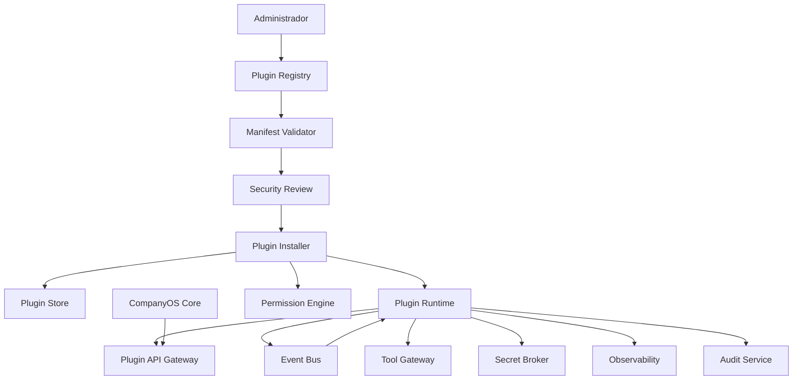
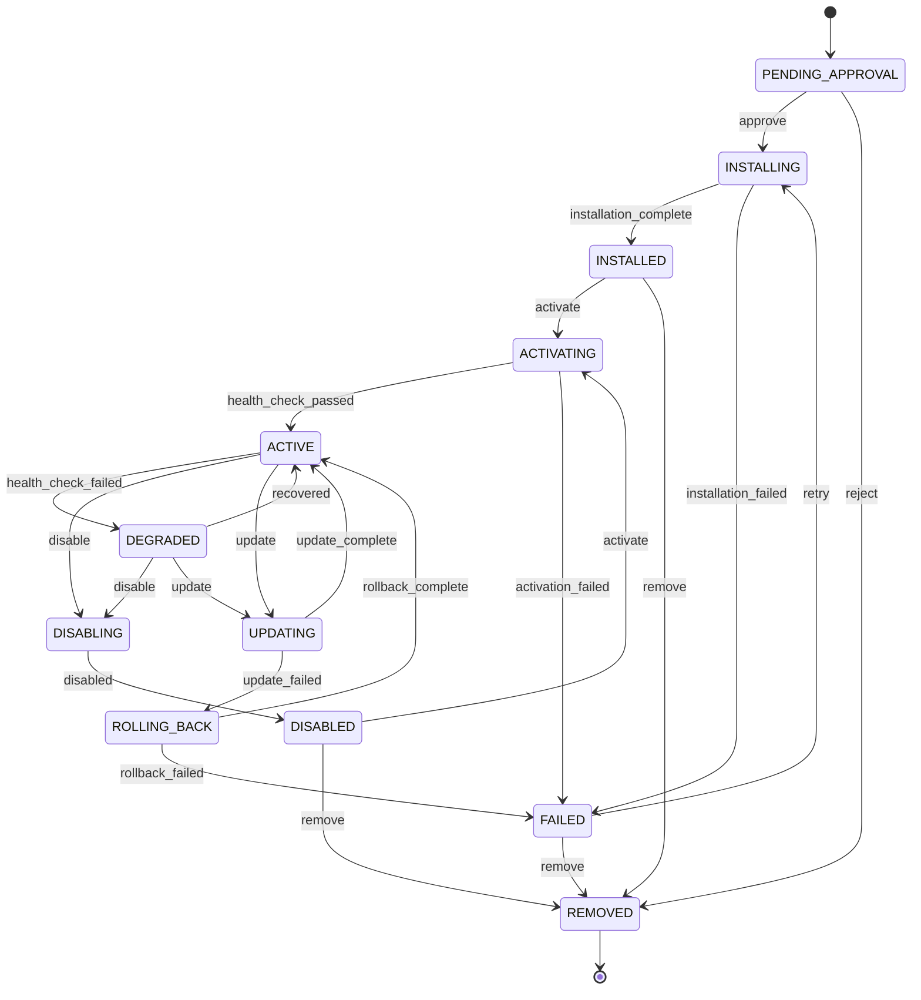

# Arquitetura do Sistema de Plugins da Stieve Software Company

## Objetivo

Definir a arquitetura oficial do sistema de plugins do CompanyOS.

Este documento estabelece:

- tipos de plugins;
- estrutura;
- manifestos;
- ciclo de vida;
- instalação;
- ativação;
- atualização;
- desativação;
- remoção;
- compatibilidade;
- permissões;
- isolamento;
- segurança;
- comunicação;
- eventos;
- armazenamento;
- observabilidade;
- auditoria;
- governança;
- critérios de teste.

O sistema de plugins permitirá estender o CompanyOS sem alterar diretamente o núcleo da plataforma.

---

# Princípios

## Extensão controlada

Plugins deverão ampliar capacidades por interfaces públicas e versionadas.

Eles não deverão acessar internamente qualquer componente de forma irrestrita.

## Menor privilégio

Todo plugin deverá declarar:

```text
capacidades necessárias
permissões necessárias
eventos consumidos
eventos publicados
recursos acessados
limites de execução
```

Nenhuma permissão deverá ser concedida automaticamente.

## Negação por padrão

Tudo que não estiver explicitamente declarado e autorizado será negado.

## Isolamento

Plugins deverão operar em ambiente controlado, preferencialmente em processo ou container separado.

## Compatibilidade explícita

Todo plugin deverá declarar com quais versões da plataforma e dos contratos é compatível.

## Segurança antes da conveniência

Um plugin não poderá:

- desabilitar auditoria;
- acessar todos os projetos;
- acessar segredos arbitrários;
- executar no host sem isolamento;
- alterar permissões próprias;
- publicar em produção diretamente;
- ignorar Approval Service;
- acessar tabelas privadas diretamente.

## Falha isolada

A falha de um plugin não deverá derrubar o CompanyOS.

---

# Visão geral



---

# Responsabilidades

O sistema de plugins deverá:

- registrar plugins;
- validar manifestos;
- verificar compatibilidade;
- validar integridade;
- controlar instalação;
- controlar ativação;
- aplicar permissões;
- fornecer APIs públicas;
- isolar execução;
- controlar eventos;
- fornecer configuração;
- controlar segredos;
- acompanhar saúde;
- registrar auditoria;
- permitir rollback de versão;
- impedir plugins incompatíveis.

O sistema de plugins não deverá:

- permitir acesso direto ao banco;
- permitir alteração do núcleo;
- permitir execução arbitrária no host;
- permitir dependências não declaradas;
- confiar no código do plugin;
- permitir acesso entre projetos sem escopo.

---

# Tipos de plugin

## TOOL

Adiciona uma ferramenta controlada ao Tool Gateway.

Exemplos:

```text
gerador de diagramas
analisador de código
cliente de serviço externo
conversor de documentos
```

## EVENT_CONSUMER

Consome eventos do Event Bus.

Exemplos:

```text
sincronização externa
relatórios
automação de notificação
```

## EVENT_PRODUCER

Publica eventos autorizados.

Esse tipo deverá ser altamente restrito.

## AI_PROVIDER

Adiciona um provedor de modelo compatível com o Provider Gateway.

## NOTIFICATION

Adiciona canal de notificação.

Exemplos:

```text
e-mail
Slack
Teams
webhook
```

## STORAGE

Adiciona implementação de armazenamento.

## INTEGRATION

Integra o CompanyOS com sistema externo.

## WORKFLOW_STEP

Adiciona um tipo de etapa ao Workflow Engine.

## AUTHENTICATION

Adiciona provedor de autenticação.

Esse tipo deverá exigir revisão de segurança reforçada.

## REPORT

Adiciona relatórios ou exportações.

## UI_EXTENSION

Adiciona extensão visual controlada ao Mission Control.

## POLICY

Adiciona políticas adicionais.

Esse tipo deverá ser reservado a plugins confiáveis e aprovados.

---

# PluginDefinition

## Campos

```text
id
organization_id
code
name
description
plugin_type
publisher
homepage
repository_url
license
status
current_version_id
trust_level
created_at
created_by
updated_at
updated_by
```

## Estados

```text
REGISTERED
VALIDATING
APPROVED
REJECTED
DISABLED
DEPRECATED
BLOCKED
```

---

# PluginVersion

## Campos

```text
id
plugin_definition_id
version
manifest
package_hash
signature
source
minimum_platform_version
maximum_platform_version
status
validation_report
security_report
published_at
created_at
created_by
```

## Estados

```text
UPLOADED
VALIDATING
VALID
INVALID
APPROVED
REJECTED
DEPRECATED
REVOKED
```

---

# PluginInstallation

Representa uma instalação em uma organização ou projeto.

## Campos

```text
id
organization_id
project_id
plugin_definition_id
plugin_version_id
scope
status
configuration
permissions_granted
resource_policy
installed_at
installed_by
activated_at
deactivated_at
last_health_check_at
version
```

## Escopos

```text
SYSTEM
ORGANIZATION
PROJECT
ENVIRONMENT
```

## Estados

```text
PENDING_APPROVAL
INSTALLING
INSTALLED
ACTIVATING
ACTIVE
DEGRADED
DISABLING
DISABLED
UPDATING
ROLLING_BACK
FAILED
REMOVED
```

---

# Máquina de estado da instalação



---

# Manifesto

Todo plugin deverá possuir um arquivo:

```text
plugin.yaml
```

Exemplo:

```yaml
apiVersion: plugins.companyos.io/v1
kind: Plugin

metadata:
  code: jira-integration
  name: Jira Integration
  version: 1.2.0
  publisher: example-company
  description: Integra tarefas do CompanyOS com o Jira.
  license: Apache-2.0

compatibility:
  companyos:
    minimum: 0.4.0
    maximum: 0.x
  plugin_api: v1

runtime:
  type: container
  image: registry.example.com/jira-integration:1.2.0
  entrypoint:
    - /app/plugin
  healthcheck:
    path: /health
    timeout_seconds: 5

capabilities:
  - EVENT_CONSUMER
  - INTEGRATION

permissions:
  required:
    - task.read
    - event.read
  optional:
    - task.update

events:
  consumes:
    - event_type: TaskCreated
      versions:
        - 1
  publishes:
    - event_type: ExternalTaskSynchronized
      version: 1

network:
  policy: ALLOWLIST
  allowed_hosts:
    - "*.atlassian.net"

resources:
  cpu_limit: "0.50"
  memory_limit_mb: 256
  disk_limit_mb: 512
  timeout_seconds: 30

configuration:
  schema: config.schema.json

secrets:
  requested:
    - name: jira_api_token
      required: true
      scope: ORGANIZATION
```

---

# Campos obrigatórios do manifesto

```text
apiVersion
kind
metadata.code
metadata.name
metadata.version
metadata.publisher
compatibility
runtime
capabilities
permissions
resources
configuration
```

---

# Validação do manifesto

A validação deverá verificar:

- formato;
- campos obrigatórios;
- código único;
- versão semântica;
- compatibilidade;
- permissões existentes;
- eventos conhecidos;
- schemas;
- limites;
- rede;
- segredos;
- imagem ou pacote;
- hash;
- assinatura quando aplicável.

---

# Versionamento

Plugins deverão usar:

```text
Semantic Versioning
```

Formato:

```text
MAJOR.MINOR.PATCH
```

## MAJOR

Mudança incompatível.

## MINOR

Nova funcionalidade compatível.

## PATCH

Correção compatível.

---

# API do sistema de plugins

A interface pública do CompanyOS para plugins será chamada:

```text
Plugin API
```

Versão inicial:

```text
/internal/plugins/v1
```

Ela deverá fornecer apenas operações autorizadas.

---

# Plugin API Gateway

## Responsabilidade

Controlar chamadas entre plugins e o CompanyOS.

## Funções

- autenticar plugin;
- identificar instalação;
- aplicar escopo;
- aplicar permissão;
- aplicar rate limiting;
- validar schema;
- propagar correlação;
- registrar auditoria;
- bloquear chamadas proibidas.

---

# Identidade do plugin

Cada instalação deverá possuir identidade própria.

Campos:

```text
plugin_installation_id
plugin_code
plugin_version
organization_id
project_id
scope
permissions
```

A identidade não deverá ser compartilhada entre instalações.

---

# Autenticação

A primeira versão poderá utilizar token interno rotacionável.

Evolução futura:

```text
mTLS
workload identity
assinatura de requisições
```

---

# Permissões

Plugins deverão declarar permissões no manifesto.

O administrador deverá conceder explicitamente as permissões.

## Permissões obrigatórias

Sem elas, o plugin não poderá ser ativado.

## Permissões opcionais

Poderão ser concedidas separadamente.

---

# Escopo

A autorização deverá sempre avaliar:

```text
plugin
+
instalação
+
organização
+
projeto
+
ambiente
+
recurso
```

---

# Permissões específicas de plugins

```text
plugin.register
plugin.read
plugin.validate
plugin.approve
plugin.install
plugin.activate
plugin.disable
plugin.update
plugin.rollback
plugin.remove
plugin.configure
plugin.permission.grant
plugin.permission.revoke
plugin.secret.grant
plugin.audit.read
```

---

# Capacidades

A capacidade indica o tipo de integração técnica.

Exemplo:

```text
TOOL
EVENT_CONSUMER
AI_PROVIDER
```

Capacidade não concede permissão.

Um plugin precisa de:

```text
capacidade declarada
+
permissão concedida
+
escopo válido
+
política atendida
```

---

# Runtime

## Container

Tipo recomendado para plugins executáveis.

Vantagens:

- isolamento;
- limites;
- filesystem controlado;
- rede controlada;
- health check;
- remoção simples.

## Process

Poderá ser usado apenas em casos internos controlados.

## WASM futuro

Poderá ser avaliado para plugins pequenos e fortemente isolados.

---

# Plugin Runtime

## Responsabilidade

Executar plugins.

## Funções

- iniciar;
- parar;
- reiniciar;
- aplicar limites;
- aplicar rede;
- injetar configuração;
- entregar segredos temporários;
- acompanhar saúde;
- coletar logs;
- bloquear plugin.

---

# Isolamento

Cada instalação deverá possuir:

- identidade;
- configuração;
- segredos;
- logs;
- limites;
- rede;
- diretório temporário;
- escopo.

Plugins não deverão compartilhar filesystem gravável por padrão.

---

# Filesystem

Política padrão:

```text
read-only root filesystem
```

Áreas graváveis permitidas:

```text
/tmp
/plugin-data/{installation_id}
```

Não permitir:

- acesso ao host;
- acesso ao repositório sem Tool Gateway;
- acesso ao workspace de outro projeto;
- acesso ao socket Docker.

---

# Rede

Políticas:

```text
NONE
INTERNAL_ONLY
ALLOWLIST
RESTRICTED_EXTERNAL
```

## Padrão

```text
NONE
```

Plugins de integração poderão solicitar `ALLOWLIST`.

A lista deverá ser revisada e auditada.

---

# Recursos

Limites mínimos:

```text
cpu_limit
memory_limit
disk_limit
process_limit
network_policy
timeout
max_concurrency
```

Plugins não deverão definir limites acima da política da plataforma.

---

# Configuração

Cada plugin deverá fornecer JSON Schema para sua configuração.

Exemplo:

```json
{
  "type": "object",
  "required": [
    "base_url"
  ],
  "properties": {
    "base_url": {
      "type": "string",
      "format": "uri"
    },
    "sync_enabled": {
      "type": "boolean",
      "default": true
    }
  },
  "additionalProperties": false
}
```

---

# Configuração sensível

Segredos não deverão ficar no objeto comum de configuração.

A configuração deverá apenas referenciar:

```text
secret_reference
```

---

# Secret Broker

## Responsabilidade

Entregar segredos temporários para plugins autorizados.

## Regras

- segredo não aparece no manifesto;
- segredo não aparece em log;
- entrega por escopo;
- expiração;
- rotação;
- revogação;
- auditoria;
- mínimo necessário.

---

# Eventos consumidos

Plugins consumidores deverão declarar:

```text
event_type
versions
routing_filter
```

O sistema criará filas específicas da instalação.

Exemplo:

```text
plugin.jira-integration.ins_01.v1
```

---

# Eventos publicados

Plugins somente poderão publicar eventos registrados e autorizados.

Eventos deverão incluir:

```text
source = plugin:<plugin_code>
plugin_installation_id
correlation_id
organization_id
project_id
```

---

# Fila por instalação

A estratégia padrão deverá usar fila por instalação quando o plugin consumir eventos.

Benefícios:

- isolamento;
- retry separado;
- DLQ separada;
- desativação independente;
- métricas próprias.

---

# Dead-letter queue

Exemplo:

```text
dlq.plugin.jira-integration.ins_01.v1
```

Reprocessamento deverá exigir permissão e auditoria.

---

# Retry

O plugin poderá declarar política dentro dos limites da plataforma.

Exemplo:

```yaml
retry:
  max_attempts: 5
  strategy: EXPONENTIAL
  initial_delay_seconds: 10
  max_delay_seconds: 1800
```

A plataforma poderá reduzir limites considerados inseguros.

---

# Idempotência

Plugins consumidores de eventos deverão ser idempotentes.

O runtime deverá disponibilizar:

```text
message_id
event_id
idempotency_key
```

O plugin deverá registrar mensagens processadas ou usar API fornecida.

---

# Tool Plugin

Um plugin do tipo `TOOL` deverá registrar:

```text
tool_code
description
input_schema
output_schema
risk_level
required_permissions
timeout
idempotency
```

Exemplo:

```yaml
tools:
  - code: external.issue.create
    description: Cria uma tarefa em sistema externo.
    risk_level: MEDIUM
    idempotent: true
    input_schema: schemas/create-issue-input.json
    output_schema: schemas/create-issue-output.json
```

---

# Execução de ferramenta de plugin

Fluxo:

```text
Agent Runtime
→ Tool Gateway
→ valida política
→ Plugin Runtime
→ executa ferramenta
→ valida saída
→ registra auditoria
→ devolve resultado
```

O agente não deverá chamar o plugin diretamente.

---

# AI Provider Plugin

Deverá implementar a interface:

```text
generate
stream
embed
list_models
health
cancel
```

## Regras

- modelos permitidos declarados;
- timeout;
- limites;
- logs sem prompts sensíveis;
- consumo registrado;
- política de fallback;
- revisão de segurança.

---

# Workflow Step Plugin

Deverá registrar:

```text
step_type
input_schema
output_schema
retry_behavior
compensation_support
risk_level
```

O Workflow Engine continuará responsável por:

- estado;
- retry;
- timeout;
- checkpoint;
- compensação;
- auditoria.

---

# UI Extension

A extensão de interface deverá ser limitada.

## Abordagem inicial

Preferir:

- links;
- páginas isoladas;
- cards declarativos;
- ações registradas;
- componentes fornecidos pela plataforma.

Evitar carregamento irrestrito de JavaScript externo.

---

# UI Manifest

Exemplo:

```yaml
ui:
  pages:
    - code: jira-sync-status
      title: Jira Sync
      route: /plugins/jira-sync
      required_permissions:
        - plugin.read
  dashboard_cards:
    - code: jira-sync-summary
      component_type: metric-card
```

---

# Instalação

## Fluxo

```text
1. registrar plugin
2. enviar pacote ou imagem
3. validar manifesto
4. validar hash
5. validar compatibilidade
6. executar análise de segurança
7. revisar permissões
8. solicitar aprovação
9. criar instalação
10. provisionar identidade
11. provisionar configuração
12. provisionar filas
13. iniciar runtime
14. executar health check
15. ativar
```

---

# Aprovação de instalação

A instalação deverá exigir aprovação quando:

- plugin é externo;
- solicita rede externa;
- solicita segredo;
- publica eventos;
- fornece autenticação;
- fornece política;
- possui risco alto ou crítico.

---

# Atualização

## Fluxo

```text
1. registrar nova versão
2. validar
3. comparar permissões
4. avaliar breaking changes
5. criar backup da configuração
6. pausar consumo
7. atualizar runtime
8. executar migration do plugin
9. executar health check
10. retomar consumo
```

---

# Alteração de permissões

Quando nova versão solicitar permissões adicionais:

```text
atualização fica pendente
+
nova aprovação é obrigatória
```

---

# Rollback

A versão anterior deverá permanecer disponível conforme política.

Rollback deverá:

- pausar plugin;
- restaurar imagem ou pacote;
- restaurar configuração compatível;
- executar health check;
- retomar filas;
- registrar auditoria.

---

# Migrations do plugin

Plugins não poderão executar migrations no banco principal.

Alternativas:

- storage próprio;
- schema dedicado;
- API de storage fornecida pela plataforma.

Migrations deverão ser:

- versionadas;
- limitadas ao storage do plugin;
- reversíveis quando possível;
- auditadas.

---

# Plugin Store

## Responsabilidade

Armazenar:

- manifestos;
- versões;
- hashes;
- assinaturas;
- relatórios;
- pacotes;
- configurações;
- metadados.

Binários deverão ficar no Object Storage.

---

# Integridade

Pacotes e imagens deverão possuir:

```text
sha256
```

Assinatura digital poderá ser exigida futuramente.

A plataforma deverá verificar o hash antes da ativação.

---

# Níveis de confiança

```text
INTERNAL
VERIFIED
COMMUNITY
UNTRUSTED
BLOCKED
```

## INTERNAL

Desenvolvido e mantido pela SSC.

## VERIFIED

Revisado e aprovado.

## COMMUNITY

Origem externa conhecida, com revisão limitada.

## UNTRUSTED

Não pode ser ativado em ambientes críticos.

## BLOCKED

Execução proibida.

---

# Análise de segurança

A validação poderá incluir:

- vulnerabilidades;
- dependências;
- malware;
- segredos;
- permissões;
- imagem;
- usuário do container;
- rede;
- filesystem;
- licença;
- assinatura;
- comportamento.

---

# Kill switch

A plataforma deverá permitir bloquear imediatamente:

- plugin;
- versão;
- instalação;
- publisher.

O bloqueio deverá:

- interromper novas execuções;
- pausar consumo;
- revogar identidade;
- revogar segredos;
- registrar incidente;
- preservar evidências.

---

# Health Check

Plugins executáveis deverão fornecer:

```text
/health
/ready
/version
```

A plataforma deverá acompanhar:

```text
status
latency
last_success
failure_count
```

---

# Estado degradado

O plugin poderá entrar em `DEGRADED` quando:

- dependência externa indisponível;
- fila acumulada;
- taxa de erro elevada;
- health check intermitente.

Em `DEGRADED`, políticas poderão:

- reduzir tráfego;
- pausar consumo;
- alertar;
- desativar automaticamente.

---

# Observabilidade

## Métricas

```text
plugin_installations_total
plugin_active_total
plugin_failures_total
plugin_requests_total
plugin_request_duration_seconds
plugin_events_consumed_total
plugin_events_failed_total
plugin_retries_total
plugin_dead_letter_total
plugin_health_status
plugin_resource_usage
```

## Logs

Campos:

```text
plugin_code
plugin_version
installation_id
organization_id
project_id
capability
operation
event_id
correlation_id
status
error_code
```

## Alertas

- plugin indisponível;
- falhas repetidas;
- DLQ;
- consumo alto;
- rede bloqueada;
- permissão negada;
- segredo solicitado indevidamente;
- hash diferente;
- versão revogada em uso.

---

# Auditoria

Ações auditáveis:

- registrar plugin;
- enviar versão;
- aprovar;
- rejeitar;
- instalar;
- ativar;
- desativar;
- atualizar;
- rollback;
- conceder permissão;
- revogar permissão;
- conceder segredo;
- bloquear;
- remover;
- reprocessar DLQ.

---

# Eventos publicados pelo sistema

```text
PluginRegistered
PluginVersionUploaded
PluginVersionValidated
PluginVersionApproved
PluginVersionRejected
PluginInstallationRequested
PluginInstalled
PluginActivated
PluginDegraded
PluginDisabled
PluginUpdated
PluginRolledBack
PluginFailed
PluginBlocked
PluginRemoved
PluginPermissionGranted
PluginPermissionRevoked
```

---

# APIs iniciais

## Registrar plugin

```text
POST /api/v1/plugins
```

## Listar

```text
GET /api/v1/plugins
```

## Consultar

```text
GET /api/v1/plugins/{plugin_id}
```

## Enviar versão

```text
POST /api/v1/plugins/{plugin_id}/versions
```

## Validar versão

```text
POST /api/v1/plugin-versions/{version_id}/validate
```

## Aprovar versão

```text
POST /api/v1/plugin-versions/{version_id}/approve
```

## Instalar

```text
POST /api/v1/plugin-versions/{version_id}/installations
```

## Ativar

```text
POST /api/v1/plugin-installations/{installation_id}/activate
```

## Desativar

```text
POST /api/v1/plugin-installations/{installation_id}/disable
```

## Atualizar

```text
POST /api/v1/plugin-installations/{installation_id}/update
```

## Rollback

```text
POST /api/v1/plugin-installations/{installation_id}/rollback
```

## Remover

```text
DELETE /api/v1/plugin-installations/{installation_id}
```

---

# Configuração via API

```text
GET   /api/v1/plugin-installations/{installation_id}/configuration
PATCH /api/v1/plugin-installations/{installation_id}/configuration
```

Alterações deverão validar o schema.

---

# Compatibilidade

A validação deverá considerar:

- versão da plataforma;
- versão da Plugin API;
- versão de eventos;
- tipo de runtime;
- arquitetura da máquina;
- dependências obrigatórias;
- recursos disponíveis.

---

# Dependências entre plugins

A primeira versão deverá evitar dependências diretas entre plugins.

Quando necessárias, deverão ser declaradas:

```yaml
dependencies:
  - plugin_code: base-integration
    version: ">=1.0.0 <2.0.0"
```

Ciclos deverão ser proibidos.

---

# Ordem de inicialização

O sistema deverá calcular dependências antes de iniciar plugins.

Falha em plugin obrigatório deverá impedir ativação do dependente.

---

# Quotas

Quotas poderão ser aplicadas por instalação:

```text
requests_per_minute
events_per_minute
max_concurrency
storage_limit
cpu_limit
memory_limit
network_requests
```

---

# Retenção

Preservar:

- manifestos;
- versões;
- hashes;
- aprovações;
- auditoria;
- relatórios de segurança;
- configuração versionada;
- histórico de instalação.

Limpar conforme política:

- temporários;
- caches;
- logs antigos;
- pacotes não aprovados expirados.

---

# Backup

Deverá incluir:

- definições;
- versões;
- instalações;
- configurações;
- permissões;
- referências de segredos;
- storage do plugin;
- manifestos;
- relatórios.

---

# Recuperação

Após restauração:

```text
1. restaurar metadados
2. restaurar pacotes
3. validar hashes
4. restaurar configurações
5. recriar identidades
6. recriar filas
7. iniciar plugins desativados
8. executar health checks
9. ativar conforme política
```

---

# Mission Control

A interface deverá exibir:

- catálogo;
- publisher;
- licença;
- versão;
- compatibilidade;
- confiança;
- permissões;
- rede;
- recursos;
- instalações;
- saúde;
- filas;
- erros;
- atualizações;
- auditoria.

---

# Governança

## Novo plugin

Deverá possuir:

- objetivo;
- responsável;
- licença;
- manifesto;
- documentação;
- permissões;
- segurança;
- testes;
- plano de atualização;
- plano de remoção.

## Revisão periódica

Plugins deverão ser revisados por:

- vulnerabilidades;
- dependências;
- compatibilidade;
- uso;
- permissões;
- saúde;
- manutenção;
- licença.

---

# Marketplace futuro

A arquitetura poderá evoluir para um marketplace.

O marketplace não deverá permitir instalação automática sem revisão de:

- confiança;
- segurança;
- permissões;
- compatibilidade;
- licença;
- publisher.

---

# Anti-padrões proibidos

```text
plugin acessando banco diretamente
plugin executando como root
plugin usando socket Docker
plugin sem manifesto
plugin sem versão
plugin sem limites
plugin com rede total por padrão
plugin alterando permissões próprias
plugin recebendo todos os segredos
plugin quebrando o núcleo ao falhar
plugin publicando evento não registrado
plugin alterando produção diretamente
```

---

# Primeira implementação

A primeira versão deverá suportar:

```text
PluginDefinition
PluginVersion
PluginInstallation
plugin.yaml
validação de manifesto
instalação manual controlada
runtime em container
configuração por JSON Schema
permissões
health check
logs
métricas
auditoria
ativação
desativação
remoção
```

Tipos iniciais prioritários:

```text
TOOL
EVENT_CONSUMER
NOTIFICATION
AI_PROVIDER
```

---

# Testes obrigatórios

## Manifesto

- manifesto válido;
- campo ausente;
- versão inválida;
- permissão inexistente;
- evento incompatível;
- limite excessivo;
- hash inválido.

## Compatibilidade

- plataforma compatível;
- plataforma incompatível;
- Plugin API incompatível;
- dependência ausente;
- ciclo.

## Instalação

- aprovação;
- criação de identidade;
- criação de fila;
- configuração;
- health check;
- falha de instalação.

## Permissões

- acesso autorizado;
- acesso negado;
- escopo de projeto;
- permissão adicional em atualização;
- revogação.

## Isolamento

- filesystem;
- rede;
- processo;
- projeto;
- segredo;
- limite de recursos.

## Eventos

- consumo;
- publicação;
- duplicidade;
- retry;
- DLQ;
- versão incompatível.

## Atualização

- atualização compatível;
- atualização incompatível;
- nova permissão;
- falha;
- rollback.

## Segurança

- imagem vulnerável;
- segredo em log;
- usuário root;
- acesso ao host;
- publisher bloqueado;
- kill switch.

## Observabilidade

- métricas;
- logs;
- health check;
- alerta;
- auditoria.

---

# Critérios de aceite da Sprint

Este documento será considerado aprovado quando:

- tipos de plugins estiverem definidos;
- manifesto estiver definido;
- ciclo de vida estiver definido;
- compatibilidade estiver definida;
- Plugin API estiver prevista;
- identidade de instalação estiver definida;
- permissões e escopos estiverem definidos;
- runtime isolado estiver definido;
- configuração estiver definida;
- segredos estiverem controlados;
- eventos estiverem integrados;
- Tool Gateway estiver integrado;
- atualização e rollback estiverem definidos;
- segurança estiver detalhada;
- observabilidade estiver definida;
- governança estiver definida;
- testes obrigatórios estiverem documentados.
