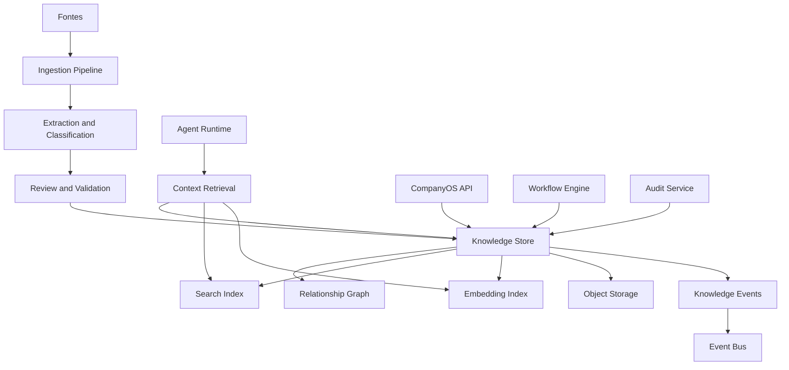

# Arquitetura do Project Knowledge Vault da Stieve Software Company

## Objetivo

Definir a arquitetura oficial do Project Knowledge Vault do CompanyOS.

Este documento estabelece:

- responsabilidades;
- tipos de conhecimento;
- fontes;
- versionamento;
- relacionamentos;
- estados;
- ingestão;
- revisão;
- busca;
- recuperação de contexto;
- embeddings;
- rastreabilidade;
- segurança;
- isolamento por projeto;
- retenção;
- auditoria;
- observabilidade;
- integração com agentes;
- critérios de teste.

O Project Knowledge Vault será a memória persistente, rastreável e versionada de cada projeto administrado pela Stieve Software Company.

---

# Princípios

## Conhecimento pertence ao projeto

Todo item de conhecimento deverá estar vinculado a:

```text
organization_id
project_id
```

Exceções globais deverão ser explicitamente classificadas e autorizadas.

## Fonte obrigatória

Nenhum item relevante deverá existir sem origem identificável.

Exemplos de origem:

```text
USER
REFERENCE
INTERVIEW
REQUIREMENT
DECISION
TASK
AGENT_EXECUTION
TEST
SECURITY_REVIEW
RELEASE
DEPLOYMENT
INCIDENT
SYSTEM
```

## Versionamento

Itens importantes não deverão ser sobrescritos silenciosamente.

Alterações deverão gerar:

- nova versão;
- histórico;
- responsável;
- justificativa;
- data;
- relação com a versão anterior.

## Separação entre fato e inferência

O Vault deverá distinguir:

```text
FACT
INFERENCE
DECISION
ASSUMPTION
QUESTION
RISK
CONSTRAINT
LESSON
```

Inferências de agentes não deverão ser registradas como fatos confirmados.

## Aprovação

Conhecimento crítico poderá exigir revisão humana antes de se tornar fonte oficial.

## Rastreabilidade

Deverá ser possível navegar:

```text
fonte
→ extração
→ requisito
→ decisão
→ tarefa
→ alteração
→ teste
→ release
→ deployment
→ incidente
→ lição aprendida
```

## Imutabilidade histórica

Versões anteriores deverão permanecer disponíveis conforme a política de retenção.

---

# Visão geral



---

# Responsabilidades

O Project Knowledge Vault deverá:

- armazenar conhecimento estruturado;
- armazenar referências a conteúdo não estruturado;
- versionar itens;
- registrar fontes;
- registrar confiança;
- registrar revisão;
- relacionar itens;
- permitir busca;
- permitir recuperação contextual;
- fornecer contexto aos agentes;
- registrar conhecimento gerado por agentes;
- impedir mistura entre projetos;
- preservar histórico;
- registrar auditoria;
- aplicar retenção.

O Vault não deverá:

- substituir o banco operacional de cada domínio;
- armazenar segredos;
- aceitar fatos sem fonte;
- permitir alteração silenciosa;
- fornecer contexto sem autorização;
- usar embeddings como única fonte de verdade.

---

# Tipos de conhecimento

## PROJECT_CONTEXT

Contexto geral do projeto.

Exemplos:

- problema;
- objetivo;
- área de negócio;
- usuários;
- processos;
- escopo;
- restrições.

## REQUIREMENT

Requisito funcional ou não funcional.

## BUSINESS_RULE

Regra de negócio.

## DECISION

Decisão arquitetural, funcional, de produto ou operacional.

## ARCHITECTURE

Conhecimento sobre componentes, serviços, integrações e padrões.

## CODE_KNOWLEDGE

Conhecimento extraído do repositório.

Exemplos:

- módulos;
- responsabilidades;
- dependências;
- interfaces;
- convenções.

## PROCESS

Fluxo ou procedimento.

## TEST_EVIDENCE

Resultado, evidência ou conclusão de teste.

## SECURITY_KNOWLEDGE

Risco, vulnerabilidade, política ou evidência de segurança.

## RELEASE_KNOWLEDGE

Versão, changelog, artefato ou decisão de release.

## DEPLOYMENT_KNOWLEDGE

Ambiente, procedimento, resultado ou rollback.

## INCIDENT_KNOWLEDGE

Sintoma, causa, correção, impacto ou postmortem.

## LESSON_LEARNED

Aprendizado confirmado.

## REFERENCE_SUMMARY

Resumo rastreável de uma referência.

## OPEN_QUESTION

Pergunta ainda não resolvida.

## ASSUMPTION

Hipótese que precisa de validação.

## RISK

Risco identificado.

## CONSTRAINT

Restrição técnica, legal, financeira ou operacional.

---

# Classificação epistemológica

Cada item deverá possuir uma classificação.

```text
FACT
INFERENCE
ASSUMPTION
DECISION
OPINION
QUESTION
EVIDENCE
POLICY
```

## FACT

Informação confirmada por fonte válida.

## INFERENCE

Conclusão produzida por análise.

## ASSUMPTION

Hipótese ainda não confirmada.

## DECISION

Escolha aprovada.

## OPINION

Avaliação subjetiva identificada como tal.

## QUESTION

Ponto pendente.

## EVIDENCE

Registro usado para comprovar algo.

## POLICY

Regra obrigatória da organização ou projeto.

---

# Estados

```text
DRAFT
PROPOSED
NEEDS_REVIEW
CONFIRMED
REJECTED
SUPERSEDED
ARCHIVED
```

## DRAFT

Item ainda em elaboração.

## PROPOSED

Item submetido para revisão.

## NEEDS_REVIEW

Item requer validação.

## CONFIRMED

Item aprovado como conhecimento oficial.

## REJECTED

Item recusado.

## SUPERSEDED

Substituído por nova versão ou decisão.

## ARCHIVED

Mantido apenas para histórico.

---

# KnowledgeItem

## Campos

```text
id
organization_id
project_id
knowledge_type
epistemic_type
title
summary
content
status
confidence
importance
confidentiality_level
source_type
source_id
source_location
created_by_type
created_by_id
created_at
updated_at
confirmed_at
confirmed_by
archived_at
archived_by
current_version_id
version
```

## Confiança

Faixa sugerida:

```text
0.00 a 1.00
```

A confiança deverá representar a qualidade da evidência, não uma certeza absoluta.

---

# KnowledgeVersion

## Campos

```text
id
knowledge_item_id
version_number
content
summary
change_reason
source_type
source_id
created_by_type
created_by_id
created_at
content_hash
```

## Regras

- `knowledge_item_id + version_number` deverá ser único;
- conteúdo confirmado não deverá ser alterado;
- nova alteração cria nova versão;
- hash deverá permitir verificar integridade;
- versão atual deverá ser explicitamente indicada.

---

# KnowledgeRelation

## Campos

```text
id
organization_id
project_id
source_knowledge_id
target_knowledge_id
relation_type
strength
metadata
created_by_type
created_by_id
created_at
```

## Tipos de relação

```text
DERIVED_FROM
SUPPORTS
CONTRADICTS
DEPENDS_ON
IMPLEMENTS
VERIFIES
SUPERSEDES
RELATES_TO
CAUSED_BY
RESOLVES
AFFECTS
DOCUMENTS
REFERENCES
```

---

# KnowledgeSource

Representa uma fonte registrada.

## Campos

```text
id
organization_id
project_id
source_type
source_id
source_version
title
location
content_hash
captured_at
captured_by
metadata
```

## Fontes possíveis

```text
REFERENCE
FILE
URL
INTERVIEW_ANSWER
REQUIREMENT
DECISION
TASK
COMMIT
TEST_RUN
SECURITY_FINDING
RELEASE
DEPLOYMENT
INCIDENT
AGENT_EXECUTION
MANUAL_ENTRY
```

---

# Ingestão

## Fluxo

```text
1. receber fonte
2. validar autorização
3. validar projeto
4. calcular hash
5. detectar duplicidade
6. classificar tipo
7. extrair conteúdo
8. gerar itens propostos
9. relacionar origem
10. solicitar revisão quando necessário
11. indexar
12. emitir evento
```

---

# Pipeline de ingestão

## Etapas

```text
RECEIVED
VALIDATING
EXTRACTING
CLASSIFYING
RELATING
REVIEWING
INDEXING
COMPLETED
FAILED
QUARANTINED
```

## Regras

- fontes em quarentena não serão indexadas;
- falha de extração deverá ser registrada;
- o conteúdo original deverá permanecer referenciado;
- extrações deverão indicar confiança;
- instruções dentro do conteúdo não serão tratadas como comandos.

---

# Deduplicação

A deduplicação poderá usar:

```text
content_hash
source_id
source_version
semantic_similarity
```

## Regra

Similaridade semântica não deverá remover automaticamente um item.

Itens semelhantes poderão ser:

- relacionados;
- marcados para revisão;
- consolidados mediante aprovação.

---

# Contradições

Quando dois itens se contradisserem:

```text
1. criar relação CONTRADICTS
2. marcar revisão
3. preservar ambos
4. registrar fontes
5. impedir uso como fato confirmado quando necessário
```

A resolução deverá gerar:

- decisão;
- confirmação;
- rejeição;
- nova versão;
- justificativa.

---

# Revisão

## Tipos

```text
AUTOMATIC
AGENT
HUMAN
DOMAIN_OWNER
SECURITY
```

## Regras

- conhecimento crítico exige revisão humana ou responsável do domínio;
- o agente que propôs não deverá ser o único aprovador quando houver risco;
- revisão deverá registrar evidência;
- rejeição deverá possuir motivo.

---

# Política de confirmação

Exemplos de itens que poderão exigir confirmação:

- requisito;
- regra de negócio;
- decisão;
- restrição;
- risco crítico;
- procedimento de produção;
- aceite de risco;
- lição de incidente;
- arquitetura aprovada.

---

# Busca

## Busca textual

Deverá suportar:

- título;
- resumo;
- conteúdo;
- tags;
- tipo;
- fonte;
- projeto;
- status.

## Busca por filtros

```text
knowledge_type
epistemic_type
status
source_type
importance
confidentiality_level
created_from
created_to
confirmed_by
```

## Busca semântica

Poderá ser usada para localizar conteúdo relacionado por significado.

Não deverá substituir:

- autorização;
- filtro por projeto;
- status;
- fonte;
- confiança;
- validação.

---

# Índice textual

A primeira versão poderá utilizar recursos do PostgreSQL.

Exemplo:

```text
full-text search
trigram index
```

Evolução futura poderá utilizar mecanismo dedicado.

---

# Embeddings

## Objetivo

Representar conteúdo para busca semântica.

## Campos

```text
id
knowledge_item_id
knowledge_version_id
chunk_id
embedding_model
embedding_dimension
embedding
content_hash
created_at
```

## Regras

- registrar modelo;
- registrar versão;
- recalcular quando conteúdo mudar;
- não misturar ambientes;
- aplicar isolamento por projeto;
- excluir segredo;
- manter relação com versão original.

---

# Estratégia inicial de embeddings

A arquitetura deverá permitir uso de:

```text
PostgreSQL + pgvector
```

ou mecanismo equivalente.

A escolha final será registrada em ADR.

---

# Chunking

Conteúdo grande deverá ser dividido em blocos.

Cada bloco deverá possuir:

```text
chunk_id
sequence
content
content_hash
source_location
token_count
```

## Regras

- preservar contexto suficiente;
- manter ordem;
- registrar origem;
- evitar cortes destrutivos;
- não misturar documentos;
- permitir reconstrução.

---

# Recuperação de contexto

## Context Retrieval

O Agent Runtime solicitará contexto por política.

Exemplo:

```json
{
  "organization_id": "org_01",
  "project_id": "prj_01",
  "execution_id": "exe_01",
  "policy": "TASK_REQUIRED",
  "query": "Implementação do endpoint de projetos",
  "resource_ids": [
    "tsk_01",
    "req_01"
  ],
  "max_items": 20,
  "token_budget": 12000
}
```

---

# Fases da recuperação

```text
1. autenticar solicitante
2. validar projeto
3. aplicar escopo
4. aplicar política
5. buscar relações explícitas
6. buscar texto
7. buscar semântica quando permitido
8. ordenar
9. remover duplicidades
10. limitar tamanho
11. registrar manifesto
12. retornar contexto
```

---

# Critérios de ranking

```text
relação direta
status confirmado
relevância textual
relevância semântica
importância
confiança
recência
tipo de conhecimento
origem
```

Itens confirmados deverão ter prioridade sobre inferências não revisadas.

---

# Context Package

## Estrutura

```json
{
  "context_id": "ctx_01",
  "organization_id": "org_01",
  "project_id": "prj_01",
  "policy": "TASK_REQUIRED",
  "items": [
    {
      "knowledge_id": "knw_01",
      "version": 3,
      "type": "REQUIREMENT",
      "status": "CONFIRMED",
      "source": {
        "type": "INTERVIEW_ANSWER",
        "id": "ans_01"
      },
      "content": "..."
    }
  ],
  "token_count": 8420,
  "created_at": "2026-08-02T21:10:00Z",
  "expires_at": "2026-08-02T22:10:00Z"
}
```

---

# Context Manifest

Toda recuperação deverá gerar manifesto.

## Campos

```text
id
organization_id
project_id
execution_id
requester_type
requester_id
policy
query
knowledge_item_ids
knowledge_version_ids
token_count
created_at
expires_at
```

Isso permitirá reconstruir qual conhecimento foi usado por um agente.

---

# Atualização do conhecimento

## Fluxo

```text
agente ou usuário propõe alteração
→ nova versão é criada
→ estado PROPOSED
→ revisão
→ confirmação
→ versão atual é atualizada
→ índice é atualizado
→ evento é emitido
```

---

# Escrita por agentes

Agentes poderão:

- propor item;
- propor versão;
- propor relação;
- registrar resumo de execução;
- registrar evidência;
- registrar pergunta;
- registrar risco.

Agentes não poderão:

- confirmar conhecimento crítico sozinhos;
- apagar histórico;
- alterar fonte;
- aumentar artificialmente confiança;
- misturar projetos;
- marcar inferência como fato.

---

# Knowledge Proposal

Exemplo:

```json
{
  "knowledge_type": "CODE_KNOWLEDGE",
  "epistemic_type": "INFERENCE",
  "title": "Responsabilidade do módulo projects",
  "summary": "O módulo concentra operações de ciclo de vida de projetos.",
  "content": "...",
  "confidence": 0.86,
  "source_type": "AGENT_EXECUTION",
  "source_id": "exe_01"
}
```

---

# Relação com domínios

## Requisitos

O Vault referencia o requisito oficial.

Não substitui `Requirement`.

## Decisões

O Vault fornece busca e contexto, mas `Decision` continua sendo entidade oficial.

## Tarefas

O Vault registra conhecimento derivado e rastreabilidade, mas não controla estado de tarefas.

## Releases

O Vault preserva contexto e evidências da release.

## Incidentes

O Vault preserva postmortem e lições aprendidas.

---

# Projeções

O Vault poderá criar projeções de leitura para facilitar busca.

Exemplos:

```text
ProjectKnowledgeSummary
CurrentArchitectureView
ActiveRisksView
ConfirmedRequirementsView
RecentLessonsView
```

Projeções deverão ser reconstruíveis a partir das fontes oficiais.

---

# Eventos publicados

```text
KnowledgeItemCreated
KnowledgeItemProposed
KnowledgeItemConfirmed
KnowledgeItemRejected
KnowledgeItemSuperseded
KnowledgeItemArchived
KnowledgeVersionCreated
KnowledgeRelationCreated
KnowledgeContradictionDetected
KnowledgeIndexUpdated
ContextPackageCreated
```

---

# Eventos consumidos

```text
ProjectCreated
ReferenceProcessed
InterviewAnswerReceived
RequirementApproved
DecisionApproved
TaskCompleted
TestSuitePassed
SecurityFindingConfirmed
ReleasePublished
DeploymentCompleted
IncidentClosed
AgentExecutionCompleted
```

O consumo deverá ser configurado por política.

---

# APIs iniciais

## Criar item

```text
POST /api/v1/projects/{project_id}/knowledge-items
```

## Listar

```text
GET /api/v1/projects/{project_id}/knowledge-items
```

## Consultar

```text
GET /api/v1/knowledge-items/{knowledge_id}
```

## Criar versão

```text
POST /api/v1/knowledge-items/{knowledge_id}/versions
```

## Criar relação

```text
POST /api/v1/knowledge-items/{knowledge_id}/relations
```

## Confirmar

```text
POST /api/v1/knowledge-items/{knowledge_id}/confirm
```

## Rejeitar

```text
POST /api/v1/knowledge-items/{knowledge_id}/reject
```

## Buscar

```text
POST /api/v1/projects/{project_id}/knowledge-search
```

## Recuperar contexto

```text
POST /internal/v1/projects/{project_id}/context-packages
```

---

# Permissões

```text
knowledge.create
knowledge.read
knowledge.update
knowledge.version
knowledge.relate
knowledge.propose
knowledge.confirm
knowledge.reject
knowledge.archive
knowledge.delete
knowledge.search
knowledge.context.retrieve
```

## Regra

`knowledge.delete` deverá ser restrita e normalmente representar exclusão lógica.

---

# Confidencialidade

Níveis:

```text
PUBLIC
INTERNAL
CONFIDENTIAL
RESTRICTED
```

A recuperação deverá considerar o nível de acesso do solicitante.

---

# Dados sensíveis

O Vault não deverá armazenar:

- senha;
- token;
- chave privada;
- segredo de infraestrutura;
- credencial;
- dado pessoal desnecessário.

Quando um dado sensível for essencial, deverá ser armazenado em sistema apropriado e apenas referenciado de modo seguro.

---

# Isolamento por projeto

Todas as consultas deverão aplicar:

```text
organization_id
project_id
```

Controles adicionais:

- Row-Level Security futuro;
- testes de isolamento;
- índices compostos;
- autorização antes da busca;
- namespaces de embeddings;
- caminhos separados no Object Storage.

---

# Banco de dados

## Tabelas principais

```text
knowledge_items
knowledge_versions
knowledge_relations
knowledge_sources
knowledge_chunks
knowledge_embeddings
knowledge_reviews
context_manifests
knowledge_ingestion_jobs
knowledge_history
```

---

# Índices

```text
knowledge_items(project_id, status)
knowledge_items(project_id, knowledge_type)
knowledge_items(project_id, epistemic_type)
knowledge_items(source_type, source_id)
knowledge_versions(knowledge_item_id, version_number)
knowledge_relations(source_knowledge_id)
knowledge_relations(target_knowledge_id)
knowledge_chunks(knowledge_version_id, sequence)
context_manifests(execution_id)
```

Índices textuais e vetoriais deverão ser adicionados conforme a tecnologia escolhida.

---

# Object Storage

Conteúdos grandes poderão ser armazenados no Object Storage.

O banco manterá:

```text
storage_key
content_hash
content_type
size
```

Exemplos:

- relatórios extensos;
- documentos processados;
- exports;
- snapshots;
- anexos;
- postmortems.

---

# Integridade

## Hash

Cada versão poderá possuir:

```text
content_hash
```

## Relação com fonte

Toda versão deverá preservar a fonte usada na criação.

## Atualização atômica

A criação de versão e atualização da versão atual deverão ocorrer em transação.

---

# Retenção

## Preservação longa

- decisões;
- requisitos;
- arquitetura;
- releases;
- incidentes;
- lições;
- auditoria;
- fontes oficiais.

## Retenção configurável

- contexto temporário;
- chunks intermediários;
- índices antigos;
- propostas rejeitadas;
- resumos temporários.

---

# Arquivamento

Arquivar não deverá apagar o item.

O item arquivado:

- permanece rastreável;
- não aparece por padrão;
- não é usado em contexto ativo, salvo solicitação;
- mantém relações;
- mantém versões.

---

# Exclusão

Exclusão física deverá ser excepcional.

Exige:

- permissão;
- política de retenção;
- motivo;
- avaliação de relações;
- auditoria;
- aprovação quando crítica.

---

# Backup

Deverá incluir:

```text
PostgreSQL
Object Storage
configuração de índices
modelos e versões de embeddings
```

Embeddings poderão ser reconstruídos, mas os conteúdos e metadados não.

---

# Recuperação

Após restauração:

```text
1. restaurar dados estruturados
2. restaurar objetos
3. validar hashes
4. reconstruir índices textuais
5. reconstruir embeddings quando necessário
6. validar relações
7. executar health checks
```

---

# Observabilidade

## Métricas

```text
knowledge_items_total
knowledge_versions_total
knowledge_proposals_total
knowledge_confirmed_total
knowledge_rejected_total
knowledge_contradictions_total
knowledge_ingestion_jobs_total
knowledge_ingestion_failures_total
knowledge_search_requests_total
knowledge_search_duration_seconds
context_packages_created_total
context_tokens_returned_total
embedding_jobs_total
embedding_failures_total
```

## Logs

Campos:

```text
knowledge_id
knowledge_version_id
project_id
source_type
source_id
status
reviewer_id
execution_id
context_id
correlation_id
error_code
```

## Alertas

- ingestão falhando;
- fila de revisão crescendo;
- índice desatualizado;
- embedding falhando;
- contradições críticas;
- tentativa de acesso entre projetos;
- hash inconsistente;
- contexto excessivamente grande.

---

# Mission Control

A interface deverá permitir:

- navegar por tipos;
- buscar;
- filtrar;
- consultar origem;
- consultar versões;
- consultar relações;
- visualizar contradições;
- revisar propostas;
- confirmar;
- rejeitar;
- arquivar;
- consultar uso por agentes;
- visualizar rastreabilidade.

---

# Visualização de relações

Exemplo:

```text
Reference
  ↓ DERIVED_FROM
Business Rule
  ↓ SUPPORTS
Requirement
  ↓ IMPLEMENTS
Task
  ↓ VERIFIED_BY
Test Evidence
  ↓ INCLUDED_IN
Release
```

---

# Auditoria

Ações auditáveis:

- criar item;
- criar versão;
- confirmar;
- rejeitar;
- arquivar;
- excluir;
- criar relação;
- remover relação;
- recuperar contexto sensível;
- exportar;
- alterar política;
- recalcular índice crítico.

---

# Governança

## Responsáveis

### Knowledge Manager

- organiza;
- revisa qualidade;
- mantém taxonomia;
- identifica duplicidades;
- administra retenção.

### Domain Owner

- confirma conhecimento do domínio;
- resolve contradições;
- valida políticas.

### Agent

- propõe;
- relaciona;
- resume;
- nunca confirma sozinho conhecimento crítico.

### Auditor

- consulta histórico;
- valida rastreabilidade;
- não altera conteúdo.

---

# Taxonomia

A taxonomia deverá ser versionada.

Mudanças deverão considerar:

- compatibilidade;
- migração;
- reclassificação;
- impacto em busca;
- impacto em agentes;
- impacto em relatórios.

---

# Qualidade do conhecimento

Critérios:

```text
source_completeness
clarity
consistency
confidence
freshness
traceability
review_status
relevance
```

---

# Obsolescência

Itens poderão receber:

```text
valid_from
valid_until
review_due_at
```

Itens vencidos deverão:

- permanecer no histórico;
- ser marcados;
- não ser usados automaticamente como conhecimento atual;
- gerar revisão quando necessário.

---

# Detecção de conhecimento desatualizado

Fontes de sinal:

- decisão substituída;
- requisito depreciado;
- arquivo alterado;
- nova release;
- incidente;
- mudança de arquitetura;
- prazo de revisão.

---

# Atualização automática

O sistema poderá propor atualização automática.

Nunca deverá confirmar automaticamente conhecimento crítico sem política explícita.

---

# Exportação

Formatos possíveis:

```text
JSON
Markdown
PDF futuro
```

Exportações deverão respeitar:

- escopo;
- confidencialidade;
- permissão;
- auditoria;
- mascaramento.

---

# Anti-padrões proibidos

```text
item sem fonte
inferência marcada como fato
agente confirmando conhecimento crítico sozinho
sobrescrever versão
misturar projetos
embedding sem referência ao conteúdo
busca sem autorização
armazenar segredo
apagar histórico silenciosamente
usar similaridade como prova
usar o Vault como banco operacional de tudo
```

---

# Primeira implementação

A primeira versão deverá suportar:

```text
KnowledgeItem
KnowledgeVersion
KnowledgeRelation
KnowledgeSource
KnowledgeReview
ContextManifest
busca textual
filtros
versionamento
isolamento por projeto
escrita por agentes como proposta
confirmação humana
auditoria
```

Embeddings poderão ser introduzidos incrementalmente, desde que o modelo e as interfaces já estejam previstos.

---

# Testes obrigatórios

## Criação

- item válido;
- fonte obrigatória;
- projeto incorreto;
- tipo inválido;
- conteúdo sensível.

## Versionamento

- nova versão;
- versão duplicada;
- versão anterior preservada;
- hash válido;
- versão atual correta.

## Relações

- relação válida;
- relação duplicada;
- ciclo permitido;
- recurso inexistente;
- projeto diferente.

## Revisão

- confirmar;
- rejeitar;
- segregação;
- agente sem permissão;
- motivo obrigatório.

## Busca

- texto;
- filtro;
- projeto;
- status;
- confidencialidade;
- paginação.

## Contexto

- política;
- token budget;
- origem;
- manifesto;
- projeto isolado;
- item não confirmado;
- deduplicação.

## Embeddings

- geração;
- versão;
- reconstrução;
- filtro de projeto;
- modelo alterado.

## Segurança

- acesso entre projetos;
- acesso a item restrito;
- segredo;
- exportação sem permissão;
- exclusão não autorizada.

## Recuperação

- restauração;
- reconstrução de índice;
- hash inconsistente;
- objeto ausente.

---

# Critérios de aceite da Sprint

Este documento será considerado aprovado quando:

- responsabilidades do Knowledge Vault estiverem definidas;
- tipos de conhecimento estiverem definidos;
- classificação epistemológica estiver definida;
- estados estiverem definidos;
- fontes obrigatórias estiverem incorporadas;
- versionamento estiver definido;
- relações estiverem definidas;
- ingestão estiver detalhada;
- revisão estiver definida;
- busca textual estiver definida;
- busca semântica estiver prevista;
- recuperação de contexto estiver definida;
- integração com agentes estiver definida;
- isolamento por projeto estiver detalhado;
- segurança estiver definida;
- retenção e backup estiverem definidos;
- observabilidade estiver definida;
- testes obrigatórios estiverem documentados.
