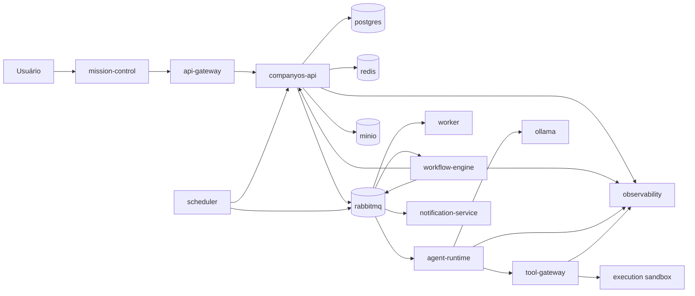

# Arquitetura de Serviços da Stieve Software Company

## Objetivo

Definir como os componentes do CompanyOS serão organizados em serviços executáveis, módulos internos e processos independentes.

Este documento estabelece:

- serviços iniciais;
- responsabilidades;
- fronteiras de domínio;
- APIs internas;
- eventos;
- persistência;
- dependências;
- implantação;
- escalabilidade;
- resiliência;
- segurança;
- observabilidade;
- critérios para extração de novos serviços.

A primeira versão deverá equilibrar robustez arquitetural e baixa complexidade operacional.

---

# Estratégia inicial

A plataforma deverá iniciar com uma combinação de:

```text
monólito modular
+
serviços especializados
+
infraestrutura compartilhada
```

O domínio principal ficará inicialmente no serviço:

```text
companyos-api
```

Serviços com necessidades operacionais distintas serão executados separadamente.

---

# Motivos para o monólito modular

O monólito modular inicial reduz:

- complexidade de rede;
- quantidade de deployments;
- falhas distribuídas;
- custo de observabilidade;
- duplicação de contratos;
- dificuldade de transações;
- esforço de manutenção.

Ao mesmo tempo, os módulos deverão possuir fronteiras claras para permitir extração futura.

---

# Serviços iniciais

```text
mission-control
api-gateway
companyos-api
workflow-engine
agent-runtime
tool-gateway
notification-service
scheduler
worker
```

Infraestrutura:

```text
postgres
rabbitmq
redis
minio
ollama
prometheus
grafana
loki
```

Serviços futuros possíveis:

```text
identity-service
reference-processing-service
knowledge-service
audit-service
release-service
deployment-service
plugin-runtime
```

---

# Diagrama de serviços



---

# Convenções

## Nome dos serviços

Os nomes deverão usar:

```text
kebab-case
```

Exemplos:

```text
companyos-api
workflow-engine
agent-runtime
tool-gateway
```

## Identidade do serviço

Cada serviço deverá possuir:

```text
service_name
service_version
instance_id
environment
started_at
```

## Endpoints operacionais

Todos os serviços HTTP deverão disponibilizar:

```text
/health
/ready
/version
/metrics
```

O endpoint `/metrics` poderá ser restrito à rede interna.

---

# mission-control

## Responsabilidade

Fornecer a interface web do SSC Mission Control.

## Tecnologia prevista

```text
frontend web
TypeScript
framework a definir
```

## Funções

- autenticação;
- navegação;
- projetos;
- Discovery;
- referências;
- requisitos;
- tarefas;
- agentes;
- workflows;
- aprovações;
- releases;
- deployments;
- auditoria;
- operações.

## Comunicação

Síncrona:

```text
HTTPS → api-gateway
```

Tempo real:

```text
SSE
```

Futuro:

```text
WebSocket
```

## Estado

O serviço deverá manter apenas estado de interface.

Não deverá possuir banco próprio inicialmente.

## Escalabilidade

Poderá ser servido como conteúdo estático e distribuído por proxy reverso.

---

# api-gateway

## Responsabilidade

Controlar o acesso externo aos serviços.

## Funções

- roteamento;
- TLS;
- CORS;
- rate limiting;
- limites de payload;
- correlação;
- autenticação inicial;
- cabeçalhos de segurança;
- logs de acesso;
- proteção contra abuso.

## Rotas iniciais

```text
/api/v1/*     → companyos-api
/stream       → companyos-api ou notification-service
/health       → resposta agregada
/docs         → documentação autorizada
```

## Dados

Não possuirá dados permanentes.

Poderá utilizar Redis para rate limiting.

## Restrições

O gateway não deverá conter regras de negócio.

---

# companyos-api

## Responsabilidade

Hospedar os módulos centrais do domínio do CompanyOS.

## Tecnologia prevista

```text
Python
FastAPI
SQLAlchemy
Alembic
Pydantic
```

## Módulos internos

```text
identity
organizations
projects
discovery
references
requirements
decisions
backlog
tasks
approvals
agents
releases
deployments
incidents
knowledge
audit
events
operations
```

## Comunicação

Entrada:

```text
HTTP
```

Saída síncrona:

```text
PostgreSQL
Redis
MinIO
serviços internos autorizados
```

Saída assíncrona:

```text
RabbitMQ
```

## Dados controlados

A maior parte dos dados estruturados iniciais.

## Regras

- módulos não acessam tabelas privadas de outros módulos diretamente;
- comunicação entre módulos passa por interfaces internas;
- eventos de domínio são emitidos via outbox;
- transações permanecem dentro da fronteira do serviço;
- estado deve seguir máquinas de estado documentadas.

---

# Estrutura interna do companyos-api

Estrutura recomendada:

```text
src/
└── companyos/
    ├── main.py
    ├── core/
    │   ├── config.py
    │   ├── database.py
    │   ├── security.py
    │   ├── errors.py
    │   ├── events.py
    │   └── observability.py
    ├── modules/
    │   ├── identity/
    │   ├── projects/
    │   ├── discovery/
    │   ├── references/
    │   ├── requirements/
    │   ├── tasks/
    │   ├── workflows/
    │   ├── approvals/
    │   ├── agents/
    │   ├── releases/
    │   ├── deployments/
    │   ├── audit/
    │   └── knowledge/
    └── shared/
        ├── domain/
        ├── infrastructure/
        └── application/
```

---

# Estrutura de módulo

Cada módulo deverá seguir uma separação aproximada:

```text
module/
├── api/
├── application/
├── domain/
├── infrastructure/
├── schemas/
├── events/
├── repositories/
└── tests/
```

## api

Responsável por:

- rotas;
- parâmetros;
- autenticação;
- serialização;
- respostas.

## application

Responsável por:

- casos de uso;
- comandos;
- consultas;
- coordenação;
- transações.

## domain

Responsável por:

- entidades;
- regras;
- estados;
- políticas;
- eventos de domínio.

## infrastructure

Responsável por:

- banco;
- mensageria;
- storage;
- integrações;
- implementações concretas.

---

# workflow-engine

## Responsabilidade

Executar workflows persistentes e processos de longa duração.

## Processo separado

Deverá operar em processo independente do `companyos-api`.

## Motivos

- workflows podem durar minutos, horas ou dias;
- precisam aguardar eventos;
- precisam aguardar aprovação;
- possuem retry próprio;
- possuem compensações;
- não devem ocupar workers HTTP.

## Funções

- carregar definição;
- iniciar instância;
- executar etapa;
- persistir checkpoint;
- aguardar evento;
- aguardar aprovação;
- aplicar timeout;
- aplicar retry;
- executar compensação;
- concluir;
- falhar.

## Dados

Metadados estruturados:

```text
PostgreSQL
```

Mensagens:

```text
RabbitMQ
```

Locks e temporários:

```text
Redis
```

## Comunicação

Consome:

```text
WorkflowRequested
WorkflowStepCompleted
HumanApprovalGranted
HumanApprovalRejected
TaskCompleted
TaskFailed
```

Publica:

```text
WorkflowStarted
WorkflowStepStarted
WorkflowStepCompleted
WorkflowWaitingApproval
WorkflowCompleted
WorkflowFailed
WorkflowCancelled
```

---

# agent-runtime

## Responsabilidade

Executar agentes e coordenar chamadas aos modelos de IA.

## Processo separado

Deverá ser separado do `companyos-api`.

## Motivos

- consumo elevado de CPU e memória;
- chamadas demoradas;
- streaming;
- controle de recursos;
- isolamento operacional;
- escalabilidade independente.

## Funções

- receber execução;
- validar manifesto;
- carregar contexto;
- selecionar modelo;
- enviar prompt;
- solicitar ferramenta;
- aguardar ferramenta;
- registrar resultado;
- registrar consumo;
- enviar resposta.

## Dependências

```text
RabbitMQ
Ollama
Tool Gateway
Knowledge Vault
PostgreSQL ou API interna
Redis
```

## Regras

- agente não acessa banco diretamente;
- contexto deve ser filtrado por projeto;
- toda ferramenta passa pelo Tool Gateway;
- execução possui timeout;
- toda saída deve ser correlacionada.

---

# tool-gateway

## Responsabilidade

Executar ferramentas autorizadas em nome de agentes.

## Processo separado

Deverá ser independente para permitir políticas e isolamento próprios.

## Funções

- validar agente;
- validar execução;
- validar permissão;
- validar ferramenta;
- validar caminho;
- validar comando;
- iniciar sandbox;
- capturar saída;
- mascarar segredo;
- registrar auditoria.

## Interfaces

Entrada:

```text
HTTP interno
ou
mensagem assíncrona
```

Saída:

```text
sandbox
workspace
Git
test runner
storage
```

## Regras

- nenhuma ferramenta é permitida por padrão;
- política é avaliada por execução;
- comandos têm timeout;
- output possui limite;
- ações críticas podem exigir aprovação.

---

# worker

## Responsabilidade

Executar tarefas assíncronas gerais.

## Exemplos

- processamento de referência;
- geração de relatório;
- exportação;
- indexação;
- cálculo de hash;
- limpeza;
- envio de notificação;
- atualização de projeção.

## Regra

Trabalhos especializados de agentes não deverão ser executados pelo worker geral.

## Escalabilidade

Poderá possuir múltiplas instâncias por fila.

---

# scheduler

## Responsabilidade

Disparar operações agendadas.

## Funções

- expirar aprovações;
- verificar agentes;
- agendar retries;
- verificar workflows;
- limpar temporários;
- aplicar retenção;
- iniciar backups;
- gerar tarefas periódicas.

## Regras

- jobs devem ser idempotentes;
- deve existir proteção contra execução duplicada;
- cada execução deve possuir correlação;
- falhas devem ser reenfileiradas quando seguras.

---

# notification-service

## Responsabilidade

Entregar eventos e notificações ao usuário.

## Canais iniciais

```text
SSE
Mission Control
```

## Canais futuros

```text
e-mail
webhooks
mensageria externa
```

## Funções

- consumir eventos;
- aplicar preferências;
- criar notificação;
- manter status de leitura;
- entregar em tempo real;
- reter histórico.

## Dados

Poderá iniciar como módulo do `companyos-api`.

Será extraído quando houver:

- alto volume;
- múltiplos canais;
- necessidade de escala independente.

---

# PostgreSQL

## Uso

Banco principal de dados estruturados.

## Estratégia inicial

Um cluster PostgreSQL compartilhado, com separação lógica por schema.

Schemas possíveis:

```text
identity
projects
discovery
requirements
tasks
workflows
agents
releases
deployments
audit
knowledge
platform
```

## Regras

- cada módulo controla suas tabelas;
- migrations versionadas;
- integridade referencial;
- backups;
- índices;
- transações;
- usuário de aplicação com menor privilégio.

---

# RabbitMQ

## Uso

Mensageria e integração assíncrona.

## Responsabilidades

- eventos de domínio;
- comandos assíncronos;
- filas de workers;
- filas de agentes;
- retry;
- dead-letter queue.

## Regra

Não será usado como armazenamento permanente de domínio.

---

# Redis

## Uso

Dados temporários e coordenação.

## Casos

- cache;
- rate limiting;
- locks;
- progresso;
- presença de agente;
- sessões temporárias;
- deduplicação curta.

## Regra

Dados críticos deverão existir em persistência permanente.

---

# MinIO

## Uso

Armazenamento de objetos.

## Conteúdos

- referências;
- relatórios;
- artefatos;
- logs grandes;
- exports;
- backups.

## Regra

Metadados permanecem no PostgreSQL.

---

# Ollama

## Responsabilidade

Hospedar modelos locais.

## Comunicação

Somente serviços autorizados deverão acessá-lo.

Preferencialmente:

```text
agent-runtime → Ollama
```

## Restrições

- não expor diretamente à internet;
- limitar modelos;
- monitorar consumo;
- aplicar timeout;
- registrar falhas;
- controlar concorrência.

---

# Comunicação síncrona entre serviços

## Quando usar

- consulta curta;
- validação imediata;
- operação que exige resposta;
- health check;
- autorização.

## Tecnologia

```text
HTTP interno
```

## Requisitos

- timeout;
- correlação;
- autenticação interna;
- retry somente quando seguro;
- circuit breaker futuro.

---

# Comunicação assíncrona

## Quando usar

- execução longa;
- múltiplos consumidores;
- processamento em segundo plano;
- workflow;
- agente;
- upload;
- release;
- deployment;
- notificação.

## Tecnologia

```text
RabbitMQ
```

## Requisitos

- mensagem versionada;
- idempotência;
- confirmação;
- retry;
- DLQ;
- correlação;
- observabilidade.

---

# APIs internas

APIs internas deverão possuir:

```text
/internal/v1
```

Exemplos:

```text
POST /internal/v1/authorizations/check
GET  /internal/v1/projects/{project_id}/context
POST /internal/v1/tasks/{task_id}/results
POST /internal/v1/agent-executions/{execution_id}/heartbeat
```

## Restrições

- não expostas externamente;
- autenticação de serviço;
- escopo restrito;
- rate limiting interno quando necessário;
- auditoria para ações críticas.

---

# Identidade entre serviços

Cada serviço deverá possuir identidade própria.

Campos:

```text
service_id
service_name
environment
permissions
```

Mecanismos possíveis na primeira versão:

```text
token interno
rede privada
segredo rotacionável
```

Evolução futura:

```text
mTLS
service mesh
workload identity
```

---

# Propriedade de dados

## Regra

Cada módulo ou serviço deverá possuir os dados que controla.

Exemplo:

```text
projects controla Project
tasks controla Task
approvals controla ApprovalRequest
releases controla Release
```

Outros módulos não deverão atualizar essas tabelas diretamente.

---

# Banco compartilhado não significa modelo compartilhado

Na primeira versão, vários módulos utilizarão o mesmo PostgreSQL.

Ainda assim:

- tabelas possuem proprietário;
- acesso deve ocorrer por repositório do módulo;
- joins entre módulos devem ser limitados;
- alterações cruzadas devem passar por casos de uso;
- eventos devem reduzir acoplamento.

---

# Transações

## Dentro do módulo

Usar transação local.

## Entre módulos do mesmo serviço

Poderá usar uma transação coordenada pelo caso de uso, quando necessário.

## Entre serviços

Usar:

```text
workflow
saga
compensação
eventos
outbox
```

Não usar transação distribuída global.

---

# Transactional Outbox

O `companyos-api` deverá registrar na mesma transação:

```text
mudança de estado
+
auditoria
+
evento na outbox
```

Um publicador separado enviará eventos ao RabbitMQ.

Estados da outbox:

```text
PENDING
PUBLISHED
FAILED
```

Campos mínimos:

```text
id
event_id
event_type
payload
attempt_count
status
created_at
published_at
last_error
```

---

# Consumidores idempotentes

Todo consumidor deverá armazenar ou reconhecer:

```text
event_id
```

Ao receber evento já processado:

```text
confirmar
+
não repetir efeito
```

---

# Retry

## Erros temporários

Podem ser repetidos:

- timeout;
- conexão;
- serviço temporariamente indisponível;
- limite momentâneo.

## Erros permanentes

Não devem entrar em retry automático:

- validação;
- autorização;
- estado inválido;
- recurso inexistente;
- payload incompatível.

## Estratégia

```text
exponential backoff
+
jitter
+
limite de tentativas
```

---

# Dead-letter queue

Cada fila crítica deverá possuir DLQ.

Exemplos:

```text
events.dead-letter
workflows.dead-letter
agents.dead-letter
references.dead-letter
notifications.dead-letter
```

Reprocessamento deverá exigir:

- permissão;
- motivo;
- auditoria;
- verificação de idempotência.

---

# Timeouts

Cada comunicação deverá definir timeout explícito.

Categorias:

```text
HTTP curto
chamada de IA
execução de ferramenta
processamento de arquivo
workflow
deployment
```

Nenhuma chamada deverá esperar indefinidamente.

---

# Circuit breaker

Poderá ser introduzido para dependências instáveis.

Exemplos:

- Ollama;
- storage;
- integração externa;
- serviço extraído.

Estados:

```text
CLOSED
OPEN
HALF_OPEN
```

---

# Escalabilidade

## Horizontal

Serviços stateless poderão possuir múltiplas instâncias:

```text
companyos-api
worker
agent-runtime
notification-service
```

## Vertical

Serviços intensivos poderão receber mais recursos:

```text
Ollama
agent-runtime
PostgreSQL
MinIO
```

## Fila

Workers poderão ser escalados conforme profundidade da fila.

---

# Afinidade e concorrência

Algumas operações precisam de exclusividade.

Exemplos:

- uma transição por recurso;
- uma execução ativa por agente;
- uma migration;
- um deployment por ambiente;
- uma sessão Discovery ativa por projeto.

Mecanismos:

```text
versionamento otimista
locks no banco
locks Redis
chaves de idempotência
```

---

# Segurança de rede

Rede Docker inicial:

```text
public
application
data
observability
execution
```

## Public

Serviços expostos:

```text
api-gateway
mission-control
```

## Application

```text
companyos-api
workflow-engine
worker
scheduler
notification-service
```

## Data

```text
postgres
rabbitmq
redis
minio
```

## Execution

```text
agent-runtime
tool-gateway
sandboxes
ollama
```

## Observability

```text
prometheus
grafana
loki
```

---

# Portas

Somente portas necessárias deverão ser publicadas no host.

Em produção, serviços internos deverão permanecer em rede privada.

---

# Segredos

Cada serviço receberá somente os segredos necessários.

Exemplos:

```text
companyos-api → banco, RabbitMQ, Redis, MinIO
agent-runtime → RabbitMQ, Ollama, Tool Gateway
tool-gateway → credenciais temporárias de ferramentas
```

## Regras

- não incluir em imagem;
- não incluir em Git;
- não registrar em log;
- rotacionar;
- limitar por serviço;
- revogar quando necessário.

---

# Logs

Todos os serviços deverão produzir logs JSON.

Campos mínimos:

```text
timestamp
level
service
version
environment
message
correlation_id
request_id
actor_id
project_id
resource_type
resource_id
error_code
```

---

# Métricas

Métricas comuns:

```text
requests_total
request_duration_seconds
errors_total
dependency_errors_total
active_operations
queue_depth
retry_total
dead_letter_total
```

Métricas específicas deverão ser adicionadas por serviço.

---

# Traces

OpenTelemetry poderá ser adicionado futuramente.

O contexto de trace deverá seguir:

```text
Mission Control
→ Gateway
→ API
→ Event Bus
→ Workflow
→ Agent
→ Tool
```

---

# Health checks

## Liveness

Confirma que o processo está vivo.

```text
/health
```

## Readiness

Confirma que pode receber trabalho.

```text
/ready
```

A readiness deverá considerar dependências críticas.

---

# Inicialização

Cada serviço deverá:

1. carregar configuração;
2. validar segredos;
3. validar dependências;
4. aplicar configurações seguras;
5. iniciar observabilidade;
6. iniciar processamento;
7. marcar readiness.

---

# Encerramento

Shutdown deverá:

1. parar de receber trabalho;
2. concluir ou pausar operações;
3. confirmar mensagens concluídas;
4. liberar locks;
5. fechar conexões;
6. registrar encerramento.

---

# Versionamento

Cada serviço deverá possuir versão independente.

Formato:

```text
MAJOR.MINOR.PATCH
```

A API pública continua versionada por:

```text
/api/v1
```

A versão de serviço não deve obrigatoriamente alterar a versão da API.

---

# Compatibilidade de eventos

Consumidores deverão:

- aceitar campos adicionais;
- validar versão;
- rejeitar versão incompatível;
- manter compatibilidade durante migração.

---

# Deployments

A primeira versão utilizará Docker Compose.

Cada serviço deverá possuir:

- imagem;
- health check;
- variáveis;
- limites;
- volume quando necessário;
- rede;
- dependências;
- política de restart.

---

# Dependências no Docker Compose

`depends_on` não deverá ser tratado como garantia de disponibilidade.

Cada serviço deverá usar:

- retry de conexão;
- readiness;
- timeout;
- backoff.

---

# Estratégia de migrations

Somente o serviço proprietário deverá executar suas migrations.

Inicialmente:

```text
companyos-api
```

Antes da API ficar pronta:

1. obter lock;
2. validar versão;
3. aplicar migrations;
4. liberar lock;
5. iniciar serviço.

---

# Backup

Dados críticos:

```text
PostgreSQL
MinIO
configurações protegidas
```

RabbitMQ e Redis não substituem backup de dados de domínio.

---

# Recuperação

Cada serviço deverá documentar:

```text
dependências
estado persistente
procedimento de restauração
impacto
health check
```

---

# Critérios para extração de serviço

Um módulo será candidato a serviço independente quando possuir pelo menos alguns destes fatores:

- alta carga;
- necessidade de escala independente;
- risco operacional específico;
- tecnologia diferente;
- ciclo de release independente;
- fronteira de domínio estável;
- equipe responsável própria;
- banco ou armazenamento especializado;
- isolamento de segurança;
- muitas dependências externas.

---

# Serviços candidatos à extração

## Identity Service

Quando houver:

- múltiplas aplicações;
- autenticação externa;
- escala de usuários;
- requisitos avançados de segurança.

## Reference Processing Service

Quando houver:

- alto volume;
- processamento pesado;
- múltiplos formatos;
- antivírus;
- OCR;
- pipelines especializados.

## Knowledge Service

Quando houver:

- indexação vetorial;
- embeddings;
- busca semântica;
- alto volume de conhecimento.

## Audit Service

Quando houver:

- retenção longa;
- storage dedicado;
- requisitos regulatórios;
- alto volume.

## Deployment Service

Quando houver:

- múltiplos ambientes;
- múltiplas máquinas;
- integrações com provedores;
- execução distribuída.

---

# Anti-padrões proibidos

```text
banco acessado por qualquer serviço
serviço sem timeout
evento sem versão
retry infinito
segredo em variável logada
comando direto do frontend
dependência circular
API interna exposta publicamente
agente acessando produção diretamente
tabela compartilhada sem proprietário
```

---

# Testes de arquitetura

## Contratos

- API corresponde ao OpenAPI;
- eventos correspondem ao catálogo;
- schemas possuem versão;
- erros seguem o padrão.

## Dependências

- serviços não acessam redes proibidas;
- agentes não acessam PostgreSQL;
- Mission Control não acessa serviços internos;
- gateway não contém domínio.

## Falhas

- banco indisponível;
- RabbitMQ indisponível;
- Redis indisponível;
- Ollama indisponível;
- worker interrompido;
- mensagem duplicada;
- timeout;
- restart.

## Segurança

- identidade de serviço inválida;
- token expirado;
- segredo mascarado;
- rede não permitida;
- ação crítica sem aprovação.

---

# Critérios de aceite da Sprint

Este documento será considerado aprovado quando:

- serviços iniciais estiverem definidos;
- módulos internos estiverem delimitados;
- responsabilidades estiverem claras;
- comunicação síncrona e assíncrona estiver definida;
- propriedade de dados estiver definida;
- estratégia de transações estiver definida;
- outbox estiver incorporada;
- retry e DLQ estiverem definidos;
- identidade entre serviços estiver prevista;
- redes estiverem separadas;
- segredos estiverem limitados;
- observabilidade estiver padronizada;
- estratégia de implantação inicial estiver definida;
- critérios de extração de serviços estiverem documentados;
- anti-padrões estiverem registrados.
