# Máquinas de Estado da Stieve Software Company

## Objetivo

Definir os estados e as transições permitidas para os principais recursos do CompanyOS.

Este documento estabelece:

- estados válidos;
- transições permitidas;
- transições proibidas;
- responsáveis pelas mudanças;
- eventos emitidos;
- aprovações necessárias;
- condições de entrada e saída;
- comportamento em falhas;
- regras de idempotência;
- critérios de auditoria.

As máquinas de estado serão usadas como base para:

- regras de negócio;
- workflows;
- contratos da API;
- eventos;
- permissões;
- testes;
- auditoria;
- interface do SSC Mission Control.

---

# Princípios gerais

## Transições explícitas

Nenhum recurso poderá mudar de estado apenas por alteração direta no banco de dados.

Toda transição deverá passar por uma operação de domínio.

Exemplo:

```text
POST /api/v1/projects/{project_id}/transitions
```

Corpo esperado:

```json
{
  "transition": "approve_discovery",
  "reason": "Discovery Report revisado e aprovado."
}
```

## Estados imutáveis após publicação

Recursos publicados ou concluídos não deverão ser alterados silenciosamente.

Exemplos:

- eventos publicados;
- releases publicadas;
- deployments concluídos;
- decisões aprovadas;
- auditorias registradas.

Alterações posteriores deverão gerar:

- nova versão;
- nova decisão;
- novo evento;
- nova release;
- nova execução;
- novo registro de auditoria.

## Auditoria obrigatória

Toda transição deverá registrar:

```text
resource_type
resource_id
previous_state
new_state
transition
actor_type
actor_id
reason
correlation_id
created_at
```

## Aprovação humana

Transições críticas deverão exigir uma aprovação válida antes da execução.

Exemplos:

- aprovação do Discovery;
- aceite de risco;
- aprovação de release;
- deployment em produção;
- rollback de produção;
- exclusão de projeto;
- alteração de permissão crítica.

## Idempotência

Repetir uma solicitação já concluída não deverá produzir efeitos duplicados.

Exemplo:

```text
APPROVED → approve
```

Resultado esperado:

```text
200 OK
state = APPROVED
changed = false
```

## Concorrência

Toda transição deverá validar a versão atual do recurso.

Campos recomendados:

```text
version
updated_at
```

Em caso de conflito de versão:

```text
412 Precondition Failed
```

---

# Padrão de transição

Cada transição deverá possuir:

```text
name
source_state
target_state
required_permissions
required_approval
guards
side_effects
events
rollback_strategy
```

Exemplo:

```yaml
name: approve_release
source_state: WAITING_APPROVAL
target_state: APPROVED
required_permissions:
  - release.approve
required_approval: true
guards:
  - tests_passed
  - security_review_approved
  - documentation_updated
side_effects:
  - lock_release_content
events:
  - ReleaseApproved
```

---

# Máquina de estado do Projeto

## Estados

```text
IDEA
DISCOVERY
WAITING_APPROVAL
PLANNING
DEVELOPMENT
TESTING
STAGING
PRODUCTION
EVOLUTION
PAUSED
ARCHIVED
CANCELLED
```

## Diagrama

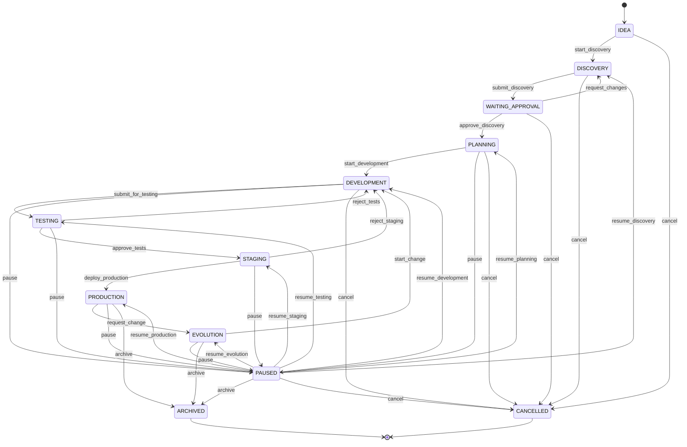

## Transições

### `start_discovery`

```text
IDEA → DISCOVERY
```

Condições:

- projeto possui nome;
- problema inicial foi informado;
- responsável foi definido;
- usuário possui `project.update`.

Evento:

```text
DiscoveryStarted
```

### `submit_discovery`

```text
DISCOVERY → WAITING_APPROVAL
```

Condições:

- Discovery Report foi gerado;
- não existem perguntas obrigatórias pendentes;
- requisitos principais foram extraídos;
- riscos foram identificados.

Eventos:

```text
DiscoveryReportGenerated
HumanApprovalRequested
```

### `request_changes`

```text
WAITING_APPROVAL → DISCOVERY
```

Condições:

- motivo obrigatório;
- usuário possui `discovery.review`.

Evento:

```text
DiscoveryChangesRequested
```

### `approve_discovery`

```text
WAITING_APPROVAL → PLANNING
```

Condições:

- aprovação humana válida;
- usuário possui `discovery.approve`;
- relatório atual corresponde à versão submetida.

Eventos:

```text
DiscoveryApproved
ProjectApproved
```

### `start_development`

```text
PLANNING → DEVELOPMENT
```

Condições:

- arquitetura inicial aprovada;
- backlog inicial criado;
- tarefas planejadas;
- agentes ou responsáveis definidos.

Evento:

```text
ProjectDevelopmentStarted
```

### `submit_for_testing`

```text
DEVELOPMENT → TESTING
```

Condições:

- critérios de aceite implementados;
- build concluído;
- testes mínimos executáveis;
- documentação técnica atualizada.

Evento:

```text
ProjectTestingStarted
```

### `approve_tests`

```text
TESTING → STAGING
```

Condições:

- testes obrigatórios aprovados;
- falhas bloqueantes resolvidas;
- revisão de segurança concluída quando aplicável.

Evento:

```text
ProjectStagingReady
```

### `deploy_production`

```text
STAGING → PRODUCTION
```

Condições:

- release aprovada;
- homologação aprovada;
- deployment de produção autorizado;
- backup e rollback preparados.

Evento:

```text
ProjectProductionStarted
```

### `request_change`

```text
PRODUCTION → EVOLUTION
```

Condições:

- solicitação de mudança registrada;
- RFC criada quando aplicável.

Evento:

```text
ProjectEvolutionStarted
```

### `pause`

Origem permitida:

```text
PLANNING
DEVELOPMENT
TESTING
STAGING
PRODUCTION
EVOLUTION
```

Destino:

```text
PAUSED
```

Condições:

- motivo obrigatório;
- workflows ativos deverão ser pausados ou concluídos;
- tarefas críticas deverão ser avaliadas.

Evento:

```text
ProjectPaused
```

### `archive`

Origem permitida:

```text
PAUSED
PRODUCTION
EVOLUTION
```

Destino:

```text
ARCHIVED
```

Condições:

- não existem deployments ativos;
- não existem aprovações críticas pendentes;
- retenção e backup foram avaliados.

Evento:

```text
ProjectArchived
```

### `cancel`

Origem permitida:

```text
IDEA
DISCOVERY
WAITING_APPROVAL
PLANNING
DEVELOPMENT
PAUSED
```

Destino:

```text
CANCELLED
```

Condições:

- motivo obrigatório;
- impacto avaliado;
- recursos ativos interrompidos;
- auditoria registrada.

Evento:

```text
ProjectCancelled
```

## Transições proibidas

Exemplos:

```text
IDEA → PRODUCTION
DISCOVERY → DEVELOPMENT
WAITING_APPROVAL → TESTING
ARCHIVED → DEVELOPMENT
CANCELLED → PLANNING
```

Projetos `ARCHIVED` ou `CANCELLED` são terminais.

Reabertura futura deverá utilizar uma operação específica e uma nova ADR.

---

# Máquina de estado do Discovery

## Estados

```text
DRAFT
COLLECTING_CONTEXT
PROCESSING_REFERENCES
INTERVIEWING
EXTRACTING_REQUIREMENTS
GENERATING_DISCOVERY
WAITING_APPROVAL
CHANGES_REQUESTED
APPROVED
CANCELLED
```

## Diagrama

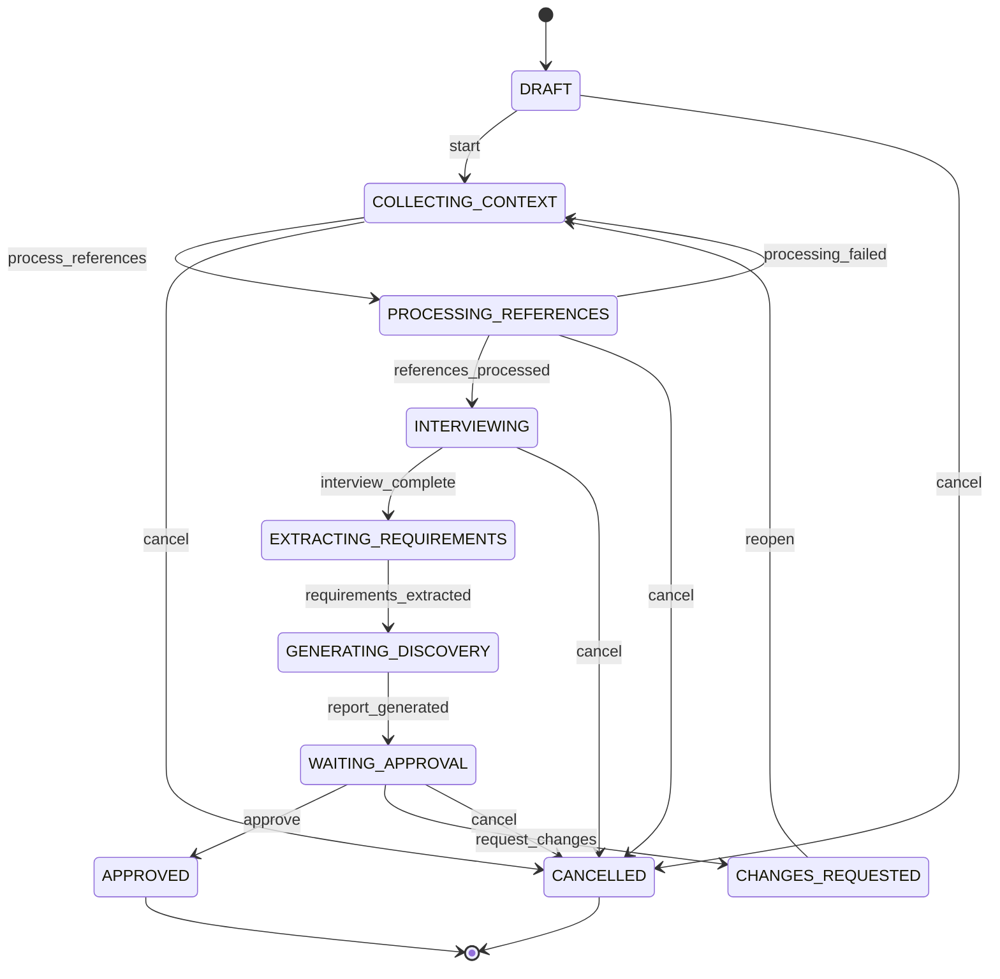

## Regras

- Somente uma sessão poderá estar ativa por projeto.
- `APPROVED` é estado terminal para a versão atual.
- Ajustes após aprovação deverão criar uma nova versão.
- `PROCESSING_REFERENCES` poderá retornar a `COLLECTING_CONTEXT` em caso de falha.
- `WAITING_APPROVAL` não poderá ser alterado por agentes.

## Eventos

```text
DiscoveryStarted
ReferenceProcessingStarted
ReferenceProcessed
InterviewQuestionCreated
InterviewAnswerReceived
RequirementExtracted
DiscoveryReportGenerated
DiscoveryChangesRequested
DiscoveryApproved
```

---

# Máquina de estado da Referência

## Estados

```text
UPLOADED
QUEUED
PROCESSING
PROCESSED
FAILED
NEEDS_REVIEW
ARCHIVED
QUARANTINED
```

## Diagrama

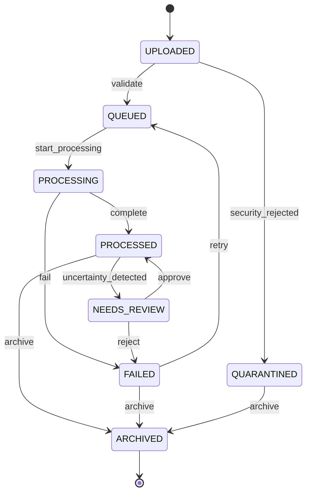

## Regras

- `QUARANTINED` bloqueia processamento.
- Referências arquivadas permanecem rastreáveis.
- Retry deverá respeitar o limite configurado.
- A aprovação de revisão deverá registrar o usuário responsável.

## Eventos

```text
ReferenceUploaded
ReferenceProcessingStarted
ReferenceProcessed
ReferenceProcessingFailed
ReferenceQuarantined
ReferenceNeedsReview
ReferenceArchived
```

---

# Máquina de estado do Requisito

## Estados

```text
DRAFT
PROPOSED
NEEDS_REVIEW
APPROVED
REJECTED
IMPLEMENTED
VERIFIED
DEPRECATED
```

## Diagrama

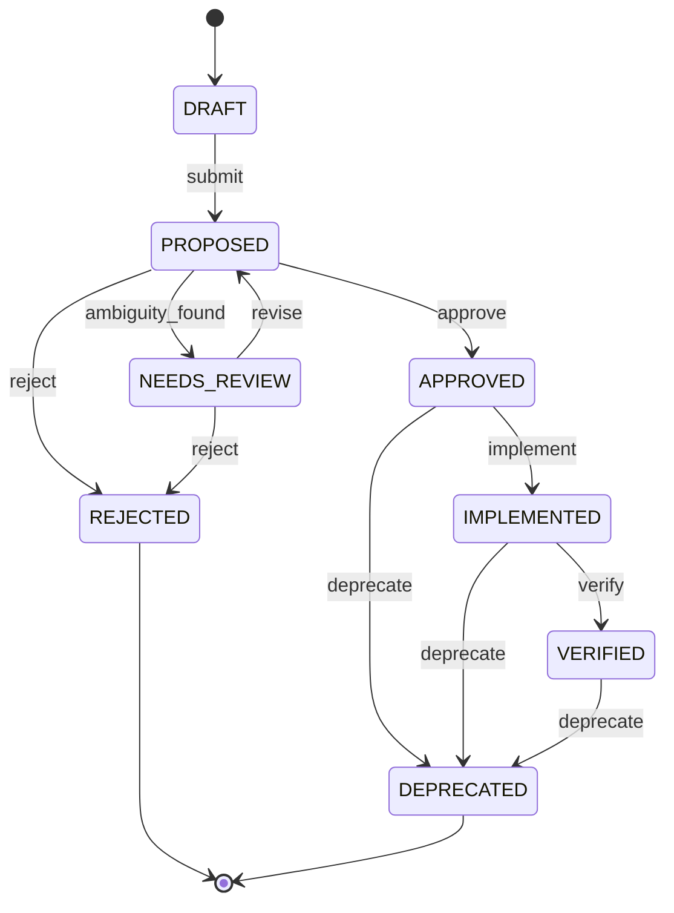

## Regras

- Requisitos aprovados deverão possuir critérios de aceite.
- `IMPLEMENTED` exige vínculo com tarefa concluída.
- `VERIFIED` exige evidência de teste.
- Requisito rejeitado não poderá ser reutilizado sem nova versão.
- Requisito `DEPRECATED` permanece no histórico.

## Eventos

```text
RequirementCreated
RequirementProposed
RequirementNeedsReview
RequirementApproved
RequirementRejected
RequirementImplemented
RequirementVerified
RequirementDeprecated
```

---

# Máquina de estado da Tarefa

## Estados

```text
PENDING
QUEUED
ASSIGNED
RUNNING
WAITING_APPROVAL
BLOCKED
RETRYING
COMPLETED
FAILED
CANCELLED
```

## Diagrama

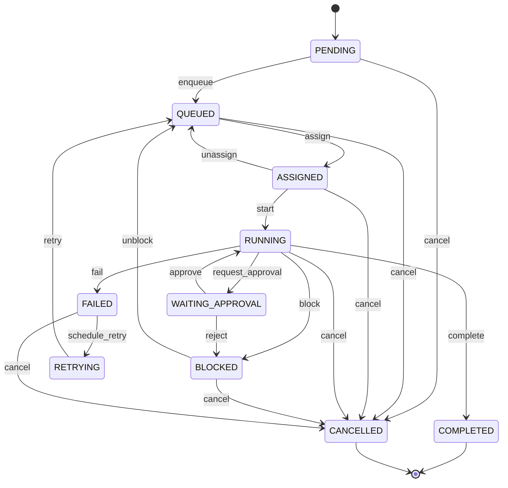

## Regras

- `RUNNING` exige agente ou usuário atribuído.
- `COMPLETED` exige resultado.
- `FAILED` exige erro registrado.
- `WAITING_APPROVAL` exige `ApprovalRequest`.
- `RETRYING` respeita `max_attempts`.
- Tarefa concluída não poderá voltar a execução.
- Reabertura deverá criar nova tarefa relacionada.

## Eventos

```text
TaskCreated
TaskQueued
TaskAssigned
TaskStarted
TaskWaitingApproval
TaskBlocked
TaskCompleted
TaskFailed
TaskRetryScheduled
TaskCancelled
```

---

# Máquina de estado do Workflow

## Estados

```text
CREATED
RUNNING
PAUSED
WAITING_APPROVAL
COMPLETED
FAILED
CANCELLED
```

## Diagrama

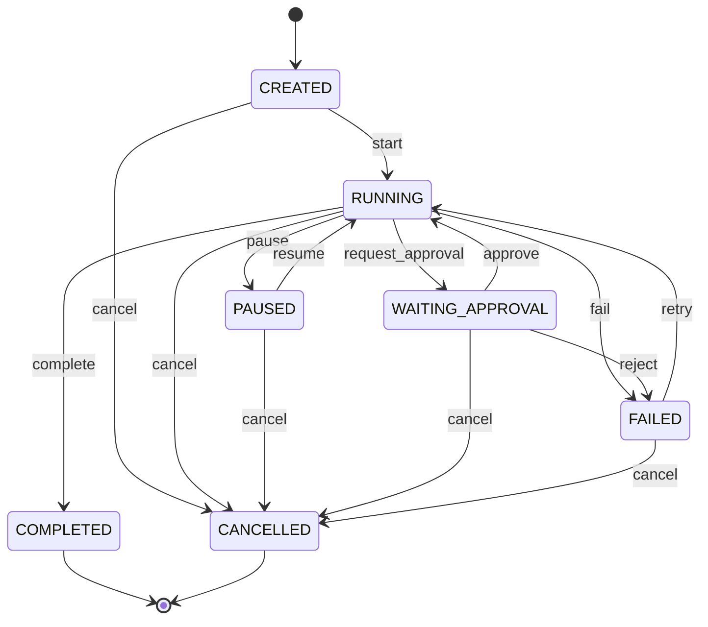

## Regras

- Workflow deverá possuir estado persistente.
- Etapas concluídas não deverão ser repetidas sem idempotência.
- Pausa deverá preservar contexto e progresso.
- Cancelamento deverá executar compensações quando definidas.
- Retry deverá ser permitido apenas quando seguro.

## Eventos

```text
WorkflowCreated
WorkflowStarted
WorkflowPaused
WorkflowResumed
WorkflowWaitingApproval
WorkflowCompleted
WorkflowFailed
WorkflowCancelled
```

---

# Máquina de estado da Etapa do Workflow

## Estados

```text
PENDING
READY
RUNNING
WAITING
WAITING_APPROVAL
COMPLETED
FAILED
SKIPPED
CANCELLED
```

## Regras

- `READY` exige dependências concluídas.
- `RUNNING` exige recurso disponível.
- `SKIPPED` exige justificativa.
- `FAILED` deverá registrar erro e possibilidade de retry.
- `COMPLETED` deverá registrar saída.

---

# Máquina de estado do Agente

## Estados

```text
OFFLINE
STARTING
IDLE
RESERVED
PLANNING
WORKING
WAITING
REVIEWING
BLOCKED
FAILED
STOPPING
```

## Diagrama

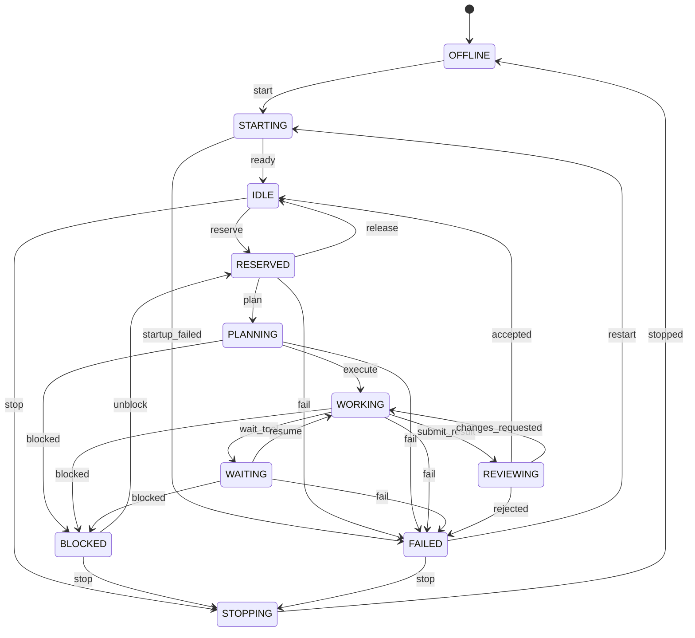

## Regras

- Somente `IDLE` poderá ser reservado.
- Um agente `RESERVED` pertence a uma única execução.
- `WORKING` deverá possuir tarefa ativa.
- `FAILED` exige erro e diagnóstico.
- Agentes bloqueados não poderão receber novas tarefas.
- Heartbeat expirado deverá mover o agente para `FAILED` ou `OFFLINE`.

## Eventos

```text
AgentStarted
AgentOnline
AgentReserved
AgentExecutionStarted
AgentWaiting
AgentReviewing
AgentBlocked
AgentExecutionCompleted
AgentExecutionFailed
AgentOffline
```

---

# Máquina de estado da Execução do Agente

## Estados

```text
CREATED
RUNNING
WAITING_TOOL
WAITING_APPROVAL
COMPLETED
FAILED
CANCELLED
TIMEOUT
```

## Regras

- `RUNNING` exige agente reservado.
- `WAITING_TOOL` registra ferramenta solicitada.
- `WAITING_APPROVAL` exige operação de risco.
- `TIMEOUT` é terminal para a execução atual.
- Retry deverá criar nova execução relacionada.
- Resultado concluído deverá registrar arquivos alterados e commit, quando aplicável.

---

# Máquina de estado da Aprovação

## Estados

```text
PENDING
APPROVED
REJECTED
EXPIRED
CANCELLED
```

## Diagrama

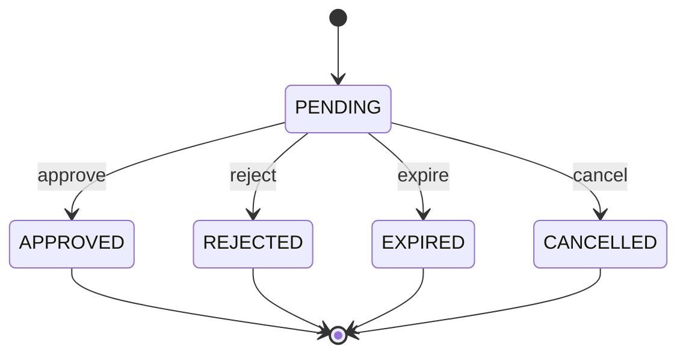

## Regras

- Apenas `PENDING` poderá receber decisão.
- Aprovação expirada não poderá ser reutilizada.
- Decisões críticas deverão registrar justificativa.
- Aprovação deverá validar recurso, versão e risco.
- Alteração do recurso invalida aprovação pendente relacionada.

## Eventos

```text
HumanApprovalRequested
HumanApprovalGranted
HumanApprovalRejected
HumanApprovalExpired
HumanApprovalCancelled
```

---

# Máquina de estado do Teste

## Estados

```text
QUEUED
RUNNING
PASSED
FAILED
CANCELLED
```

## Regras

- `PASSED` exige relatório.
- `FAILED` exige falhas registradas.
- Testes cancelados não contam como aprovados.
- Reexecução deverá criar novo `TestRun`.
- Coverage deverá ser registrada quando aplicável.

## Eventos

```text
TestSuiteQueued
TestSuiteStarted
TestSuitePassed
TestSuiteFailed
TestSuiteCancelled
CoverageCalculated
```

---

# Máquina de estado do Achado de Segurança

## Estados

```text
OPEN
CONFIRMED
IN_PROGRESS
RESOLVED
FALSE_POSITIVE
RISK_ACCEPTED
```

## Diagrama

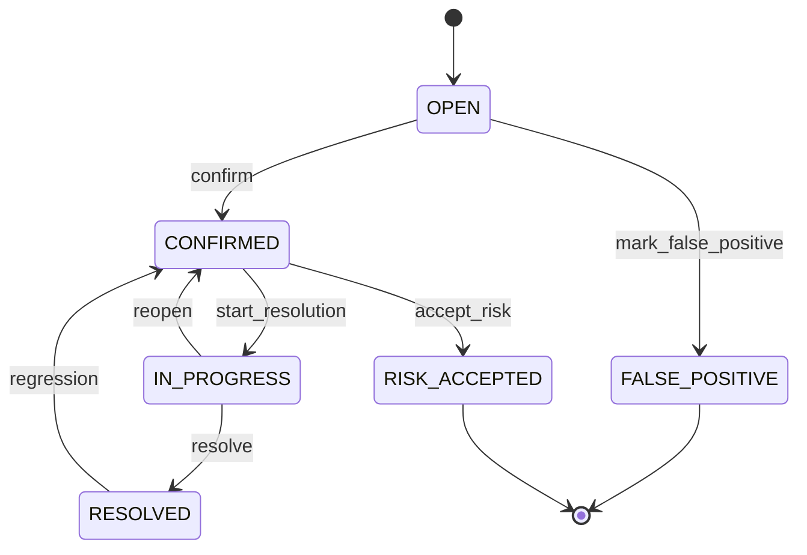

## Regras

- Severidade `CRITICAL` bloqueia release.
- `RISK_ACCEPTED` exige aprovação humana autorizada.
- `FALSE_POSITIVE` exige justificativa.
- Regressão deverá reabrir o achado.

## Eventos

```text
VulnerabilityDetected
SecurityFindingConfirmed
SecurityResolutionStarted
SecurityFindingResolved
SecurityFindingReopened
SecurityRiskAccepted
SecurityFindingMarkedFalsePositive
```

---

# Máquina de estado da Release

## Estados

```text
DRAFT
VALIDATING
WAITING_APPROVAL
APPROVED
REJECTED
PUBLISHED
DEPRECATED
```

## Diagrama

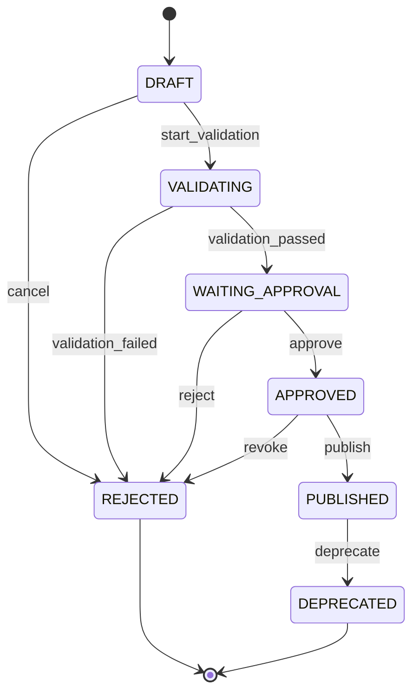

## Regras

- `VALIDATING` executa testes, segurança e documentação.
- `WAITING_APPROVAL` exige todas as validações concluídas.
- `APPROVED` exige aprovação humana.
- `PUBLISHED` torna o conteúdo imutável.
- Release publicada não poderá ser rejeitada; apenas depreciada.
- Versão deverá ser única por projeto.

## Eventos

```text
ReleaseCreated
ReleaseValidationStarted
ReleaseValidationPassed
ReleaseValidationFailed
ReleaseApproved
ReleaseRejected
ReleasePublished
ReleaseDeprecated
```

---

# Máquina de estado do Deployment

## Estados

```text
REQUESTED
WAITING_APPROVAL
APPROVED
RUNNING
SUCCEEDED
FAILED
ROLLING_BACK
ROLLED_BACK
CANCELLED
```

## Diagrama

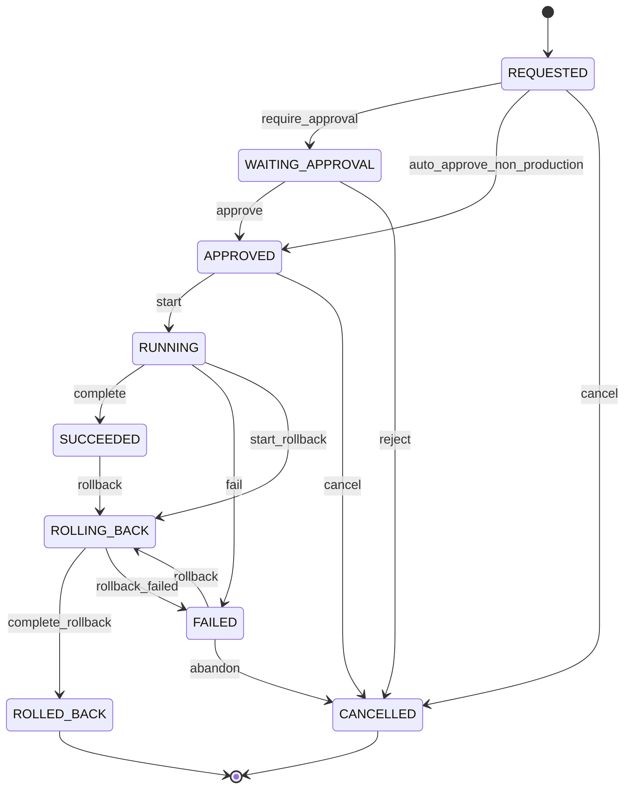

## Regras

- Produção sempre exige `WAITING_APPROVAL`.
- `RUNNING` exige release aprovada.
- `SUCCEEDED` exige health checks aprovados.
- `FAILED` deverá registrar logs e causa.
- Rollback exige versão anterior ou plano alternativo.
- Um deployment concluído não poderá ser executado novamente.
- Nova tentativa deverá gerar novo deployment.

## Eventos

```text
DeploymentRequested
DeploymentApprovalRequested
DeploymentApproved
DeploymentStarted
DeploymentCompleted
DeploymentFailed
RollbackStarted
RollbackCompleted
RollbackFailed
DeploymentCancelled
```

---

# Máquina de estado do Evento

## Estados

```text
CREATED
PUBLISHED
PROCESSING
PROCESSED
FAILED
DEAD_LETTERED
```

## Regras

- Evento publicado é imutável.
- `FAILED` pode retornar a `PUBLISHED` por retry.
- Ao exceder tentativas, deverá ir para `DEAD_LETTERED`.
- Reprocessamento da DLQ exige autorização e auditoria.
- Consumidores deverão validar versão e idempotência.

---

# Máquina de estado do Incidente

## Estados

```text
OPEN
INVESTIGATING
CONTAINED
RESOLVING
RESOLVED
CLOSED
```

## Diagrama

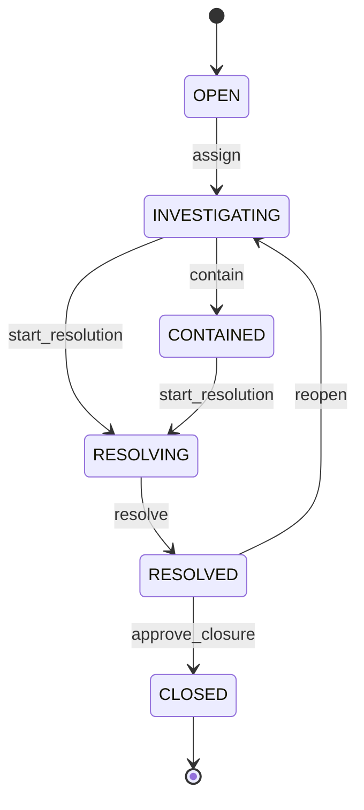

## Regras

- Incidentes críticos poderão pausar workflows e deployments.
- `CONTAINED` não significa resolvido.
- `CLOSED` exige causa, resolução e lições aprendidas.
- Reabertura deverá preservar histórico.

---

# Transições por responsabilidade

## Usuário proprietário

Pode autorizar:

```text
approve_discovery
approve_release
deploy_production
rollback_production
accept_security_risk
archive_project
cancel_project
change_critical_permission
```

## Gestor de projeto

Pode solicitar:

```text
start_discovery
submit_discovery
start_development
submit_for_testing
request_change
pause_project
resume_project
```

## Agentes executivos

Podem recomendar e solicitar:

```text
generate_discovery
request_approval
create_backlog
submit_release
propose_rfc
propose_adr
```

Não podem aprovar decisões humanas críticas.

## Agentes de engenharia

Podem executar:

```text
start_task
complete_task
fail_task
submit_for_review
run_tests
create_security_finding
prepare_release
```

Não podem publicar diretamente em produção.

## Serviços do sistema

Podem executar transições automáticas controladas:

```text
expire_approval
detect_timeout
schedule_retry
mark_agent_offline
dead_letter_event
update_health_status
```

---

# Matriz de transições críticas

| Recurso | Transição | Aprovação humana | Permissão |
|---|---|---:|---|
| Project | `approve_discovery` | Sim | `discovery.approve` |
| Project | `archive` | Sim | `project.archive` |
| Approval | `approve` | Sim | conforme o recurso |
| SecurityFinding | `accept_risk` | Sim | `security.risk.accept` |
| Release | `approve` | Sim | `release.approve` |
| Deployment | `approve production` | Sim | `deployment.production` |
| Deployment | `rollback production` | Sim | `deployment.rollback` |
| Project | `cancel` | Sim | `project.cancel` |
| Permission | alteração crítica | Sim | `permission.manage` |

---

# Regras de falha

## Falha temporária

Exemplos:

- timeout de rede;
- fila indisponível;
- modelo de IA indisponível;
- serviço externo temporariamente indisponível.

Tratamento:

```text
FAILED → RETRYING → QUEUED
```

## Falha permanente

Exemplos:

- entrada inválida;
- permissão negada;
- requisito ausente;
- vulnerabilidade crítica;
- incompatibilidade de versão.

Tratamento:

```text
FAILED
```

Deverá exigir intervenção, correção ou cancelamento.

## Timeout

Timeout deverá:

- interromper a execução;
- liberar recursos;
- registrar logs;
- emitir evento;
- avaliar retry;
- não marcar tarefa automaticamente como concluída.

## Compensação

Workflows de longa duração deverão definir compensações.

Exemplos:

```text
deployment falhou
  ↓
rollback
  ↓
restauração de versão
  ↓
health check
  ↓
registro do incidente
```

---

# Eventos e transações

A alteração de estado e o registro do evento deverão ser atômicos.

Estratégia recomendada:

```text
Transactional Outbox
```

Fluxo:

```text
1. valida transição
2. atualiza o estado
3. grava auditoria
4. grava evento na outbox
5. confirma transação
6. publicador envia evento
```

Isso evita:

- estado alterado sem evento;
- evento emitido sem estado persistido;
- perda de rastreabilidade.

---

# Padrão de resposta da API

Transição bem-sucedida:

```json
{
  "data": {
    "resource_type": "project",
    "resource_id": "prj_01",
    "previous_state": "WAITING_APPROVAL",
    "current_state": "PLANNING",
    "transition": "approve_discovery",
    "changed": true,
    "version": 8,
    "updated_at": "2026-08-02T20:40:00Z"
  },
  "meta": {
    "correlation_id": "cor_01"
  }
}
```

Transição idempotente:

```json
{
  "data": {
    "resource_type": "project",
    "resource_id": "prj_01",
    "previous_state": "PLANNING",
    "current_state": "PLANNING",
    "transition": "approve_discovery",
    "changed": false,
    "version": 8
  }
}
```

Transição inválida:

```json
{
  "error": {
    "code": "INVALID_STATE_TRANSITION",
    "message": "A transição solicitada não é permitida para o estado atual.",
    "details": {
      "resource_type": "project",
      "resource_id": "prj_01",
      "current_state": "IDEA",
      "requested_transition": "deploy_production",
      "allowed_transitions": [
        "start_discovery",
        "cancel"
      ]
    }
  }
}
```

---

# Testes obrigatórios

Cada máquina de estado deverá possuir testes para:

- todas as transições permitidas;
- todas as transições proibidas;
- ausência de permissão;
- ausência de aprovação;
- guardas não atendidas;
- repetição idempotente;
- conflito de versão;
- emissão de evento;
- criação de auditoria;
- timeout;
- retry;
- estado terminal.

Exemplo:

```text
given project = WAITING_APPROVAL
and valid approval exists
when approve_discovery
then project = PLANNING
and event DiscoveryApproved is created
and audit log is created
```

---

# Critérios de aceite da Sprint

Este documento será considerado aprovado quando:

- os estados dos principais recursos estiverem definidos;
- as transições permitidas estiverem descritas;
- transições críticas exigirem aprovação;
- estados terminais estiverem claros;
- regras de falha e retry estiverem documentadas;
- idempotência estiver definida;
- auditoria estiver incorporada;
- eventos estiverem relacionados às transições;
- a API puder validar transições;
- os fluxos puderem ser transformados em testes automatizados.
