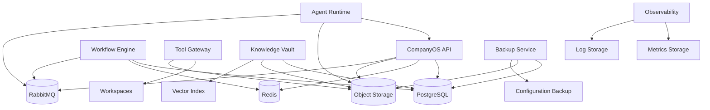

# Arquitetura de Armazenamento da Stieve Software Company

## Objetivo

Definir a arquitetura oficial de armazenamento do CompanyOS.

Este documento estabelece:

- tipos de dados;
- tecnologias de armazenamento;
- propriedade dos dados;
- persistência;
- consistência;
- versionamento;
- retenção;
- backup;
- restauração;
- integridade;
- criptografia;
- isolamento;
- capacidade;
- observabilidade;
- governança;
- critérios de teste.

A estratégia deverá garantir durabilidade, rastreabilidade, isolamento por projeto e evolução segura da plataforma.

---

# Princípios

## Fonte única de verdade

Cada dado deverá possuir uma fonte oficial.

Exemplos:

```text
dados estruturados de domínio → PostgreSQL
objetos binários → Object Storage
cache e locks → Redis
eventos em trânsito → RabbitMQ
conhecimento persistente → PostgreSQL + Object Storage
```

## Propriedade explícita

Cada módulo ou serviço deverá possuir os dados que controla.

Outros componentes deverão acessar esses dados por:

- API;
- evento;
- projeção autorizada;
- consulta interna controlada.

## Persistência conforme criticidade

Dados críticos deverão utilizar armazenamento durável.

Dados temporários não deverão ser tratados como fonte definitiva.

## Isolamento

Todo dado de organização ou projeto deverá carregar:

```text
organization_id
project_id
```

quando aplicável.

## Versionamento

Dados importantes não deverão ser sobrescritos silenciosamente.

## Backup verificável

Backup somente será considerado válido após teste de restauração.

## Segurança por padrão

Segredos, credenciais e dados restritos deverão possuir controles específicos.

---

# Visão geral



---

# Classes de dados

## Dados estruturados

Exemplos:

- usuários;
- projetos;
- requisitos;
- tarefas;
- workflows;
- aprovações;
- agentes;
- releases;
- deployments;
- auditoria;
- conhecimento estruturado.

Armazenamento:

```text
PostgreSQL
```

## Objetos binários

Exemplos:

- arquivos enviados;
- relatórios;
- artefatos;
- exports;
- backups;
- logs extensos;
- anexos.

Armazenamento:

```text
MinIO ou Object Storage compatível
```

## Dados temporários

Exemplos:

- cache;
- locks;
- rate limiting;
- presença;
- progresso temporário;
- sessões temporárias.

Armazenamento:

```text
Redis
```

## Mensagens

Exemplos:

- eventos;
- comandos;
- retries;
- DLQ.

Armazenamento de transporte:

```text
RabbitMQ
```

## Workspaces

Exemplos:

- repositórios;
- arquivos intermediários;
- execuções;
- artefatos temporários.

Armazenamento:

```text
filesystem controlado
+
volumes isolados
```

## Métricas e logs

Armazenamento:

```text
Prometheus
Loki
```

## Embeddings

Armazenamento inicial previsto:

```text
PostgreSQL + pgvector
```

ou tecnologia equivalente aprovada por ADR.

---

# PostgreSQL

## Responsabilidade

Ser a fonte principal dos dados estruturados e transacionais.

## Dados controlados

```text
identity
projects
discovery
references
requirements
decisions
backlog
tasks
workflows
approvals
agents
releases
deployments
incidents
knowledge
audit
platform
```

---

# Estratégia de schemas

Estrutura inicial possível:

```text
identity
projects
discovery
requirements
tasks
workflows
agents
releases
deployments
audit
knowledge
platform
```

## Regras

- cada módulo possui suas tabelas;
- migrations são controladas;
- acesso cruzado é restrito;
- integridade referencial é aplicada;
- nomes seguem padrão;
- índices são documentados.

---

# Convenções de tabelas

## Nomes

```text
snake_case
plural
```

Exemplos:

```text
projects
workflow_instances
agent_executions
audit_records
```

## Campos comuns

```text
id
organization_id
project_id
created_at
created_by
updated_at
updated_by
version
```

## Exclusão lógica

```text
is_deleted
deleted_at
deleted_by
```

quando aplicável.

---

# Identificadores

Formato recomendado:

```text
<prefixo>_<ulid>
```

Exemplos:

```text
org_01...
prj_01...
tsk_01...
wfl_01...
agt_01...
```

---

# Integridade referencial

Usar:

- chaves primárias;
- chaves estrangeiras;
- índices únicos;
- constraints;
- checks;
- not null;
- transações.

---

# Concorrência

Estratégia principal:

```text
optimistic locking
```

Campo:

```text
version
```

Em operações críticas, também poderão ser usados:

- `SELECT FOR UPDATE`;
- advisory locks;
- locks distribuídos.

---

# Transações

## Dentro de um módulo

Usar transação local.

## Entre módulos do monólito modular

Poderá existir transação coordenada por caso de uso.

## Entre serviços

Usar:

```text
workflow
saga
outbox
compensação
```

---

# Transactional Outbox

A outbox deverá permanecer no PostgreSQL.

Campos:

```text
id
event_id
event_type
event_version
payload
headers
status
attempt_count
available_at
created_at
published_at
last_error
```

---

# Migrations

Tecnologia:

```text
Alembic
```

## Regras

- versionadas no Git;
- revisadas;
- testadas;
- reversíveis quando possível;
- compatíveis com rollout;
- sem perda silenciosa;
- com backup antes de mudanças críticas.

---

# Estratégia expand-and-contract

Para mudanças incompatíveis:

```text
1. adicionar novo campo
2. publicar versão compatível
3. migrar dados
4. atualizar consumidores
5. remover campo antigo em release futura
```

---

# Particionamento

Poderá ser aplicado a tabelas de alto volume.

Candidatas:

```text
audit_records
event_records
agent_usage
workflow_history
logs de execução
```

Critério inicial:

```text
occurred_at
created_at
```

---

# Índices

Todo índice deverá possuir justificativa.

Tipos:

- B-tree;
- GIN;
- GiST;
- trigram;
- vetor;
- composto;
- parcial.

## Regras

- evitar excesso;
- monitorar uso;
- revisar queries lentas;
- remover índices inúteis;
- documentar impacto.

---

# Full-text search

Poderá ser usado inicialmente para:

- Knowledge Vault;
- referências;
- requisitos;
- decisões;
- auditoria autorizada.

---

# pgvector

Uso previsto:

- embeddings;
- busca semântica;
- recuperação contextual.

## Regras

- modelo registrado;
- dimensão registrada;
- índice por projeto ou namespace;
- conteúdo sem segredo;
- versão preservada.

---

# Redis

## Responsabilidade

Armazenar dados temporários e de coordenação.

## Casos de uso

```text
cache
rate limiting
locks
presença de agentes
progresso temporário
sessões temporárias
deduplicação curta
```

---

# Redis não é fonte de verdade

Dados críticos deverão existir em armazenamento durável.

Perda do Redis não deverá causar perda definitiva de:

- projetos;
- tarefas;
- workflows;
- aprovações;
- resultados;
- auditoria.

---

# Chaves Redis

Formato sugerido:

```text
companyos:{environment}:{domain}:{scope}:{identifier}
```

Exemplos:

```text
companyos:development:rate-limit:user:usr_01
companyos:development:lock:workflow:wfl_01
companyos:development:agent-presence:agt_01
```

---

# TTL

Toda chave temporária deverá possuir TTL quando aplicável.

Exemplos:

```text
rate limit
sessão temporária
cache
lock
deduplicação
```

---

# Locks Redis

Usar apenas quando:

- lock local do banco não é suficiente;
- recurso é distribuído;
- operação é curta;
- existe timeout;
- existe owner token.

Evitar locks permanentes.

---

# MinIO e Object Storage

## Responsabilidade

Armazenar objetos binários e arquivos grandes.

## Conteúdos

```text
references
artifacts
exports
reports
backups
postmortems
large logs
snapshots
```

---

# Buckets

Estrutura inicial possível:

```text
companyos-references
companyos-artifacts
companyos-exports
companyos-backups
companyos-reports
companyos-audit-exports
```

Alternativa:

```text
bucket por ambiente
+
prefixos por organização e projeto
```

---

# Estrutura de chaves

Formato:

```text
{environment}/{organization_id}/{project_id}/{resource_type}/{resource_id}/{version}/{object_name}
```

Exemplo:

```text
development/org_01/prj_01/references/ref_01/v1/source.pdf
```

---

# Metadados de objeto

PostgreSQL deverá armazenar:

```text
storage_key
content_hash
content_type
size_bytes
original_name
created_at
created_by
version
retention_class
confidentiality_level
```

---

# Upload

Fluxo:

```text
1. autenticar
2. autorizar
3. validar tamanho
4. validar MIME
5. gerar storage_key
6. calcular hash
7. enviar
8. confirmar integridade
9. persistir metadados
10. emitir evento
```

---

# Download

Fluxo:

```text
1. autenticar
2. autorizar
3. validar escopo
4. gerar URL temporária
5. auditar quando sensível
```

---

# URLs temporárias

Deverão possuir:

```text
expiração
escopo
método permitido
objeto específico
```

Não deverão conceder acesso permanente.

---

# Integridade de objetos

Cada objeto deverá possuir:

```text
sha256
```

A plataforma deverá verificar o hash em:

- upload;
- download crítico;
- backup;
- restauração;
- validação periódica.

---

# Versionamento de objetos

Usar quando necessário para:

- referências;
- artefatos;
- relatórios;
- configuração;
- backups.

A versão antiga não deverá ser sobrescrita silenciosamente.

---

# Quarentena

Arquivos suspeitos deverão ser movidos ou marcados em área de quarentena.

Estado:

```text
QUARANTINED
```

Objetos em quarentena não poderão ser consumidos por agentes.

---

# Workspaces

## Responsabilidade

Armazenar o ambiente de trabalho temporário dos agentes.

Estrutura:

```text
/workspaces/
└── {organization_id}/
    └── {project_id}/
        ├── repository/
        ├── executions/
        ├── artifacts/
        └── temp/
```

---

# Regras de workspace

- isolamento por projeto;
- diretório por execução;
- usuário não privilegiado;
- quota de disco;
- limpeza controlada;
- sem segredos persistentes;
- path traversal bloqueado;
- symlink externo bloqueado.

---

# Repositório Git

O repositório será a fonte oficial de:

- código;
- documentação versionada;
- configuração como código;
- manifests;
- migrations;
- OpenAPI;
- schemas.

---

# Artefatos

Artefatos de build deverão ser:

- identificados;
- versionados;
- ligados à release;
- armazenados no Object Storage;
- acompanhados de hash;
- imutáveis após publicação.

---

# Configuração

## Não sensível

Poderá ser armazenada em:

- arquivos versionados;
- banco;
- variáveis de ambiente.

## Sensível

Deverá utilizar mecanismo de segredos.

Não deverá ficar em:

- Git;
- logs;
- prompts;
- workspaces;
- arquivos públicos.

---

# Secret storage

A primeira versão poderá utilizar mecanismo protegido simples.

A interface deverá permitir evolução para:

```text
Vault
KMS
secret manager
```

---

# Dados por ambiente

Ambientes:

```text
development
testing
staging
production
```

## Regra

Dados não deverão ser compartilhados entre ambientes.

Cada ambiente deverá possuir:

- banco;
- buckets ou prefixos isolados;
- Redis;
- RabbitMQ vhost;
- segredos;
- backups;
- observabilidade.

---

# Isolamento por organização

Toda tabela relevante deverá possuir:

```text
organization_id
```

Consultas deverão filtrar organização obrigatoriamente.

---

# Isolamento por projeto

Toda entidade de projeto deverá possuir:

```text
project_id
```

Consultas, objetos, workspaces e embeddings deverão respeitar esse escopo.

---

# Row-Level Security

Poderá ser introduzida futuramente no PostgreSQL.

Uso recomendado para:

- defesa adicional;
- relatórios;
- acesso multiempresa;
- consultas administrativas.

Não substitui autorização na aplicação.

---

# Criptografia em trânsito

Usar TLS quando:

- comunicação sair do host;
- ambiente for staging ou production;
- dados forem sensíveis.

---

# Criptografia em repouso

Poderá ser aplicada em:

- discos;
- volumes;
- backups;
- Object Storage;
- segredos.

A estratégia final dependerá do ambiente.

---

# Retenção

## Classes

```text
TEMPORARY
SHORT
STANDARD
LONG
PERMANENT
LEGAL_HOLD
```

---

# Exemplos

## TEMPORARY

- arquivos intermediários;
- cache;
- sandboxes.

## SHORT

- logs de debug;
- exports temporários.

## STANDARD

- dados operacionais ativos.

## LONG

- auditoria;
- releases;
- incidentes;
- decisões.

## PERMANENT

- registros fundacionais;
- decisões estratégicas.

## LEGAL_HOLD

- dados preservados por obrigação específica.

---

# Política de limpeza

Toda limpeza deverá:

- seguir política;
- verificar vínculos;
- respeitar legal hold;
- registrar auditoria;
- gerar relatório;
- ser testada.

---

# Arquivamento

Arquivar significa:

- retirar do uso ativo;
- manter rastreabilidade;
- preservar integridade;
- reduzir custo quando possível.

---

# Exclusão física

Deverá ser excepcional.

Requer:

- autorização;
- justificativa;
- verificação de dependências;
- retenção;
- auditoria;
- aprovação em dados críticos.

---

# Backup

## Escopo

```text
PostgreSQL
Object Storage
configurações
manifests
dashboards
regras
segredos protegidos
```

---

# Tipos de backup

## Full

Cópia completa.

## Incremental

Somente alterações.

## Logical

Dump lógico do banco.

## Physical

Cópia física do cluster.

---

# Estratégia inicial

## PostgreSQL

```text
backup lógico diário
+
backup completo periódico
```

## Object Storage

```text
versionamento
+
cópia periódica
```

## Configurações

```text
Git
+
backup protegido
```

---

# RPO

Recovery Point Objective.

Define quanto dado pode ser perdido.

Exemplo inicial:

```text
development: 24 horas
staging: 12 horas
production futura: 1 hora ou menor
```

---

# RTO

Recovery Time Objective.

Define tempo máximo de recuperação.

Exemplo inicial:

```text
development: 8 horas
staging: 4 horas
production futura: 1 hora ou menor
```

Valores finais deverão ser aprovados.

---

# Backup verification

Todo backup deverá registrar:

```text
backup_id
started_at
completed_at
status
size
hash
storage_key
source_version
environment
```

---

# Teste de restauração

Deverá ocorrer periodicamente.

Fluxo:

```text
1. selecionar backup
2. restaurar em ambiente isolado
3. validar schema
4. validar quantidade
5. validar hashes
6. executar health checks
7. gerar relatório
```

---

# Restauração

## PostgreSQL

```text
1. isolar ambiente
2. validar backup
3. restaurar
4. aplicar migrations necessárias
5. validar integridade
6. iniciar serviços
```

## Object Storage

```text
1. restaurar objetos
2. validar hashes
3. validar metadados
4. reconstruir índices
```

---

# Disaster Recovery

A estratégia deverá prever perda de:

- VM;
- disco;
- banco;
- Object Storage;
- configuração.

Artefatos críticos deverão possuir cópia fora do volume principal.

---

# Capacidade

## PostgreSQL

Monitorar:

```text
database_size
table_size
index_size
connection_count
query_latency
deadlocks
disk_free
```

## Object Storage

Monitorar:

```text
used_bytes
free_bytes
object_count
failed_uploads
integrity_errors
```

## Redis

Monitorar:

```text
memory_usage
evictions
key_count
latency
connections
```

## Workspaces

Monitorar:

```text
used_bytes
quota
orphaned_directories
cleanup_failures
```

---

# Quotas

Poderão ser aplicadas por:

- organização;
- projeto;
- plugin;
- agente;
- workspace;
- tipo de objeto.

Exemplos:

```text
max_storage_bytes
max_reference_size
max_artifact_size
max_workspace_size
max_export_size
```

---

# Backpressure

Quando o armazenamento estiver próximo do limite:

- bloquear uploads grandes;
- impedir novas execuções pesadas;
- alertar;
- limpar temporários seguros;
- priorizar dados críticos.

---

# Observabilidade

## Métricas

```text
companyos_storage_postgres_size_bytes
companyos_storage_object_used_bytes
companyos_storage_object_count
companyos_storage_redis_memory_bytes
companyos_storage_workspace_used_bytes
companyos_storage_backup_success_total
companyos_storage_backup_failure_total
companyos_storage_restore_success_total
companyos_storage_integrity_failure_total
companyos_storage_quota_exceeded_total
```

---

# Logs

Campos:

```text
storage_type
operation
organization_id
project_id
resource_type
resource_id
storage_key
size_bytes
hash
result
duration
error_code
correlation_id
```

---

# Alertas

```text
DatabaseDiskLow
ObjectStorageDiskLow
RedisMemoryHigh
WorkspaceQuotaExceeded
BackupFailed
RestoreTestFailed
IntegrityCheckFailed
StorageUnavailable
```

---

# Segurança

Permissões:

```text
storage.read
storage.write
storage.delete
storage.archive
storage.backup.create
storage.backup.read
storage.restore
storage.retention.manage
storage.integrity.verify
```

---

# Acesso direto

Usuários, agentes e plugins não deverão acessar diretamente:

- PostgreSQL;
- Redis;
- MinIO administrativo;
- volumes do host.

O acesso deverá ocorrer por serviços autorizados.

---

# Auditoria

Ações auditáveis:

- upload;
- download sensível;
- exclusão;
- arquivamento;
- alteração de retenção;
- criação de backup;
- restauração;
- verificação de integridade;
- alteração de quota;
- acesso administrativo.

---

# Governança

## Proprietário de dados

Cada módulo deverá documentar:

```text
entidades
storage principal
retention class
backup requirement
confidentiality
owner
```

## Novo tipo de dado

Deverá definir:

- fonte oficial;
- formato;
- tamanho;
- índice;
- retenção;
- backup;
- confidencialidade;
- isolamento;
- migração;
- exclusão.

---

# Data Catalog

A plataforma deverá manter um catálogo de dados.

Campos:

```text
data_domain
entity
owner
storage
classification
retention
backup
encryption
project_scoped
personal_data
```

---

# Anti-padrões proibidos

```text
Redis como fonte definitiva
arquivo binário no PostgreSQL sem justificativa
segredo no Object Storage comum
bucket público
workspace compartilhado entre projetos
backup não testado
migration destrutiva sem plano
objeto sem hash
dado sem proprietário
ambientes compartilhando banco
exclusão física sem auditoria
```

---

# Primeira implementação

A primeira versão deverá incluir:

```text
PostgreSQL
Redis
MinIO
volumes de workspace
schemas por domínio
Alembic
outbox
hash de objetos
retenção básica
backup do PostgreSQL
backup do Object Storage
teste de restauração
métricas
alertas
```

---

# Testes obrigatórios

## PostgreSQL

- migration;
- rollback seguro;
- integridade;
- concorrência;
- transação;
- outbox;
- isolamento por projeto.

## Redis

- TTL;
- lock;
- perda de cache;
- indisponibilidade;
- eviction.

## Object Storage

- upload;
- download;
- hash;
- versão;
- quarentena;
- URL temporária;
- objeto ausente.

## Workspace

- projeto isolado;
- quota;
- path traversal;
- symlink externo;
- limpeza.

## Backup

- criação;
- hash;
- retenção;
- falha;
- restauração;
- teste periódico.

## Segurança

- acesso direto negado;
- bucket privado;
- segredo bloqueado;
- projeto incorreto;
- exclusão não autorizada.

## Capacidade

- limite de disco;
- quota;
- backpressure;
- alerta.

---

# Critérios de aceite da Sprint

Este documento será considerado aprovado quando:

- classes de dados estiverem definidas;
- fontes oficiais estiverem definidas;
- PostgreSQL estiver detalhado;
- Redis estiver delimitado;
- Object Storage estiver detalhado;
- workspaces estiverem definidos;
- propriedade dos dados estiver definida;
- versionamento estiver definido;
- retenção estiver definida;
- backup e restauração estiverem definidos;
- RPO e RTO estiverem previstos;
- integridade por hash estiver definida;
- isolamento por ambiente, organização e projeto estiver definido;
- capacidade e quotas estiverem definidas;
- segurança estiver definida;
- observabilidade estiver definida;
- testes obrigatórios estiverem documentados.
