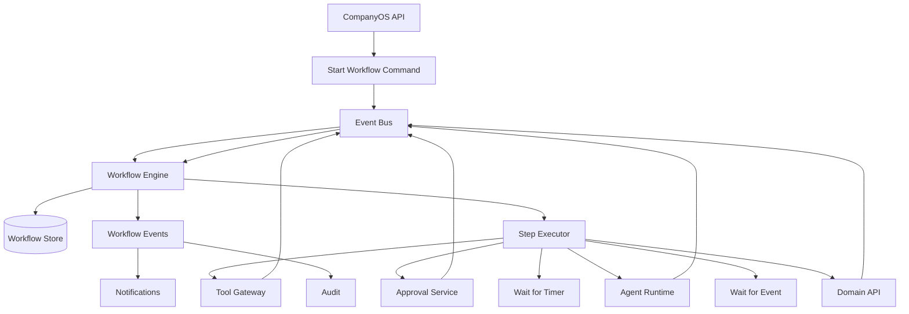
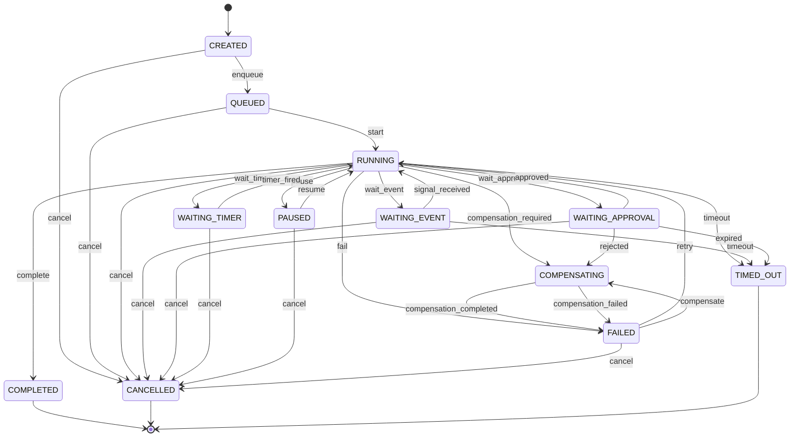

# Arquitetura do Workflow Engine da Stieve Software Company

## Objetivo

Definir a arquitetura oficial do Workflow Engine do CompanyOS.

Este documento estabelece:

- responsabilidades;
- modelos de workflow;
- definições;
- instâncias;
- etapas;
- estados;
- persistência;
- execução;
- retry;
- timeout;
- compensação;
- aprovações humanas;
- integração com agentes;
- integração com o Event Bus;
- idempotência;
- segurança;
- observabilidade;
- governança;
- critérios de teste.

O Workflow Engine será responsável por coordenar processos de longa duração que envolvem múltiplas etapas, serviços, agentes e aprovações.

---

# Princípios

## Estado persistente

Todo workflow deverá persistir seu estado.

O engine não poderá depender apenas de memória para saber:

- etapa atual;
- etapas concluídas;
- etapas falhas;
- aprovações pendentes;
- dados de entrada;
- resultados;
- compensações;
- tentativas;
- prazos.

## Execução retomável

Após reinício do processo, o workflow deverá continuar a partir do último checkpoint seguro.

## Idempotência

Repetir uma etapa não deverá causar efeitos duplicados quando a etapa for declarada idempotente.

## Processos longos

O engine deverá suportar processos que durem:

```text
segundos
minutos
horas
dias
```

## Aprovação humana

Etapas críticas poderão aguardar uma decisão humana sem manter thread ou processo bloqueado.

## Compensação

Processos distribuídos deverão possuir ações de compensação quando necessário.

## Separação de responsabilidades

O Workflow Engine coordena.

Ele não deverá:

- implementar regras de domínio;
- acessar diretamente tabelas privadas de outros módulos;
- executar agentes sem o Agent Runtime;
- executar ferramentas sem o Tool Gateway;
- publicar em produção sem Approval Service;
- substituir o Event Bus.

---

# Visão geral



---

# Responsabilidades

O Workflow Engine deverá:

- registrar definições;
- criar instâncias;
- validar entrada;
- iniciar execução;
- selecionar etapa;
- validar dependências;
- executar etapa;
- persistir checkpoint;
- aguardar evento;
- aguardar aprovação;
- aguardar tempo;
- aplicar timeout;
- aplicar retry;
- executar compensação;
- concluir;
- falhar;
- cancelar;
- produzir eventos;
- expor status;
- permitir auditoria.

---

# Tipos de workflow

## Sequential

Etapas executadas em sequência.

```text
A → B → C
```

## Parallel

Etapas independentes executadas em paralelo.

```text
A
├── B
├── C
└── D
```

## Conditional

Próxima etapa depende de uma condição.

```text
A
├── condição verdadeira → B
└── condição falsa → C
```

## Event-driven

A execução aguarda evento externo.

```text
A
→ WAITING_EVENT
→ evento recebido
→ B
```

## Approval-driven

A execução aguarda aprovação.

```text
A
→ WAITING_APPROVAL
→ aprovação
→ B
```

## Timer-driven

A execução aguarda um prazo.

```text
A
→ WAITING_TIMER
→ prazo atingido
→ B
```

## Saga

Processo distribuído com compensações.

```text
A → B → C
        ↓ falha
      compensate B
      compensate A
```

---

# Casos de uso iniciais

## Discovery

```text
criar sessão
→ processar referências
→ gerar perguntas
→ coletar respostas
→ extrair requisitos
→ gerar relatório
→ solicitar aprovação
→ concluir
```

## Desenvolvimento

```text
validar backlog
→ criar tarefas
→ atribuir agentes
→ executar tarefas
→ executar testes
→ revisar segurança
→ preparar release
```

## Release

```text
criar release
→ validar testes
→ validar segurança
→ validar documentação
→ solicitar aprovação
→ publicar
```

## Deployment

```text
validar release
→ criar backup
→ aplicar migrations
→ executar deploy
→ executar health checks
→ concluir
```

## Rollback

```text
detectar falha
→ solicitar autorização quando aplicável
→ restaurar versão
→ validar saúde
→ registrar incidente
```

---

# Conceitos principais

## WorkflowDefinition

Define o modelo do processo.

## WorkflowInstance

Representa uma execução específica.

## WorkflowStepDefinition

Define uma etapa do modelo.

## WorkflowStepInstance

Representa a execução concreta da etapa.

## WorkflowTransition

Define como a execução avança.

## WorkflowCheckpoint

Registra um ponto seguro de retomada.

## WorkflowCompensation

Define e registra compensações.

## WorkflowSignal

Representa um evento externo recebido.

## WorkflowTimer

Representa uma espera temporal persistente.

---

# WorkflowDefinition

## Campos

```text
id
organization_id
code
name
description
version
status
trigger_type
input_schema
output_schema
timeout_seconds
max_duration_seconds
concurrency_policy
created_at
created_by
updated_at
updated_by
published_at
```

## Estados

```text
DRAFT
VALIDATING
PUBLISHED
DEPRECATED
DISABLED
```

## Regras

- `code + version` deverá ser único;
- definição publicada é imutável;
- alteração exige nova versão;
- definição deve possuir schema de entrada;
- todas as etapas devem ser alcançáveis;
- dependências cíclicas devem ser bloqueadas;
- etapa final deve ser explícita.

---

# WorkflowInstance

## Campos

```text
id
organization_id
project_id
workflow_definition_id
workflow_definition_version
status
current_step_id
input
output
context
correlation_id
causation_id
started_by_type
started_by_id
started_at
completed_at
failed_at
cancelled_at
timeout_at
version
created_at
updated_at
```

## Estados

```text
CREATED
QUEUED
RUNNING
WAITING_EVENT
WAITING_APPROVAL
WAITING_TIMER
PAUSED
COMPENSATING
COMPLETED
FAILED
CANCELLED
TIMED_OUT
```

---

# Máquina de estado do workflow



---

# WorkflowStepDefinition

## Campos

```text
id
workflow_definition_id
code
name
description
step_type
sequence
dependencies
input_mapping
output_mapping
condition
timeout_seconds
retry_policy
compensation_step_code
approval_policy
agent_policy
tool_policy
continue_on_failure
created_at
```

## Tipos de etapa

```text
DOMAIN_COMMAND
DOMAIN_QUERY
AGENT_EXECUTION
TOOL_EXECUTION
APPROVAL
WAIT_EVENT
TIMER
CONDITION
PARALLEL
JOIN
SUBWORKFLOW
NOTIFICATION
COMPENSATION
END
```

---

# WorkflowStepInstance

## Campos

```text
id
workflow_instance_id
step_definition_id
status
attempt_count
input
output
error
started_at
completed_at
failed_at
timeout_at
assigned_worker_id
idempotency_key
version
created_at
updated_at
```

## Estados

```text
PENDING
READY
QUEUED
RUNNING
WAITING
WAITING_APPROVAL
COMPLETED
FAILED
SKIPPED
CANCELLED
TIMED_OUT
COMPENSATED
```

---

# Dependências

Uma etapa ficará `READY` somente quando:

- todas as dependências obrigatórias estiverem concluídas;
- condições forem satisfeitas;
- o workflow estiver em estado executável;
- não houver bloqueio;
- o limite de concorrência permitir.

---

# Etapas condicionais

Exemplo:

```yaml
code: security_gate
step_type: CONDITION
condition: context.security_findings_critical == 0
on_true: prepare_release
on_false: block_release
```

As expressões deverão usar linguagem controlada e segura.

Não será permitido executar código arbitrário na condição.

---

# Etapas paralelas

Exemplo:

```text
validate_release
├── run_tests
├── security_scan
└── validate_documentation
```

O workflow continuará quando a política de join for atendida.

Políticas:

```text
ALL
ANY
MINIMUM_SUCCESS
CUSTOM
```

---

# Join

## ALL

Todas as etapas precisam concluir com sucesso.

## ANY

A primeira conclusão válida permite continuar.

## MINIMUM_SUCCESS

Quantidade mínima configurada.

## CUSTOM

Política controlada e previamente registrada.

---

# Subworkflows

Um workflow poderá iniciar outro workflow.

Exemplo:

```text
ReleaseWorkflow
→ TestWorkflow
→ SecurityReviewWorkflow
→ DeploymentWorkflow
```

## Regras

- preservar `correlation_id`;
- registrar `causation_id`;
- controlar propagação de cancelamento;
- controlar propagação de falha;
- evitar recursão infinita;
- aplicar limite de profundidade.

---

# Contexto do workflow

O contexto contém dados necessários à coordenação.

Exemplo:

```json
{
  "project_id": "prj_01",
  "release_id": "rel_01",
  "test_run_id": "tst_01",
  "security_review_id": "sec_01"
}
```

## Regras

- não armazenar segredos;
- limitar tamanho;
- versionar alterações;
- persistir após cada checkpoint;
- registrar origem dos dados;
- não duplicar arquivos ou payloads grandes.

Dados grandes deverão ficar em Object Storage.

---

# Input mapping

Cada etapa poderá extrair dados do contexto.

Exemplo:

```yaml
input_mapping:
  release_id: context.release_id
  project_id: workflow.project_id
```

---

# Output mapping

O resultado da etapa poderá atualizar o contexto.

Exemplo:

```yaml
output_mapping:
  context.test_run_id: result.test_run_id
  context.tests_passed: result.passed
```

---

# Validação de schema

Entradas e saídas deverão possuir schemas.

Validar:

- entrada do workflow;
- entrada da etapa;
- resultado da etapa;
- saída final.

Falha de schema deverá ser tratada como erro permanente.

---

# Execução de etapa

Fluxo:

```text
1. selecionar etapa READY
2. obter lock
3. validar versão
4. marcar RUNNING
5. gerar idempotency key
6. executar ação
7. persistir resultado
8. criar checkpoint
9. emitir evento
10. liberar lock
11. calcular próximas etapas
```

---

# Workers

O Workflow Engine poderá utilizar workers especializados.

Exemplos:

```text
workflow-domain-worker
workflow-agent-worker
workflow-approval-worker
workflow-timer-worker
workflow-compensation-worker
```

Na primeira versão, esses workers poderão existir no mesmo serviço.

---

# Locks

Locks deverão impedir execução duplicada da mesma etapa.

Mecanismos possíveis:

```text
SELECT FOR UPDATE
advisory lock do PostgreSQL
lock Redis
versionamento otimista
```

A estratégia inicial deverá priorizar o PostgreSQL.

---

# Idempotency key

Formato recomendado:

```text
workflow_instance_id
+
step_code
+
attempt_number
```

Para ações idempotentes entre retries, poderá ser usada uma chave estável por etapa.

Exemplo:

```text
wfl_01:prepare_release
```

---

# Checkpoint

Um checkpoint deverá ser criado após:

- conclusão de etapa;
- entrada em espera;
- alteração crítica de contexto;
- aprovação recebida;
- compensação concluída.

## Campos

```text
id
workflow_instance_id
step_instance_id
sequence
status
context_snapshot
created_at
```

Snapshots completos poderão ser substituídos por versão incremental futuramente.

---

# Wait for Event

Uma etapa poderá aguardar evento.

## Registro

```text
workflow_instance_id
step_instance_id
expected_event_type
subject_type
subject_id
correlation_id
expires_at
status
```

## Fluxo

```text
etapa registra espera
→ workflow entra em WAITING_EVENT
→ consumidor recebe evento
→ valida correlação
→ valida subject
→ registra signal
→ retoma workflow
```

---

# WorkflowSignal

## Campos

```text
id
workflow_instance_id
step_instance_id
signal_type
event_id
payload
received_at
processed_at
status
```

## Regras

- evento duplicado não retoma duas vezes;
- sinal deve corresponder à espera;
- sinal incompatível deve ser ignorado ou auditado;
- sinal recebido após timeout deve ser registrado sem reabrir automaticamente.

---

# Aprovação humana

## Fluxo

```text
workflow cria ApprovalRequest
→ entra em WAITING_APPROVAL
→ Approval Service notifica usuário
→ usuário aprova ou rejeita
→ evento é publicado
→ workflow retoma
```

## Regras

- aprovação deve referenciar a versão do recurso;
- aprovação expirada não pode ser reutilizada;
- alteração do recurso invalida aprovação;
- segregação de funções deve ser aplicada;
- rejeição pode iniciar compensação ou revisão.

---

# Timers persistentes

Timers deverão permanecer válidos após reinício.

## Campos

```text
id
workflow_instance_id
step_instance_id
timer_type
fire_at
status
created_at
fired_at
cancelled_at
```

Estados:

```text
SCHEDULED
FIRED
CANCELLED
EXPIRED
```

---

# Scheduler de timers

O scheduler deverá:

- buscar timers vencidos;
- obter lock;
- marcar como disparado;
- publicar evento;
- retomar workflow;
- ser idempotente.

---

# Timeout

## Timeout de etapa

Limita uma execução específica.

## Timeout de espera

Limita tempo aguardando evento ou aprovação.

## Timeout global

Limita duração total do workflow.

## Resultado

Dependendo da política:

```text
retry
fail
compensate
cancel
escalate
```

---

# Retry policy

Exemplo:

```yaml
retry_policy:
  max_attempts: 4
  strategy: EXPONENTIAL
  initial_delay_seconds: 10
  max_delay_seconds: 1800
  jitter: true
  retryable_errors:
    - SERVICE_UNAVAILABLE
    - UPSTREAM_TIMEOUT
```

---

# Estratégias de retry

```text
NONE
FIXED
EXPONENTIAL
CUSTOM
```

## NONE

Sem nova tentativa.

## FIXED

Mesmo intervalo entre tentativas.

## EXPONENTIAL

Intervalo crescente.

## CUSTOM

Política previamente registrada.

---

# Erros temporários

Exemplos:

```text
SERVICE_UNAVAILABLE
EVENT_BUS_UNAVAILABLE
AI_PROVIDER_UNAVAILABLE
OBJECT_STORAGE_UNAVAILABLE
UPSTREAM_TIMEOUT
```

---

# Erros permanentes

Exemplos:

```text
VALIDATION_ERROR
PERMISSION_DENIED
INVALID_STATE_TRANSITION
RESOURCE_NOT_FOUND
APPROVAL_REJECTED
```

---

# Retry seguro

Antes de repetir, o engine deverá verificar:

- etapa é idempotente;
- ação aceita idempotency key;
- efeito anterior é conhecido;
- não existe conclusão persistida;
- limite não foi excedido.

---

# Compensação

Compensação desfaz ou reduz os efeitos de etapas concluídas.

Exemplo:

```text
backup criado
→ migration aplicada
→ deploy falhou
→ restaurar versão
→ restaurar banco quando necessário
```

## Regras

- compensação não é rollback de transação;
- compensação pode falhar;
- compensação deve ser auditada;
- ordem geralmente será inversa;
- compensações devem ser idempotentes.

---

# WorkflowCompensation

## Campos

```text
id
workflow_instance_id
original_step_instance_id
compensation_step_code
status
attempt_count
input
output
error
started_at
completed_at
```

## Estados

```text
PENDING
RUNNING
COMPLETED
FAILED
SKIPPED
```

---

# Políticas de compensação

```text
REVERSE_COMPLETED
SELECTIVE
MANUAL
NONE
```

## REVERSE_COMPLETED

Compensa etapas concluídas na ordem inversa.

## SELECTIVE

Compensa apenas etapas marcadas.

## MANUAL

Cria incidente ou aprovação para intervenção humana.

## NONE

Usado quando não existe compensação segura.

---

# Cancelamento

## Cancelamento solicitado

Pode ocorrer por:

- usuário;
- sistema;
- incidente;
- política;
- projeto cancelado.

## Regras

- etapas não iniciadas são canceladas;
- etapa em execução recebe solicitação de cancelamento;
- ações não canceláveis devem concluir ou expirar;
- compensação pode ser iniciada;
- resultado deve ser auditado.

---

# Pausa

Pausa deverá:

- impedir novas etapas;
- preservar contexto;
- preservar timers conforme política;
- não perder eventos recebidos;
- manter auditoria.

---

# Retomada

Ao retomar:

- validar estado do projeto;
- validar permissões;
- validar dependências;
- validar aprovações ainda válidas;
- recalcular etapas prontas.

---

# Falha do processo

Se o serviço for interrompido durante uma etapa:

```text
RUNNING
→ lease expira
→ etapa é reavaliada
```

A política poderá:

- consultar efeito externo;
- retomar;
- repetir;
- marcar como desconhecida;
- solicitar revisão humana.

---

# Leases

Uma etapa em execução poderá possuir:

```text
worker_id
lease_expires_at
heartbeat_at
```

O worker deverá renovar o lease.

Lease expirado não significa automaticamente que a ação não ocorreu.

---

# Estado desconhecido

Quando não for possível determinar se uma ação externa ocorreu:

```text
UNKNOWN_OUTCOME
```

Esse estado deverá exigir:

- reconciliação;
- consulta externa;
- revisão;
- não repetir cegamente.

Na primeira versão, poderá ser representado como `FAILED` com código específico.

---

# Integração com o Event Bus

## Comandos consumidos

```text
StartWorkflow
PauseWorkflow
ResumeWorkflow
CancelWorkflow
RetryWorkflow
SignalWorkflow
```

## Eventos consumidos

```text
TaskCompleted
TaskFailed
AgentExecutionCompleted
AgentExecutionFailed
HumanApprovalGranted
HumanApprovalRejected
TestSuitePassed
TestSuiteFailed
DeploymentCompleted
DeploymentFailed
```

## Eventos publicados

```text
WorkflowCreated
WorkflowStarted
WorkflowStepQueued
WorkflowStepStarted
WorkflowStepCompleted
WorkflowStepFailed
WorkflowWaitingEvent
WorkflowWaitingApproval
WorkflowPaused
WorkflowResumed
WorkflowCompensationStarted
WorkflowCompensationCompleted
WorkflowCompleted
WorkflowFailed
WorkflowCancelled
WorkflowTimedOut
```

---

# Integração com Agent Runtime

Uma etapa `AGENT_EXECUTION` deverá:

```text
1. criar AgentExecution
2. publicar ExecuteAgent
3. entrar em WAITING_EVENT
4. aguardar AgentExecutionCompleted ou Failed
5. persistir resultado
6. avançar ou aplicar retry
```

O Workflow Engine não deverá chamar diretamente o modelo de IA.

---

# Integração com Tool Gateway

Etapas técnicas controladas poderão solicitar ferramentas.

O engine deverá:

- validar política;
- solicitar execução;
- aguardar resultado;
- aplicar timeout;
- registrar evidência.

---

# Integração com Approval Service

O engine deverá criar aprovação por API interna ou comando.

Campos mínimos:

```text
workflow_instance_id
step_instance_id
resource_type
resource_id
resource_version
approval_type
risk_level
expires_at
```

---

# Integração com domínio

Operações de domínio deverão usar:

- comandos internos;
- API interna;
- casos de uso autorizados.

O Workflow Engine não deverá alterar tabelas de domínio diretamente.

---

# Definição em YAML

Exemplo:

```yaml
code: release_workflow
version: 1
name: Release Workflow
timeout_seconds: 86400

input_schema:
  type: object
  required:
    - project_id
    - release_id

steps:
  - code: validate_tests
    type: DOMAIN_QUERY
    action: tests.validate_release
    retry_policy:
      max_attempts: 2

  - code: validate_security
    type: DOMAIN_QUERY
    action: security.validate_release
    retry_policy:
      max_attempts: 2

  - code: approval
    type: APPROVAL
    depends_on:
      - validate_tests
      - validate_security
    approval_policy:
      permission: release.approve
      risk_level: HIGH

  - code: publish
    type: DOMAIN_COMMAND
    depends_on:
      - approval
    action: releases.publish

  - code: end
    type: END
    depends_on:
      - publish
```

---

# Validação de definição

Antes de publicar, validar:

- código;
- versão;
- schemas;
- etapas;
- dependências;
- ciclos;
- etapas inalcançáveis;
- etapa final;
- compensações;
- tipos registrados;
- políticas de retry;
- timeouts;
- permissões;
- referências a subworkflows.

---

# Versionamento

Definições publicadas são imutáveis.

Nova alteração gera:

```text
version + 1
```

Instâncias em andamento continuam usando a versão original.

Migração de instância ativa exigirá processo específico e aprovação.

---

# Concurrency policy

Opções:

```text
ALLOW
ONE_PER_PROJECT
ONE_PER_RESOURCE
REJECT
QUEUE
```

## ALLOW

Permite múltiplas instâncias.

## ONE_PER_PROJECT

Somente uma instância ativa por projeto.

## ONE_PER_RESOURCE

Somente uma instância por recurso.

## REJECT

Rejeita nova execução.

## QUEUE

Aceita e aguarda a anterior terminar.

---

# Persistência

## Tabelas principais

```text
workflow_definitions
workflow_step_definitions
workflow_instances
workflow_step_instances
workflow_checkpoints
workflow_signals
workflow_timers
workflow_compensations
workflow_history
```

---

# Histórico

Toda alteração deverá gerar histórico.

Campos:

```text
id
workflow_instance_id
step_instance_id
event_type
previous_status
current_status
actor_type
actor_id
details
correlation_id
created_at
```

---

# Índices

Índices recomendados:

```text
workflow_instances(status)
workflow_instances(project_id, status)
workflow_instances(correlation_id)
workflow_step_instances(workflow_instance_id, status)
workflow_timers(status, fire_at)
workflow_signals(workflow_instance_id, status)
workflow_history(workflow_instance_id, created_at)
```

---

# Segurança

## Permissões

```text
workflow.create
workflow.read
workflow.start
workflow.pause
workflow.resume
workflow.cancel
workflow.retry
workflow.approve
workflow.definition.manage
```

## Isolamento

Toda instância deverá respeitar:

```text
organization_id
project_id
```

## Dados sensíveis

Não armazenar:

- tokens;
- senhas;
- chaves;
- conteúdo secreto;
- arquivos binários.

## Ações críticas

Etapas críticas deverão exigir Approval Service.

---

# Limites

Configurações iniciais:

```text
max_steps_per_workflow
max_parallel_steps
max_subworkflow_depth
max_context_size
max_retry_attempts
max_workflow_duration
max_active_workflows_per_project
```

---

# Observabilidade

## Métricas

```text
workflows_started_total
workflows_completed_total
workflows_failed_total
workflows_cancelled_total
workflows_timed_out_total
workflow_duration_seconds
workflow_steps_started_total
workflow_steps_failed_total
workflow_step_duration_seconds
workflow_retries_total
workflow_compensations_total
workflow_waiting_approval
workflow_waiting_event
workflow_queue_depth
```

## Logs

Campos:

```text
workflow_definition
workflow_version
workflow_instance_id
step_code
step_instance_id
status
attempt_count
project_id
correlation_id
causation_id
error_code
worker_id
```

## Alertas

- workflows presos;
- aprovação vencida;
- muitas falhas;
- compensação falha;
- timer atrasado;
- lease expirado;
- fila crescendo;
- duração anormal.

---

# Mission Control

A interface deverá exibir:

- definição;
- versão;
- estado;
- progresso;
- etapas;
- dependências;
- tentativas;
- aprovações;
- timers;
- erros;
- compensações;
- duração;
- histórico;
- correlação.

Controles autorizados:

```text
pause
resume
cancel
retry
approve
reject
```

---

# Auditoria

Ações auditáveis:

- iniciar workflow;
- pausar;
- retomar;
- cancelar;
- retry manual;
- aprovar;
- rejeitar;
- alterar definição;
- publicar definição;
- executar compensação manual;
- migrar versão.

---

# Recuperação

Após reinício:

```text
1. carregar workflows não terminais
2. verificar leases expirados
3. verificar timers vencidos
4. verificar eventos não processados
5. recalcular etapas READY
6. retomar execução
```

---

# Reconciliação

Jobs periódicos deverão identificar:

- etapa RUNNING sem worker;
- workflow WAITING sem registro de espera;
- timer vencido não disparado;
- aprovação decidida não consumida;
- workflow completo com etapa pendente;
- execução duplicada.

---

# Anti-padrões proibidos

```text
workflow somente em memória
thread bloqueada aguardando aprovação
retry infinito
etapa sem timeout
condição executando código arbitrário
workflow alterando banco de outro domínio
agente chamado diretamente pelo engine
payload com segredo
compensação não idempotente
definição publicada alterada
```

---

# Primeira implementação

A primeira implementação deverá suportar:

```text
SEQUENTIAL
CONDITION
APPROVAL
WAIT_EVENT
TIMER
AGENT_EXECUTION
DOMAIN_COMMAND
END
```

Também deverá incluir:

- persistência PostgreSQL;
- RabbitMQ;
- checkpoints;
- retry exponencial;
- timeout;
- cancelamento;
- pausa e retomada;
- idempotência;
- histórico;
- métricas;
- health checks.

Compensação completa e paralelismo avançado poderão ser incrementais, mas os contratos deverão existir desde o início.

---

# Testes obrigatórios

## Definição

- workflow válido;
- dependência inexistente;
- ciclo;
- etapa inalcançável;
- schema inválido;
- versão duplicada.

## Execução

- sequência simples;
- condição verdadeira;
- condição falsa;
- espera por evento;
- espera por aprovação;
- timer;
- subworkflow;
- conclusão.

## Falhas

- erro temporário;
- erro permanente;
- timeout;
- worker interrompido;
- lease expirado;
- mensagem duplicada.

## Retry

- limite;
- backoff;
- idempotência;
- erro não repetível.

## Compensação

- ordem inversa;
- compensação parcial;
- compensação falha;
- retry da compensação.

## Segurança

- projeto incorreto;
- permissão ausente;
- aprovação ausente;
- segredo no contexto;
- ação crítica não autorizada.

## Recuperação

- reinício em RUNNING;
- reinício em WAITING_EVENT;
- reinício em WAITING_APPROVAL;
- timer vencido durante indisponibilidade.

---

# Critérios de aceite da Sprint

Este documento será considerado aprovado quando:

- responsabilidades do Workflow Engine estiverem definidas;
- modelos e instâncias estiverem separados;
- estados estiverem definidos;
- tipos de etapas estiverem definidos;
- persistência estiver detalhada;
- checkpoints estiverem previstos;
- eventos e sinais estiverem definidos;
- timers persistentes estiverem definidos;
- retry e timeout estiverem definidos;
- compensações estiverem definidas;
- aprovações humanas estiverem integradas;
- Agent Runtime estiver integrado;
- Event Bus estiver integrado;
- segurança estiver definida;
- observabilidade estiver definida;
- recuperação após falha estiver definida;
- testes obrigatórios estiverem documentados.
